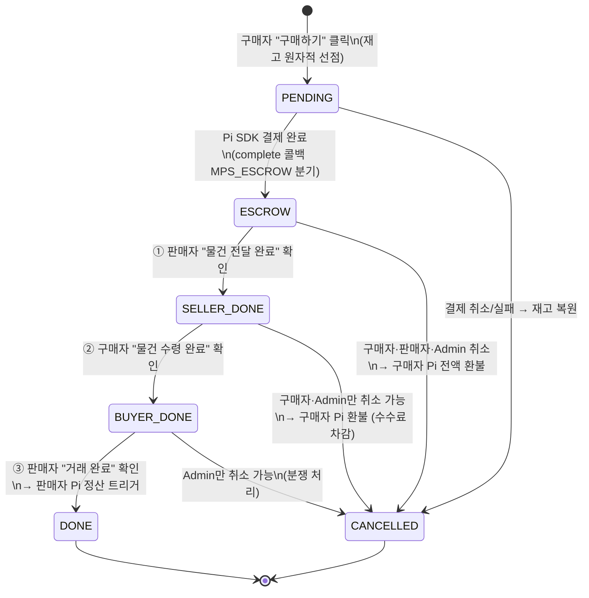

# PRD_8_MPS.md — MyPiShop(MPS): Pi Coin P2P 직거래 마켓플레이스

> **작성일**: 2026-06-10
> **버전**: v1.7
> **상태**: Phase 1 MVP 구현 반영
> **작성자**: mps-prd-architect 에이전트 (검토: anakin)

---

## 변경 이력

| 버전 | 날짜 | 변경 내용 | 작성자 |
|------|------|-----------|--------|
| v1.7 | 2026-06-11 | **잔여 0.1π = 지급준비금 확정** — 보증금 1π 중 수수료 충당은 0.9π(9회)까지, 잔여 0.1π는 수수료 공제 대상이 아닌 최소 유지 잔액(은행 지급준비금 개념). 보증금 계정 0원 방지 버퍼 + 반환 송금 수수료 충당 여력. 반환 시 지급준비금 포함 전액 반환. §12 #1 잔여는 정상 거래 수수료율만 남음 | anakin |
| v1.6 | 2026-06-11 | **보증금·수수료 확정 수치** — 판매 등록 시 **1π 예치 옵션**(계정 단위 스테이킹), 취소수수료 **정액 0.1π/회**, 1π로 **누적 9회** 감당, 소진 시 추가 1π 예치 옵션 발동(재예치 전 무보증금 모드). 판매자 취소 0.1π→구매자, 구매자 취소 0.1π→판매자. 보증금 잔액·취소 횟수 마이페이지 표시, 잔여 보증금 반환 규칙. §12 #1 잔여(정상 거래 수수료율·잔여 0.1π 처리)로 축소 | anakin |
| v1.5 | 2026-06-11 | **보증금 연동 단서 확정** — 주문 성립 시 판매자에게 보증금 예치 제안. **OK: 구매자 취소수수료 수령 가능**(+본인 취소 시 보증금 공제) / **NOT OK: 구매자 취소수수료 수령 불가**(전액 환불·양방향 수수료 없음). 보상 권리와 페널티 책임의 인센티브 대칭 명문화. FR-10 단서·§5-4 표 개정 | anakin |
| v1.4 | 2026-06-11 | **취소수수료 정책 확정** — ① 베타: 양측 취소수수료 0π (이력만 기록) ② 구매자 취소: 에스크로 공제 후 환불 (징수 보장) ③ 판매자 취소: 에스크로 예치금 부재로 강제 징수 수단 없음을 구조적 문제로 명시, 정식 도입 후보(후불 정산 차감 vs PiRC3 보증금) 기술 ④ 귀속 원칙: 플랫폼 수익이 아닌 **피해 상대방 보상** (§5-6 0π 원칙과 일관). FR-10·§5-4·§12 #1 개정 | anakin |
| v1.3 | 2026-06-11 | **§5-6 이중 송금 수수료 구조 신설** — ① Pi Network 공식 에스크로 서비스 부재 명시 ② 플랫폼 에스크로 대행으로 온체인 송금 2회 → 네트워크 수수료 2중 지불 구조 인식 ③ 사용자 지불 수수료(예: 0.01π + 0.1π)는 전액 Pi Network 네트워크 수수료이며 **플랫폼 수령 수수료 = 0π** 강조 (UI 고지 원칙 포함) | anakin |
| v1.2 | 2026-06-11 | **3단계 확인 판매전략 확정·구현 반영** — `BUYER_DONE` 상태 추가. 거래 종결·정산 트리거를 구매자 수령 확인에서 **판매자 최종 거래완료 확인**으로 이동 (등록→결제→전달완료(판매자)→수령완료(구매자)→거래완료(판매자)). FR-09·10·11, §5 상태 머신, §7-5·7-7, §8 API 경로(`/api/store/*` 구현 기준) 현행화 | anakin |
| v1.1 | 2026-06-10 | 거래 완료 양방향 확인 반영 — `SELLER_DONE` 상태 추가, FR-09·FR-11 개정 | anakin |
| v1.0 | 2026-06-10 | 최초 작성 — FR-01~13, mps_shop 매장 등록, 에스크로 설계 포함 | mps-prd-architect |

---

## 목차

1. [프로젝트 개요](#1-프로젝트-개요)
2. [사용자 역할 정의](#2-사용자-역할-정의)
3. [핵심 기능 요건 (FR)](#3-핵심-기능-요건-fr)
4. [비기능 요건 (NFR)](#4-비기능-요건-nfr)
5. [에스크로 시스템 상세 설계](#5-에스크로-시스템-상세-설계)
6. [화면 목록](#6-화면-목록)
7. [DB 스키마 설계](#7-db-스키마-설계)
8. [API 엔드포인트 목록](#8-api-엔드포인트-목록)
9. [Pi Network 연동 상세](#9-pi-network-연동-상세)
10. [제약사항 및 가정](#10-제약사항-및-가정)
11. [마일스톤 및 우선순위](#11-마일스톤-및-우선순위)
12. [미결 사항 (Open Issues)](#12-미결-사항-open-issues)

---

## 1. 프로젝트 개요

### 1-1. 제품명

**MyPiShop (MPS)** — Pi Coin 전용 P2P 직거래 마켓플레이스

### 1-2. 한 줄 요약

Pi KYC 인증 사용자 간에 Pi Coin으로 안전하게 물건을 사고파는 직거래 플랫폼.
에스크로가 중간에서 Pi를 보관하여 "먹튀"를 원천 차단한다.

### 1-3. 배경 및 목적

Pi Network는 수천만 명의 KYC 기반 사용자를 보유하지만, Pi Coin을 실질적으로 소비할 수 있는 생태계가 부족하다. MyPiShop는 Pi 사용자 간 P2P 중고·신품·수제품 거래를 가능하게 하여 **Pi Coin 소비 생태계의 핵심 인프라**를 구축한다.

### 1-4. 핵심 가치

| # | 가치 | 설명 |
|---|------|------|
| 1 | **Pi Coin 전용** | Pi 외 결제 수단 없음 — Pi 생태계 내 순환 극대화 |
| 2 | **에스크로 안전 거래** | 구매자 Pi → 에스크로 보관 → 거래 완료 확인 후 판매자 전송 |
| 3 | **KYC 신뢰** | Pi Network 인증 사용자만 참여 — 익명 사기 원천 차단 |
| 4 | **매장 기반 판매** | 온·오프라인 매장 등록으로 판매자 신뢰도·브랜드 구축 |
| 5 | **Google Maps 준비** | 오프라인 매장 위치 데이터 선제 수집, 향후 지도 연동 기반 마련 |

### 1-5. 현재 범위 제한

- **직거래 전용** — 배송 기능 없음. 구매자·판매자가 직접 만나 거래.
- **Pi Coin 단독** — 법정화폐·카드 결제 없음.
- **가상 에스크로** — PiRC3 스마트 컨트랙트 미출시 → 운영자 Pi 계정을 중간 에스크로 주소로 활용 (PiRC3 출시 후 마이그레이션 예정).
- **배송 주소 없음** — 직거래 장소 텍스트 메모만 허용.

---

## 2. 사용자 역할 정의

### 2-1. 역할 정의

| 역할 | 설명 | 로그인 방식 |
|------|------|------------|
| **Buyer (구매자)** | Pi 계정으로 로그인한 모든 사용자. 상품 조회·주문·결제 가능. | Pi 로그인 |
| **Seller (판매자)** | 상품을 등록·관리하는 사용자. Buyer와 동일 계정, 역할 자동 부여. | Pi 로그인 |
| **Admin (관리자)** | 상품 신고 처리·에스크로 강제 정산·카테고리 관리 권한 보유. | Pi 로그인 (ADMIN/MASTER role) |
| **Guest (비로그인)** | 상품 목록·상세 조회만 가능. 주문·연락 불가. | 없음 |

### 2-2. 권한 매트릭스

| 기능 | Guest | Buyer | Seller | Admin |
|------|-------|-------|--------|-------|
| 상품 목록·상세 조회 | ✅ | ✅ | ✅ | ✅ |
| 상품 검색 | ✅ | ✅ | ✅ | ✅ |
| 상품 등록 | ❌ | ✅ | ✅ | ✅ |
| 본인 상품 수정·삭제 | ❌ | ❌ | ✅ | ✅ |
| 타인 상품 강제 삭제 | ❌ | ❌ | ❌ | ✅ |
| 매장 등록·관리 | ❌ | ✅ | ✅ | ✅ |
| 주문 생성 (구매) | ❌ | ✅ | ✅ | ✅ |
| 주문 취소 (본인) | ❌ | ✅ | ✅ | ✅ |
| 거래 완료 확인 | ❌ | ✅ | ✅ | ✅ |
| 에스크로 강제 정산 | ❌ | ❌ | ❌ | ✅ |
| 카테고리 CRUD | ❌ | ❌ | ❌ | ✅ |
| 전체 거래 내역 조회 | ❌ | ❌ | ❌ | ✅ |

---

## 3. 핵심 기능 요건 (FR)

---

### FR-01: 상품 등록·수정·삭제 (CRUD)

- **설명**: 로그인한 사용자는 Pi로 판매할 상품을 등록·수정·삭제할 수 있다.
- **우선순위**: P0
- **사용자 스토리**: As a Seller, I want to list items for sale with price in Pi and upload photos, so that Buyers can find and purchase them.
- **수락 기준**:
  - [ ] 상품명, 설명, 카테고리, 가격(Pi), 상태(새거/중고/수제품), 등록수량, 이미지 최대 5장 등록 가능
  - [ ] 이미지 중 1장을 썸네일로 지정 가능
  - [ ] 상품을 소속 매장(mps_shop)에 연결하거나 매장 없이 등록 가능
  - [ ] 상품 삭제는 논리삭제 (`del_yn = 'Y'`) — 물리 DELETE 금지
  - [ ] 본인 상품만 수정·삭제 가능 (타인 시 403 반환)

---

### FR-02: 상품 상태 관리

- **설명**: 판매자는 상품 게시 상태를 직접 제어하며, 재고 소진 시 자동으로 SOLD 전환된다.
- **우선순위**: P0
- **사용자 스토리**: As a Seller, I want to pause or resume my listing, so that I can control when it appears to Buyers.
- **수락 기준**:
  - [ ] 상태 전이: `DRAFT → OPEN → CLOSED → OPEN` (재게시 가능), `OPEN → SOLD` (재고 소진 시 자동)
  - [ ] DRAFT 상태에서는 일반 사용자에게 노출되지 않음
  - [ ] SOLD 상태에서는 신규 주문 생성 불가 (API에서 400 반환)
  - [ ] 판매자가 SOLD 상품의 `reg_qty`를 늘리면 `OPEN`으로 재전환 가능

---

### FR-03: 카테고리 시스템

- **설명**: 계층형 카테고리(대분류 → 소분류)로 상품을 분류한다.
- **우선순위**: P1
- **사용자 스토리**: As a Buyer, I want to browse items by category, so that I can find relevant products quickly.
- **수락 기준**:
  - [ ] 2단계 계층 카테고리 지원 (`parent_ctgr_id` 자기 참조)
  - [ ] 관리자만 카테고리 생성·수정·삭제 가능
  - [ ] 상품 등록 시 카테고리 선택 (미선택 허용 — nullable)
  - [ ] 카테고리별 상품 목록 필터링 지원

---

### FR-04: 상품 검색 및 목록 조회

- **설명**: 키워드 검색, 카테고리 필터, 가격 범위 필터로 상품을 탐색한다.
- **우선순위**: P0
- **사용자 스토리**: As a Buyer, I want to search and filter items, so that I can efficiently find what I need.
- **수락 기준**:
  - [ ] 키워드로 상품명·설명 전문 검색 (PostgreSQL `ILIKE` 또는 `tsvector`)
  - [ ] 카테고리 필터, 가격 범위 필터, 상태(NEW/USED/HANDMADE) 필터 지원
  - [ ] 정렬: 최신순(기본), 가격 낮은순, 가격 높은순, 조회수순
  - [ ] 비로그인 Guest도 조회 가능
  - [ ] OPEN 상태 상품만 목록에 노출 (DRAFT·CLOSED·SOLD 제외)
  - [ ] 페이지네이션 (cursor 기반, 20개/페이지)

---

### FR-05: 상품 상세 페이지

- **설명**: 상품의 전체 정보, 이미지 갤러리, 판매자 정보, 소속 매장 정보를 표시한다.
- **우선순위**: P0
- **사용자 스토리**: As a Buyer, I want to see full item details and seller info, so that I can make an informed purchase decision.
- **수락 기준**:
  - [ ] 이미지 갤러리 (썸네일 → 원본 전환)
  - [ ] 가격(Pi), 상태(새거/중고/수제품), 잔여 재고수량 표시
  - [ ] 판매자 Pi 닉네임 표시
  - [ ] 소속 매장 정보 표시 (매장명, 유형, 오프라인 시 주소)
  - [ ] "구매하기" 버튼 — 비로그인 시 Pi 로그인 유도, SOLD 시 비활성화
  - [ ] 조회수(`view_cnt`) 1 증가 (중복 방문은 세션 단위로 1회만 카운트)

---

### FR-06: 판매자 매장 등록·관리 _(온·오프라인, Google Maps 준비)_

- **설명**: 판매자는 개인정보와 별개로 1개 이상의 매장(Shop)을 등록·관리할 수 있다. 오프라인 매장은 위도·경도를 저장하여 향후 Google Maps 연동 기반을 마련한다.
- **우선순위**: P1
- **사용자 스토리**: As a Seller, I want to register my shops (online/offline), so that Buyers can find my Shop and trust my seller profile.
- **수락 기준**:
  - [ ] 매장 유형 선택: `ONLINE`(온라인 전용), `OFFLINE`(오프라인 실물), `BOTH`(병행)
  - [ ] OFFLINE·BOTH 매장은 주소 텍스트 + 위도(`lat`) + 경도(`lng`) 입력 가능
  - [ ] 좌표는 최초 nullable 허용 — 향후 지오코딩 자동화 또는 지도 핀 선택 UI로 채움
  - [ ] 매장마다 영업시간, 연락처(전화/이메일), SNS 링크, 대표 이미지 URL 관리 가능
  - [ ] 매장과 상품은 N:1 관계 — 상품 하나는 한 매장에 소속 (또는 매장 없음)
  - [ ] Google Maps 확장 포인트: `place_id TEXT NULL` 컬럼 예약 — Google Maps Place API 연동 시 채움
  - [ ] 상품 상세 페이지에서 소속 매장 정보 노출
  - [ ] 본인 매장만 수정·삭제 가능 (삭제는 논리삭제)
  - [ ] 매장 삭제 시 소속 상품의 `shop_id`는 NULL로 처리 (상품 자체 삭제 금지)

---

### FR-07: 재고수량 엄격 관리 _(핵심 불변 조건)_

> ⚠️ **절대 원칙**: `stock_qty = reg_qty - ordered_qty`
> 이 항등식은 DB 어느 시점에서도 반드시 성립해야 한다.
> 재고 관련 버그는 판매자 손실·구매자 피해로 직결되므로 타협 없이 적용한다.

- **설명**: 주문 생성·취소 시 재고를 원자적으로 관리하여 음수 재고와 race condition을 원천 차단한다.
- **우선순위**: P0
- **사용자 스토리**: As a Seller, I want the system to accurately track my inventory, so that I never oversell or lose track of stock.
- **수락 기준**:
  - [ ] 주문 생성 시 `stock_qty > 0` 조건과 `ordered_qty += 1`이 단일 DB UPDATE로 처리됨
    ```sql
    UPDATE mps_item
    SET ordered_qty = ordered_qty + 1,
        stock_qty   = reg_qty - (ordered_qty + 1),
        -- reg_qty = 9999(무제한 센티널)이면 SOLD 자동전환 억제
        item_st_cd  = CASE
                        WHEN reg_qty - (ordered_qty + 1) = 0
                         AND reg_qty != 9999
                        THEN 'SOLD'
                        ELSE item_st_cd
                      END
    WHERE item_id = :id AND stock_qty > 0
    RETURNING item_id, stock_qty;
    -- 0 rows returned → 재고 없음, 주문 거부 (409 반환)
    ```
  - [ ] `stock_qty = 0` 순간 `item_st_cd` 자동 `SOLD` 전환 (`reg_qty = 9999` 제외)
  - [ ] 주문 취소(CANCELLED) 시 `ordered_qty -= 1`, `stock_qty += 1` 원자적 복원
  - [ ] `DONE(거래완료)` 상태에서는 취소·재고 복원 불가
  - [ ] DB 레벨 `CHECK (stock_qty >= 0)` 제약 — 앱 버그로도 음수 저장 불가
  - [ ] DB 레벨 `CHECK (ordered_qty >= 0)` 제약
  - [ ] 판매자가 `reg_qty` 감소 시도 시 `new_reg_qty >= ordered_qty` 검증 → 미충족 시 400 반환
  - [ ] **9999 무제한 센티널**: 커피·피자 등 재고 추적이 무의미한 상품은 `reg_qty = 9999`로 등록
    - `stock_qty = 9999 - ordered_qty` 불변 조건은 그대로 유지됨
    - 자동 SOLD 전환 억제: `reg_qty = 9999` 상품은 `stock_qty = 0` 도달 시에도 `OPEN` 유지
    - 판매자가 `reg_qty = 9999`로 수정 시 기존 `ordered_qty`로 `stock_qty` 재계산

---

### FR-08: 주문 생성 및 Pi Coin 에스크로 송금

- **설명**: 구매자가 "구매하기"를 누르면 Pi SDK를 통해 Pi Coin을 에스크로로 전송하고 주문이 생성된다.
- **우선순위**: P0
- **사용자 스토리**: As a Buyer, I want to pay Pi securely through escrow, so that my payment is protected until the deal is confirmed.
- **수락 기준**:
  - [ ] 주문 생성 → Pi SDK `createPayment()` 호출 → 구매자 Pi 지갑에서 결제 승인
  - [ ] `/api/Shop/payments/approve` 콜백에서 주문 상태 `PENDING` → `ESCROW` 전환
  - [ ] `/api/Shop/payments/complete` 콜백에서 `pi_pymnt` 테이블에 기록 + `escrow_txid` 저장
  - [ ] 모든 Pi 결제 API 호출에 `piFetch` 사용 (X-Pi-Token 헤더 자동 첨부)
  - [ ] 재고 차감은 에스크로 완료 후 확정 (approve 시점에 차감)
  - [ ] 결제 실패 또는 타임아웃 시 주문 자동 취소, 재고 복원

---

### FR-09: 주문 상태 관리 _(3단계 확인 판매전략 — v1.2 확정)_

- **설명**: 주문은 명확한 상태 머신을 따르며, 각 상태 전이는 권한 있는 당사자만 수행한다. 거래는 **① 판매자 전달 확인 → ② 구매자 수령 확인 → ③ 판매자 최종 거래완료 확인**의 3단계를 모두 거쳐야 종결되고, 정산은 ③ 시점에 트리거된다.
- **우선순위**: P0
- **판매전략 (전체 흐름)**:

  | 순서 | 단계 | 행위자 | 주문 상태 |
  |---|---|---|---|
  | 1 | 상품 등록 | 판매자 | (상품 `OPEN`) |
  | 2 | 결제 (에스크로) | 구매자 | `PENDING` → `ESCROW` |
  | 3 | 상품 전달 완료 | 판매자 | `ESCROW` → `SELLER_DONE` |
  | 4 | 상품 수령 완료 | 구매자 | `SELLER_DONE` → `BUYER_DONE` |
  | 5 | 거래 완료 (정산 트리거) | 판매자 | `BUYER_DONE` → `DONE` |

- **사용자 스토리**: As a Buyer or Seller, I want to track the order status in real-time, and the deal closes only after delivery, receipt, and the seller's final confirmation.
- **수락 기준**:
  - [x] 상태 전이 규칙 (에스크로 상세 설계 §5 참조):
    - `PENDING` → `ESCROW` (Pi 결제 완료 자동 — `/api/payments/complete`의 `MPS_ESCROW` 분기)
    - `ESCROW` → `SELLER_DONE` (① 판매자 "물건 전달 완료" 확인)
    - `SELLER_DONE` → `BUYER_DONE` (② 구매자 "물건 수령 완료" 확인)
    - `BUYER_DONE` → `DONE` (③ 판매자 "거래 완료" 확인 → Pi 판매자 정산 트리거)
    - `PENDING/ESCROW/TRADING` → `CANCELLED` (구매자·판매자·관리자 취소)
    - `SELLER_DONE` → `CANCELLED` (구매자·관리자만 취소 가능 — 판매자는 불가)
    - `BUYER_DONE` → `CANCELLED` (**관리자만** — 수령 확인 후 취소는 분쟁 처리)
  - [x] 단계 순서 강제: 각 전이는 직전 상태일 때만 허용 (상태 가드 UPDATE — 0행 반환 시 409)
  - [x] 정산 이력(`RELEASE_OUT`)은 ③ `DONE` 전환 시점에만 `mps_txn_hist`에 기록
  - [x] 비당사자(구매자·판매자 아닌 자)의 주문 상세 접근 시 403 반환
  - [ ] 주문 상세 화면에서 현재 상태·변경 이력 타임라인 표시 (후속)
  - [ ] 자동 전환 타임아웃: `SELLER_DONE`·`BUYER_DONE`에서 상대방 미확인 N일 경과 시 자동 다음 단계 전환 cron (기본 3일, → §12 미결 사항 #8, 후속)

---

### FR-10: 양방향 주문 취소 _(취소수수료 정책 v1.4 확정)_

- **설명**: 구매자·판매자 양쪽 모두 취소 요청 가능. 취소 요청자가 수수료를 부담한다.
- **우선순위**: P1
- **사용자 스토리**: As a Buyer or Seller, I want to cancel an order when necessary, understanding that I bear the cancellation fee.

#### 취소수수료 정책 (2026-06-11 확정)

> **Phase 1 베타: 양측 모두 취소수수료 0π.** 취소 이력(`cancel_req_id`·`cancel_reason`)만 기록한다.
> 수수료 징수는 PiRC3 스마트 컨트랙트 에스크로 전환 시점에 도입한다.

- **구매자 취소 (정식 도입 시)**: 에스크로 보관액에서 취소수수료를 **공제하고 잔액을 환불**한다.
  자금이 이미 에스크로에 있으므로 징수가 기술적으로 보장된다.
  `환불액 = 결제금액 - 취소수수료`
- **판매자 취소의 구조적 문제 (인식)**: 판매자는 에스크로에 예치한 자금이 없으므로
  **수수료를 강제 징수할 온체인 수단이 없다.** 정식 도입 시 후보 방안 (→ §12 미결 #1):
  - ① **후불 정산 차감** — 미수금 원장에 기록 후 다음 거래 정산액에서 차감, 미납 시 신규 등록·판매 차단 (추가 송금 없음)
  - ② **보증금 선예치** — PiRC3 컨트랙트의 dual-deposit(판매자 본드)으로 해소 (§3 "최소 수수료 추가 의견" 참조)
- **수수료 귀속 원칙 (확정)**: 징수된 취소수수료는 플랫폼 수익이 아니라 **피해 상대방에게 보상**으로 지급한다.
  - 구매자 취소 → 판매자에게 (기회비용 보상) / 판매자 취소 → 구매자에게 (대기시간 보상)
  - "플랫폼 수령 수수료 = 0π" 원칙(§5-6)과 일관 — 플랫폼은 취소수수료에서도 수익을 갖지 않는다.

#### 단서: 보증금 연동 상호주의 (v1.5 확정 — 정식 도입 시 적용)

> **취소수수료의 수령 자격은 판매자의 보증금 예치 여부에 연동한다.**
> 플랫폼은 주문 성립 시점에 판매자에게 보증금(취소수수료 상당액) 예치를 **제안**하고,
> 판매자의 수락 여부에 따라 해당 거래의 수수료 모드가 결정된다.

| 판매자 선택 | 구매자 취소 시 | 판매자 취소 시 |
|------------|---------------|---------------|
| **보증금 예치 OK** | 구매자 환불액에서 수수료 공제 → **판매자가 수수료 수령 가능** | 보증금에서 수수료 공제 → 구매자에게 보상 |
| **보증금 NOT OK (미예치)** | **수수료 수령 불가** — 구매자에게 전액 환불 (수수료 미부과) | 수수료 징수 불가 — 페널티 없음 (취소 이력만 기록) |

- **설계 의도 (인센티브 대칭)**: 자기 자금을 걸지 않은 판매자(=본인 취소 페널티를 받을 수 없는 판매자)는
  구매자 취소 보상도 받을 수 없다. 보상 권리와 페널티 책임이 항상 한 쌍으로 움직인다.
- 무보증금 거래에서 구매자 수수료를 부과하지 않는 이유: 부과하면 귀속처가 없어
  플랫폼이 가져갈 수밖에 없는데, 이는 "플랫폼 수령 수수료 = 0π" 원칙(§5-6) 위반이다.
- 보증금 예치 선택은 상품 상세·주문 화면에 표시해 구매자가 거래 전에 인지하도록 한다
  (보증금 거래 = 취소 시 수수료 발생 / 무보증금 거래 = 자유 취소).
- PiRC3 전환 시 `SellerBonded` 상태(§3 "최소 수수료 추가 의견" 상태 머신)로 온체인 구현한다.

#### 보증금·수수료 확정 수치 (v1.6 — 2026-06-11)

> 보증금은 거래별이 아닌 **판매자 계정 단위 스테이킹** 방식이다 (§3 의견의 완화책 ① 채택).
> 1회 예치로 여러 거래에 걸친 취소수수료를 누적 감당한다.

| 항목 | 값 | 비고 |
|------|-----|------|
| **보증금 예치액** | **1π** | 판매(상품) 등록 시 옵션으로 선택 — 강제 아님 |
| **취소수수료 (정액)** | **0.1π / 회** | 정률(%) 아닌 정액 — 소액 거래도 동일 |
| **1π 예치로 감당하는 취소 횟수** | **누적 9회** | 9회 누적 취소 시 보증금 소진 |
| **소진 시 처리** | **추가 1π 예치 옵션 발동** | 재예치 전까지 무보증금 모드로 전환 (수수료 수령 불가) |

**취소수수료 흐름 (보증금 예치 판매자의 거래에 한함)**:

- **거래 중 판매자 취소** → 판매자 보증금에서 **0.1π를 구매자에게 지불** (대기시간 보상) + 구매자 결제액 전액 환불
- **거래 중 구매자 취소** → 구매자 에스크로 환불액에서 **0.1π를 판매자에게 지불** (기회비용 보상) + 잔액 환불

**운영 규칙**:

- 보증금 잔액·누적 취소 횟수는 판매자 마이페이지에 상시 표시한다.
- 9회 소진 시점에 판매자에게 알림 + 추가 1π 예치 제안. 재예치 거절 시 해당 판매자의 신규 거래는
  무보증금 모드(양방향 수수료 없음)로 진행된다.
- 잔여 보증금은 판매자 요청 시 반환 가능 (반환 시점부터 무보증금 모드, 반환 송금 네트워크 수수료는 판매자 부담).
- **잔여 0.1π = 지급준비금 (확정 — 2026-06-11)**: 보증금 1π 중 수수료 충당에 사용하는 금액은
  9회 × 0.1π = **0.9π까지**이며, 잔여 **0.1π는 은행의 지급준비금에 해당하는 최소 유지 잔액**이다.
  - 수수료 공제 대상이 아니다 — 보증금 계정이 의무 이행 중 0이 되는 것을 방지하는 안전 버퍼
  - 반환 시 발생하는 송금 네트워크 수수료 등 부대비용의 충당 여력으로 기능
  - 보증금 반환 시 지급준비금 포함 잔액 전부를 반환한다 (반환 송금 수수료 차감 후)

- **수락 기준**:
  - [x] `PENDING`, `ESCROW`, `TRADING` 상태: 구매자·판매자·관리자 취소 가능 (`DONE` 취소 불가)
  - [x] `SELLER_DONE` 상태에서는 구매자·관리자만 취소 가능 (판매자 취소 불가 — 이미 물건 전달 선언)
  - [x] `BUYER_DONE` 상태에서는 **관리자만** 취소 가능 (구매자가 수령까지 확인한 상태 — 분쟁 처리 절차)
  - [x] 취소 시 취소 사유(텍스트) 필수 입력 (`cancel_reason`)
  - [x] 취소 완료 시 `ordered_qty -= 1`, `stock_qty += 1` 원자적 복원 (`fn_mps_order_cancel`)
  - [x] **베타: 취소수수료 0π** — 취소 요청자·사유 이력만 기록
  - [ ] (정식) 구매자 취소 시 `(결제금액 - 수수료)` 환불 + 수수료는 판매자에게 보상 지급
  - [ ] (정식) 판매자 취소 수수료 징수 방식 확정 — 후불 정산 차감 vs 보증금 (→ §12 미결 #1)
  - [ ] (정식) 취소 이력 `mps_txn_hist`에 `REFUND`, `FEE` 타입으로 각각 기록
  - [x] 관리자는 모든 주문 강제 취소 가능 (수수료 0)

---

### FR-11: 3단계 거래 완료 확인 후 판매자 Pi Coin 전송 _(v1.2 개정)_

- **설명**: 에스크로 Pi는 **③단계(판매자 거래완료 확인)가 끝나야만** 판매자에게 정산된다. 구매자 수령 확인(②)만으로는 정산되지 않는다 — 정산 전 마지막 점검권을 판매자가 가진다.
- **우선순위**: P0
- **사용자 스토리**: As a Platform, I want to release escrowed Pi only after the seller marks delivery, the buyer confirms receipt, AND the seller finally closes the deal, so that settlement never fires by a single party's mistake.
- **수락 기준**:
  - [x] **①단계**: 판매자가 "물건 전달 완료" 확인 → `ESCROW → SELLER_DONE` 전환 (`POST /api/store/orders/[orderId]/confirm`)
  - [x] **②단계**: 구매자가 "물건 수령 완료" 확인 → `SELLER_DONE → BUYER_DONE` 전환 (`POST .../release`)
  - [x] **③단계**: 판매자가 "거래 완료" 확인 → `BUYER_DONE → DONE` 전환 → Pi 정산 트리거 (`POST .../complete`)
  - [x] 세 단계가 모두 완료된 시점에만 Pi 정산 수행 (단계 순서 강제 — 건너뛰기 불가, 상태 가드 UPDATE)
  - [x] `DONE` 전환 시 `mps_txn_hist`에 `RELEASE_OUT` 이력 기록 (Phase 1: 정산 대기 메모 — 실 송금은 운영자 처리)
  - [ ] `DONE` 전환 시: 운영자 에스크로 Pi 계정 → 판매자 Pi 지갑으로 `(결제금액 - 플랫폼 수수료)` 자동 전송 (A2U — 후속)
  - [ ] `release_txid` 컬럼에 전송 트랜잭션 ID 저장 (실 송금 자동화 시)
  - [ ] `SELLER_DONE`·`BUYER_DONE`에서 상대방 미확인 N일 경과 시 자동 다음 단계 전환 (cron — 양측 보호 장치, 후속)
  - [ ] 자동 전환 시 `mps_txn_hist`에 `AUTO_RELEASE` 타입으로 기록 (후속)
  - [ ] 전송 실패 시 관리자 알림 + 수동 처리 플로우 안내 (후속)


## 최소 수수료에 대한 추가 의견


네, 합리적일 뿐 아니라 **온체인 에스크로에서는 사실상 유일한 강제 수단**입니다. 결론부터 말씀드리면, 이 패턴은 이미 "양방향 보증금 에스크로(dual-deposit escrow)" 또는 "판매자 본드(seller bond)"라는 이름으로 검증된 설계입니다.

## 왜 담보가 필요한가: 스마트 컨트랙트의 근본 제약

스마트 컨트랙트는 **자신이 보관 중인 자금만 움직일 수 있습니다**. 구매자 취소 시 수수료 공제가 가능한 이유는 구매자의 결제 대금이 이미 Lock 상태로 컨트랙트 안에 있기 때문입니다. 반면 판매자는 에스크로에 아무것도 넣지 않은 상태라, 판매자가 취소할 때 "수수료를 부담시킬" 방법이 컨트랙트에는 없습니다. 나중에 청구하는 방식은 오프체인 신용에 의존하는 것이라 트러스트리스 설계가 깨집니다. 따라서 판매자 측 페널티를 집행하려면 **거래 성립 시점에 판매자도 최소한 취소수수료만큼을 선예치**하는 것이 논리적 귀결입니다.

비대칭 설계(구매자만 페널티)를 방치하면 실무에서 문제가 생깁니다. 판매자가 가격이 오르면 무비용으로 취소하고 더 비싸게 재판매하거나, 재고 없이 리스팅을 남발하는 행위를 막을 수 없습니다. 담보는 공정성 문제이기 전에 인센티브 정합성 문제입니다.

## 권장 설계

상태 머신 관점에서 이렇게 확장하면 됩니다 (이전에 논의한 Pi 에스크로의 4-state 모델 위에 얹는 구조):

```
Created ──> SellerBonded ──> Locked ──> Released        (정상 완료: 양측 자금 정산)
                               ├──> CancelledByBuyer    (대금 - 수수료 → 구매자, 수수료 → 판매자, 담보 전액 → 판매자)
                               ├──> CancelledBySeller   (대금 전액 → 구매자, 담보 - 수수료 → 판매자, 수수료 → 구매자)
                               └──> Disputed            (중재 결과에 따라 분배)
```

설계 시 결정해야 할 핵심 변수들:

**담보 규모** — 취소수수료와 동액이 가장 깔끔합니다. 상품가의 일정 %로 하면 고가 상품에서 판매자 자본 잠김이 과도해지고, 너무 작으면 억지력이 없습니다. "취소수수료 = 담보액 = 상품가의 3~5% (상하한 캡 적용)" 같은 구조가 일반적입니다.

**수수료의 귀속처** — 플랫폼 수익으로 가져가는 것보다 **피해를 본 상대방에게 보상**으로 지급하는 쪽이 정당성이 높습니다. 구매자 취소 시 수수료는 판매자에게(기회비용 보상), 판매자 취소 시 수수료는 구매자에게(대기시간 보상). 플랫폼 몫은 별도의 거래수수료로 분리하는 게 깔끔합니다.

**예외 케이스** — 상호 합의 취소(양측 서명 시 수수료 면제 또는 절반씩), 타임아웃(판매자가 기한 내 발송 확인을 안 하면 판매자 귀책 취소로 자동 처리 → 담보에서 공제), 분쟁(Dispute 상태로 전환 후 중재자 판정). 특히 타임아웃 규칙이 없으면 판매자가 "취소하지 않고 방치"하는 방식으로 페널티를 회피할 수 있으니 반드시 필요합니다.

## 트레이드오프와 완화책

단점은 판매자 진입 장벽입니다. 거래마다 자본이 잠기므로 다건 판매자일수록 부담이 커집니다. 완화 방안으로는 ① 거래별 담보 대신 **계정 단위 스테이킹**(판매자가 일정량을 한 번 예치하고 동시 진행 거래 수에 비례해 차감 가능액 관리), ② 평판 등급에 따른 담보율 차등(신규 판매자 100%, 검증 판매자 50% 등), ③ 소액 거래는 담보 면제 + 평판 슬래싱으로 대체하는 하이브리드가 있습니다. 다만 ②③은 평판 시스템이라는 별도 인프라가 필요하니 초기 버전은 단순한 거래별 동액 담보로 시작하는 것을 권합니다.

요약하면: 판매자 담보 요구는 합리적 요구사항이 맞고, 온체인에서 양방향 취소 페널티를 구현하는 표준적인 방법입니다. 핵심은 담보액·수수료 귀속·타임아웃 규칙을 함께 명세하는 것이고, 이 세 가지가 빠지면 담보만으로는 설계가 완결되지 않습니다. 원하시면 이 상태 머신을 Soroban 컨트랙트 명세(함수 시그니처 + 에러 케이스) 수준으로 구체화해드릴 수 있습니다.

---

### FR-12: 거래 내역 조회

- **설명**: 사용자는 본인이 참여한 모든 거래(구매·판매·Pi 입출금)를 조회할 수 있다.
- **우선순위**: P1
- **사용자 스토리**: As a Buyer or Seller, I want to see my full transaction history, so that I can reconcile my Pi balance.
- **수락 기준**:
  - [ ] 구매 이력 / 판매 이력 / Pi 입출금 내역 탭 구분
  - [ ] 각 항목: 날짜, 상품명, 거래 유형, Pi 금액, 상태 표시
  - [ ] 날짜 범위 필터 지원
  - [ ] 관리자는 전체 사용자 거래 내역 조회 가능

---

### FR-13: PiRC2 기반 가상 에스크로 구현

- **설명**: PiRC3 전용 에스크로 컨트랙트 출시 전까지, 운영자 Pi 계정을 중간 주소로 활용한 가상 에스크로를 구현한다.
- **우선순위**: P0
- **사용자 스토리**: As the Platform, I want to hold buyer's Pi safely until the deal completes, so that neither party can be cheated.
- **수락 기준**:
  - [ ] 구매자가 Pi SDK U2A 결제로 운영자 Pi 계정에 Pi 전송
  - [ ] `metadata.type = 'MPS_ESCROW'`로 주문 식별
  - [ ] 거래 완료 시 운영자 계정 → 판매자 Pi 지갑으로 재전송 (서버 사이드 Pi API 호출)
  - [ ] 취소 시 운영자 계정 → 구매자 Pi 지갑으로 환불
  - [ ] 운영자 계정 활용 리스크 명시 및 관리 절차 수립 (→ §10 참조)
  - [ ] PiRC3 출시 시 마이그레이션 전략 문서화 (→ §12 미결 사항)

---

## 4. 비기능 요건 (NFR)

### 4-1. Pi Browser WebView 호환성 _(최우선)_

> ⚠️ **Pi Browser WebView는 모든 방식의 `Set-Cookie`를 저장하지 않는다.**

- 인증이 필요한 모든 API는 **쿠키 OR `X-Pi-Token` 헤더** 이중 경로를 지원해야 한다.
- 서버 컴포넌트에서 `getSessionUser()` 결과가 `null`일 때 **`redirect()` 절대 금지** — Pi Browser 무한 루프 발생.
- 인증 필요 페이지는 클라이언트 게이트 패턴 적용:

  ```tsx
  // 올바른 패턴
  if (!user) return <ClientShopGate />

  // 금지 패턴
  if (!user) redirect('/login')  // ← Pi Browser 무한 루프
  ```

- 모든 Pi 관련 API 호출은 `piFetch` 사용 (`src/lib/pi-fetch.ts` — X-Pi-Token 헤더 자동 첨부).

### 4-2. 재고 원자성 (Atomicity)

- 주문 생성 시 재고 확인과 차감은 **단일 PostgreSQL `UPDATE ... WHERE stock_qty > 0 RETURNING`** 으로 처리.
- 읽기-확인-쓰기 3단계 분리 금지 (race condition 발생).
- **9999 무제한 센티널**: `reg_qty = 9999`이면 자동 SOLD 전환 억제 — SQL CASE 조건에 `AND reg_qty != 9999` 포함 필수.

### 4-3. 성능 목표

| 지표 | 목표 |
|------|------|
| 상품 목록 API 응답 | ≤ 300ms (p95) |
| 상품 상세 API 응답 | ≤ 200ms (p95) |
| 주문 생성 API 응답 | ≤ 500ms (p95, Pi SDK 콜백 제외) |
| 동시 주문 처리 | 동일 상품 동시 100건 — 음수 재고 발생 0건 |

### 4-4. 보안 요건

- 모든 PATCH/DELETE API: 본인 확인 (`seller_id = getSessionUser().id`) 후 처리.
- 주문 상세 조회: 구매자·판매자·Admin만 접근 가능 (비당사자 403).
- Pi 결제 승인 콜백 (`/api/Shop/payments/approve`): Pi SDK 서명 검증 필수.
- 관리자 기능: `isAdmin(user)` 체크 필수.

### 4-5. DA 표준 준수

- `docs/da/데이터표준규칙.md` 정본 기준 적용.
- `mps_` 접두사: MPS 주제영역 신규 등록 (기존 `sys_`, `pi_`, `brd_` 등에 추가).
- 모든 테이블 시스템 컬럼 4개 필수, 논리삭제 원칙 적용.

---

## 5. 에스크로 시스템 상세 설계

### 5-1. 주문 상태 머신



> **핵심 원칙 (v1.2)**: ① 판매자 전달 확인 → ② 구매자 수령 확인 → ③ 판매자 거래완료 확인, **세 단계가 모두 완료된 시점에만** 에스크로 Pi가 판매자에게 전송된다. 정산 직전 마지막 점검권은 판매자에게 있다.

### 5-2. 가상 에스크로 자금 흐름

```
구매자 Pi 지갑
    │
    │ Pi SDK U2A 결제 (metadata.type = 'MPS_ESCROW')
    ▼
운영자 Pi 계정 (에스크로 보관)
    │
    ├─── 거래 완료(DONE) ─────────→ 판매자 Pi 지갑
    │                               (결제금액 - 플랫폼 수수료)
    │
    └─── 취소(CANCELLED) ──────────→ 구매자 Pi 지갑
                                     (결제금액 - 취소 수수료)
                                     취소 수수료 → 운영자 계정
```

### 5-3. Pi 결제 metadata 구조

```json
{
  "type": "MPS_ESCROW",
  "orderId": "uuid-v4",
  "itemId": "uuid-v4",
  "buyerId": "sys_user.user_id",
  "sellerId": "sys_user.user_id"
}
```

```json
{
  "type": "MPS_RELEASE",
  "orderId": "uuid-v4",
  "sellerId": "sys_user.user_id"
}
```

```json
{
  "type": "MPS_CANCEL_REFUND",
  "orderId": "uuid-v4",
  "buyerId": "sys_user.user_id",
  "cancelReqId": "sys_user.user_id"
}
```

### 5-4. 수수료 정책

> **v1.4 확정**: Phase 1 베타는 모든 수수료 0π. 정식 도입 시에도 취소수수료는 플랫폼이 아닌
> **피해 상대방에게 보상**으로 귀속한다 (§5-6 "플랫폼 수령 수수료 = 0π" 원칙과 일관).

| 상황 | 베타 (Phase 1) | 정식 도입 시 (PiRC3 전환 후) | 부담자 | 귀속처 |
|------|---------------|------------------------------|--------|--------|
| 정상 거래 완료 | 0π | TBD % (정산액에서 차감) | 판매자 | TBD (→ §12 #1) |
| 구매자 취소 | 0π | **정액 0.1π** 환불액에서 공제 — 판매자가 보증금(1π) 예치한 거래에 한함 (FR-10 단서) | 구매자 | **판매자** (기회비용 보상) |
| 판매자 취소 | 0π | **정액 0.1π** 보증금(1π·누적 9회)에서 공제 — 미예치 시 징수 불가·페널티 없음 (FR-10 단서) | 판매자 | **구매자** (대기시간 보상) |
| 관리자 강제 취소 | 0π | 0π | 없음 | 없음 (분쟁 처리) |

> **보증금 연동 단서 (FR-10)**: 취소수수료는 판매자가 보증금을 예치(OK)한 거래에서만 양방향으로 발생한다.
> 미예치(NOT OK) 거래는 양방향 모두 수수료 없음 — 보상 권리와 페널티 책임은 항상 한 쌍.
> ⚠️ 정식 수수료율(%·상하한 캡) 미결 → §12 Open Issues #1 참조

### 5-5. 운영자 Pi 계정 에스크로 리스크

현재 구현은 PiRC3 전용 컨트랙트 대신 **운영자 Pi 계정을 중간 주소로 활용**하는 방식이다.
이는 다음 리스크를 수반하며, 운영팀은 명확히 인지하고 관리해야 한다.

| 리스크 | 완화 방안 |
|--------|-----------|
| 운영자 계정 해킹 시 에스크로 자금 유출 | Pi 계정 2FA 강제, 서버 Pi API 키 환경변수 격리 |
| 운영자의 자금 독단 사용 가능성 | 에스크로 잔액 실시간 모니터링, 블록체인 투명성으로 감사 |
| Pi Network 정책 변경으로 운영자 계정 동결 | PiRC3 출시 즉시 마이그레이션 계획 선실행 |

### 5-6. 이중 송금 수수료 구조 — 구조적 인식 필수 ⚠️ _(v1.3 신설)_

> **전제: Pi Network에는 현재 공식 에스크로 서비스가 존재하지 않는다.**
> 따라서 안전 거래를 위해서는 **플랫폼(운영자 Pi 계정)이 에스크로 역할을 대행**할 수밖에 없다.

#### 구조적 결과: 네트워크 송금 수수료의 2중 발생

플랫폼이 에스크로를 담당하면 하나의 거래에 **온체인 송금이 2회** 일어난다.

```
[1차 송금] 구매자 지갑 ──→ 에스크로(운영자 계정)   : 네트워크 수수료 발생 (예: 0.01π)
[2차 송금] 에스크로     ──→ 판매자 지갑            : 네트워크 수수료 발생 (예: 0.1π)
```

- 직거래(P2P 직접 송금)라면 1회 송금 수수료로 끝나지만, 에스크로를 경유하므로 **수수료가 2중으로 지불되는 구조**다.
- 이는 플랫폼의 선택이 아니라 **공식 에스크로 부재에서 비롯된 구조적 비용**이다.
- 취소 환불 시에도 환불 송금(에스크로 → 구매자)에 추가 네트워크 수수료가 발생한다.

#### ⭐ 핵심 강조: 플랫폼 수령 수수료 = 0π

> **사용자가 거래 과정에서 수수료로 0.01π + 0.1π를 지불하더라도, 이 금액은 전액 Pi Network
> 블록체인의 네트워크(트랜잭션) 수수료이며, 플랫폼(MyPiShop)이 수령하는 수수료는 0π이다.**

| 항목 | 금액 (예시) | 귀속처 |
|------|------------|--------|
| 1차 송금 수수료 (구매자 → 에스크로) | 0.01π | Pi Network (블록체인) |
| 2차 송금 수수료 (에스크로 → 판매자) | 0.1π | Pi Network (블록체인) |
| **플랫폼 거래 수수료** | **0π** | **MyPiShop 수령 없음** |

- UI·안내 문구에서 이 구분을 명확히 표기해 "플랫폼이 수수료를 떼간다"는 오해를 차단한다 (구매·정산 화면 안내 문구에 반영).
- 향후 플랫폼 수수료를 도입하더라도(§5-4 TBD) **네트워크 수수료와 분리해 별도 항목으로 고지**한다.
- PiRC3 공식 에스크로 출시 시 송금 구조가 변경될 수 있으므로 본 절은 마이그레이션(§12) 시 재검토한다.

---

## 6. 화면 목록

> v1.2 — 구현된 실제 경로 기준 (`/[locale]/store/*`)

| 화면ID | 화면명 | 경로 | 접근 권한 | 상태 |
|--------|--------|------|-----------|------|
| SCR-01 | 상품 목록·검색 | `/[locale]/store` | 모든 사용자 (Guest 포함) | ✅ |
| SCR-02 | 상품 상세 | `/[locale]/store/[itemId]` | 모든 사용자 (Guest 포함) | ✅ |
| SCR-03 | 내 상품 관리 | `/[locale]/store/my/items` | 로그인 필요 (클라이언트 게이트) | ✅ |
| SCR-04 | 상품 등록·수정 | `/[locale]/store/my/items/new`<br>`/[locale]/store/my/items/[itemId]/edit` | 로그인 필요 | ✅ |
| SCR-05 | 주문 관리 (판매자) | `/[locale]/store/my/sales` | 로그인 필요 | ✅ |
| SCR-06 | 주문 관리 (구매자) | `/[locale]/store/my/orders` | 로그인 필요 | ✅ |
| SCR-07 | 거래 내역 | `/[locale]/store/my/history` | 로그인 필요 | 🔜 Phase 2 |
| SCR-08 | 매장 등록·관리 | `/[locale]/store/my/shops`<br>`/[locale]/store/my/shops/new` | 로그인 필요 | 🔜 Phase 2 |

> **클라이언트 게이트 패턴 (구현 반영)**: 로그인 필요 화면에서 `redirect()` 금지 (Pi Browser 무한 루프).
> 서버에서 `getSessionUser()`(Pi+Google 통합) 결과를 `serverAuthed` prop으로 전달하고,
> 클라이언트는 `serverAuthed OR usePiAuth()` OR 게이트로 판정 — PC Google 로그인과 Pi Browser 모두 지원.

---

## 7. DB 스키마 설계

> **DA 표준 정본**: `docs/da/데이터표준규칙.md`
> **주제영역 접두사**: `mps_` (MPS = MyPiShop 마켓플레이스 신규 등록)
> **필수 원칙**: 시스템 컬럼 4개 모든 테이블 포함, 논리삭제 (`del_yn / del_dtm`), 물리 DELETE 절대 금지

---

### 7-1. mps_ctgr (상품 카테고리)

```sql
CREATE TABLE mps_ctgr (
  ctgr_id        UUID PRIMARY KEY DEFAULT gen_random_uuid(),
  parent_ctgr_id UUID REFERENCES mps_ctgr(ctgr_id),  -- NULL이면 대분류
  ctgr_nm        VARCHAR(100) NOT NULL,
  ctgr_desc      TEXT,
  sort_ord       INT  NOT NULL DEFAULT 0,
  use_yn         CHAR(1) NOT NULL DEFAULT 'Y',
  del_yn         CHAR(1) NOT NULL DEFAULT 'N',
  del_dtm        TIMESTAMPTZ,
  regr_id        TEXT NOT NULL DEFAULT 'ADMIN',
  reg_dtm        TIMESTAMPTZ NOT NULL DEFAULT CURRENT_TIMESTAMP,
  modr_id        TEXT NOT NULL DEFAULT 'ADMIN',
  mod_dtm        TIMESTAMPTZ NOT NULL DEFAULT CURRENT_TIMESTAMP
);
```

---

### 7-2. mps_shop (판매자 매장)

```sql
-- Google Maps 연동 확장 포인트: place_id, lat, lng
CREATE TABLE mps_shop (
  shop_id        UUID PRIMARY KEY DEFAULT gen_random_uuid(),
  seller_id      TEXT NOT NULL,             -- sys_user.user_id 참조
  shop_nm        VARCHAR(200) NOT NULL,
  shop_type_cd   VARCHAR(10) NOT NULL,      -- ONLINE / OFFLINE / BOTH
  shop_desc      TEXT,
  addr           TEXT,                      -- 오프라인 주소 (OFFLINE·BOTH 시 권장)
  lat            NUMERIC(9,6),              -- 위도 (WGS84, nullable)
  lng            NUMERIC(10,6),             -- 경도 (WGS84, nullable)
  place_id       TEXT,                      -- Google Maps Place ID (nullable, 미래 연동용)
  biz_hour       TEXT,                      -- 영업시간 (자유 텍스트 또는 JSON 문자열)
  contact_tel    VARCHAR(30),               -- 연락처 전화
  contact_email  VARCHAR(200),              -- 연락처 이메일
  sns_url        TEXT,                      -- SNS 링크 (인스타그램 등)
  thumb_url      TEXT,                      -- 대표 이미지 URL
  use_yn         CHAR(1) NOT NULL DEFAULT 'Y',
  del_yn         CHAR(1) NOT NULL DEFAULT 'N',
  del_dtm        TIMESTAMPTZ,
  regr_id        TEXT NOT NULL DEFAULT 'ADMIN',
  reg_dtm        TIMESTAMPTZ NOT NULL DEFAULT CURRENT_TIMESTAMP,
  modr_id        TEXT NOT NULL DEFAULT 'ADMIN',
  mod_dtm        TIMESTAMPTZ NOT NULL DEFAULT CURRENT_TIMESTAMP,
  CONSTRAINT chk_shop_type CHECK (shop_type_cd IN ('ONLINE', 'OFFLINE', 'BOTH'))
);

-- 인덱스
CREATE INDEX idx_mps_shop_seller ON mps_shop(seller_id) WHERE del_yn = 'N';
```

> **Google Maps 연동 전략**:
> - Phase 1·2: `addr` 텍스트 입력 → `lat`·`lng` nullable 수동 입력 또는 미입력
> - Phase 3: Geocoding API로 `addr` → `lat/lng` 자동 변환, Place 검색 UI로 `place_id` 채움

---

### 7-3. mps_item (상품)

```sql
-- ⚠️ 핵심 불변 조건: stock_qty = reg_qty - ordered_qty
CREATE TABLE mps_item (
  item_id        UUID PRIMARY KEY DEFAULT gen_random_uuid(),
  seller_id      TEXT NOT NULL,             -- sys_user.user_id
  shop_id        UUID REFERENCES mps_shop(shop_id),  -- nullable: 매장 미지정 허용
  ctgr_id        UUID REFERENCES mps_ctgr(ctgr_id),  -- nullable: 카테고리 미지정 허용
  item_nm        VARCHAR(300) NOT NULL,
  item_desc      TEXT,
  price_pi       NUMERIC(18,7) NOT NULL,    -- Pi 단위 (소수점 7자리: 1 Pi = 10,000,000 units)
  item_cnd_cd    VARCHAR(10) NOT NULL,      -- NEW / USED / HANDMADE
  item_type_cd   VARCHAR(10) NOT NULL DEFAULT 'GOODS', -- 향후 SERVICE 등 확장
  item_st_cd     VARCHAR(10) NOT NULL DEFAULT 'DRAFT', -- DRAFT / OPEN / CLOSED / SOLD
  view_cnt       INT NOT NULL DEFAULT 0,
  thumbnail_url  TEXT,
  -- ─── 재고 삼위일체 컬럼 (세 컬럼이 항상 함께 존재해야 함) ───
  -- 9999 = 무제한 센티널: 커피·피자 등 재고 추적 불필요 상품에 사용
  --        stock_qty = reg_qty - ordered_qty 불변 조건은 동일하게 유지됨
  --        단, stock_qty = 0 도달 시 자동 SOLD 전환이 억제됨
  reg_qty        INT NOT NULL DEFAULT 1
                   CHECK (reg_qty > 0),            -- 판매자 등록수량 (9999 = 무제한)
  ordered_qty    INT NOT NULL DEFAULT 0
                   CHECK (ordered_qty >= 0),        -- 주문수량 누적
  stock_qty      INT NOT NULL DEFAULT 1
                   CHECK (stock_qty >= 0),          -- 재고수량 (= reg_qty - ordered_qty)
  -- ─────────────────────────────────────────────────
  del_yn         CHAR(1) NOT NULL DEFAULT 'N',
  del_dtm        TIMESTAMPTZ,
  regr_id        TEXT NOT NULL DEFAULT 'ADMIN',
  reg_dtm        TIMESTAMPTZ NOT NULL DEFAULT CURRENT_TIMESTAMP,
  modr_id        TEXT NOT NULL DEFAULT 'ADMIN',
  mod_dtm        TIMESTAMPTZ NOT NULL DEFAULT CURRENT_TIMESTAMP,
  CONSTRAINT chk_item_cnd   CHECK (item_cnd_cd IN ('NEW', 'USED', 'HANDMADE')),
  CONSTRAINT chk_item_st    CHECK (item_st_cd IN ('DRAFT', 'OPEN', 'CLOSED', 'SOLD')),
  -- stock_qty 항등식 보장 (DB 레벨 이중 안전장치)
  CONSTRAINT chk_stock_eq   CHECK (stock_qty = reg_qty - ordered_qty)
);

-- 인덱스
CREATE INDEX idx_mps_item_seller   ON mps_item(seller_id) WHERE del_yn = 'N';
CREATE INDEX idx_mps_item_ctgr     ON mps_item(ctgr_id)   WHERE del_yn = 'N' AND item_st_cd = 'OPEN';
CREATE INDEX idx_mps_item_open     ON mps_item(item_st_cd, reg_dtm DESC) WHERE del_yn = 'N';
```

---

### 7-4. mps_item_img (상품 이미지)

```sql
CREATE TABLE mps_item_img (
  img_id         UUID PRIMARY KEY DEFAULT gen_random_uuid(),
  item_id        UUID NOT NULL REFERENCES mps_item(item_id),
  img_url        TEXT NOT NULL,
  sort_ord       INT  NOT NULL DEFAULT 0,
  thumbnail_yn   CHAR(1) NOT NULL DEFAULT 'N',
  del_yn         CHAR(1) NOT NULL DEFAULT 'N',
  del_dtm        TIMESTAMPTZ,
  regr_id        TEXT NOT NULL DEFAULT 'ADMIN',
  reg_dtm        TIMESTAMPTZ NOT NULL DEFAULT CURRENT_TIMESTAMP,
  modr_id        TEXT NOT NULL DEFAULT 'ADMIN',
  mod_dtm        TIMESTAMPTZ NOT NULL DEFAULT CURRENT_TIMESTAMP
);

CREATE INDEX idx_mps_item_img_item ON mps_item_img(item_id, sort_ord) WHERE del_yn = 'N';
```

---

### 7-5. mps_order (주문)

```sql
CREATE TABLE mps_order (
  order_id       UUID PRIMARY KEY DEFAULT gen_random_uuid(),
  item_id        UUID NOT NULL REFERENCES mps_item(item_id),
  buyer_id       TEXT NOT NULL,             -- sys_user.user_id
  seller_id      TEXT NOT NULL,             -- sys_user.user_id
  order_price_pi NUMERIC(18,7) NOT NULL,    -- 주문 시점 가격 스냅샷
  order_st_cd    VARCHAR(10) NOT NULL DEFAULT 'PENDING',
  escrow_txid    TEXT,                      -- Pi SDK 에스크로 결제 txid
  release_txid   TEXT,                      -- 판매자 정산 전송 txid
  cancel_req_id  TEXT,                      -- 취소 요청자 user_id
  cancel_reason  TEXT,                      -- 취소 사유
  fee_pi         NUMERIC(18,7),             -- 수수료 Pi 금액
  fee_payer_id   TEXT,                      -- 수수료 부담자 user_id
  meet_loc_desc  TEXT,                      -- 직거래 장소 메모
  del_yn         CHAR(1) NOT NULL DEFAULT 'N',
  del_dtm        TIMESTAMPTZ,
  regr_id        TEXT NOT NULL DEFAULT 'ADMIN',
  reg_dtm        TIMESTAMPTZ NOT NULL DEFAULT CURRENT_TIMESTAMP,
  modr_id        TEXT NOT NULL DEFAULT 'ADMIN',
  mod_dtm        TIMESTAMPTZ NOT NULL DEFAULT CURRENT_TIMESTAMP,
  CONSTRAINT chk_order_st CHECK (
    order_st_cd IN ('PENDING', 'ESCROW', 'TRADING', 'SELLER_DONE', 'BUYER_DONE', 'DONE', 'CANCELLED')
  )
);

CREATE INDEX idx_mps_order_buyer  ON mps_order(buyer_id,  reg_dtm DESC);
CREATE INDEX idx_mps_order_seller ON mps_order(seller_id, reg_dtm DESC);
CREATE INDEX idx_mps_order_item   ON mps_order(item_id);
```

---

### 7-6. mps_txn_hist (거래 이력)

```sql
CREATE TABLE mps_txn_hist (
  txn_id         UUID PRIMARY KEY DEFAULT gen_random_uuid(),
  order_id       UUID NOT NULL REFERENCES mps_order(order_id),
  user_id        TEXT NOT NULL,             -- 거래 당사자 user_id
  txn_type_cd    VARCHAR(20) NOT NULL,      -- ESCROW_IN / RELEASE_OUT / AUTO_RELEASE / REFUND / FEE
  pi_amt         NUMERIC(18,7) NOT NULL,    -- Pi 금액 (입금 +, 출금 -)
  txn_dtm        TIMESTAMPTZ NOT NULL DEFAULT CURRENT_TIMESTAMP,
  pi_txid        TEXT,                      -- Pi Network 트랜잭션 ID
  memo           TEXT,
  del_yn         CHAR(1) NOT NULL DEFAULT 'N',
  del_dtm        TIMESTAMPTZ,
  regr_id        TEXT NOT NULL DEFAULT 'ADMIN',
  reg_dtm        TIMESTAMPTZ NOT NULL DEFAULT CURRENT_TIMESTAMP,
  modr_id        TEXT NOT NULL DEFAULT 'ADMIN',
  mod_dtm        TIMESTAMPTZ NOT NULL DEFAULT CURRENT_TIMESTAMP,
  CONSTRAINT chk_txn_type CHECK (
    txn_type_cd IN ('ESCROW_IN', 'RELEASE_OUT', 'AUTO_RELEASE', 'REFUND', 'FEE')
  )
);

CREATE INDEX idx_mps_txn_order ON mps_txn_hist(order_id, txn_dtm DESC);
CREATE INDEX idx_mps_txn_user  ON mps_txn_hist(user_id,  txn_dtm DESC);
```

---

### 7-7. 코드 도메인 정의 요약

| 컬럼 | 코드값 | 의미 |
|------|--------|------|
| `item_cnd_cd` | `NEW` | 새거 |
| | `USED` | 중고 |
| | `HANDMADE` | 수제품 |
| `item_st_cd` | `DRAFT` | 임시저장 |
| | `OPEN` | 게시중 |
| | `CLOSED` | 게시중단 |
| | `SOLD` | 판매완료 (재고 소진 자동) |
| `order_st_cd` | `PENDING` | 주문접수 (재고 선점, 결제 대기) |
| | `ESCROW` | 에스크로완료 (Pi 결제 보관) |
| | `TRADING` | 거래중 (예약 — 현재 미사용) |
| | `SELLER_DONE` | ① 판매자 전달완료 확인 (구매자 수령 확인 대기) |
| | `BUYER_DONE` | ② 구매자 수령완료 확인 (판매자 거래종결 대기) |
| | `DONE` | ③ 거래완료 (판매자 최종 확인 → Pi 정산) |
| | `CANCELLED` | 취소 |
| `txn_type_cd` | `ESCROW_IN` | 에스크로 입금 |
| | `RELEASE_OUT` | 판매자 정산 출금 (구매자 수령 확인) |
| | `AUTO_RELEASE` | 판매자 정산 출금 (타임아웃 자동 정산) |
| | `REFUND` | 구매자 환불 |
| | `FEE` | 수수료 |
| `shop_type_cd` | `ONLINE` | 온라인 전용 |
| | `OFFLINE` | 오프라인 실물 매장 |
| | `BOTH` | 온·오프라인 병행 |

---

## 8. API 엔드포인트 목록

> v1.2 — 구현된 실제 경로 기준 (`/api/store/*`). Pi 결제 콜백은 별도 엔드포인트 대신
> 기존 공용 콜백 `/api/payments/approve`·`/api/payments/complete`의 `metadata.type='MPS_ESCROW'` 분기로 통합.

| Method | Path | 설명 | 인증 | 상태 |
|--------|------|------|------|------|
| GET | `/api/store/items` | 상품 목록 조회 (검색·필터·정렬·페이지) / `?mine=1` 내 상품 | 불필요 / mine은 필요 | ✅ |
| POST | `/api/store/items` | 상품 등록 (Zod 검증) | 필요 | ✅ |
| GET | `/api/store/items/[itemId]` | 상품 상세 조회 (이미지·매장 포함, 조회수 증가) | 불필요 | ✅ |
| PATCH | `/api/store/items/[itemId]` | 상품 수정 (본인만, reg_qty ≥ ordered_qty 검증) | 필요 | ✅ |
| DELETE | `/api/store/items/[itemId]` | 상품 논리삭제 (본인·관리자) | 필요 | ✅ |
| POST | `/api/store/orders` | 주문 생성 (재고 원자적 차감 + Pi 결제 파라미터 반환) | 필요 | ✅ |
| GET | `/api/store/orders?role=buyer\|seller` | 내 주문 목록 (구매/판매 분리) | 필요 | ✅ |
| GET | `/api/store/orders/[orderId]` | 주문 상세 (당사자·관리자만, 비당사자 403) | 필요 | ✅ |
| POST | `/api/store/orders/[orderId]/cancel` | 주문 취소 (상태별 권한 — FR-10) | 필요 | ✅ |
| POST | `/api/store/orders/[orderId]/confirm` | ① 판매자 "물건 전달 완료" (ESCROW→SELLER_DONE) | 필요 | ✅ |
| POST | `/api/store/orders/[orderId]/release` | ② 구매자 "물건 수령 완료" (SELLER_DONE→BUYER_DONE) | 필요 | ✅ |
| POST | `/api/store/orders/[orderId]/complete` | ③ 판매자 "거래 완료" (BUYER_DONE→DONE, 정산 트리거) | 필요 | ✅ |
| POST | `/api/payments/approve` | Pi 결제 승인 콜백 (공용) | Pi SDK | ✅ |
| POST | `/api/payments/complete` | Pi 결제 완료 콜백 (공용 — `MPS_ESCROW` 분기: PENDING→ESCROW + ESCROW_IN 이력 + 금액 재검증) | Pi SDK | ✅ |
| GET | `/api/store/shops` 외 매장 CRUD | 매장 등록·수정·삭제 (lib 구현 완료, 라우트는 Phase 2) | 필요 | 🔜 |
| GET | `/api/store/txns` | 거래 내역 조회 (FR-12) | 필요 | 🔜 |
| POST | `/api/store/items/[itemId]/images` | 이미지 업로드 (Supabase Storage) | 필요 | 🔜 |

> **인증 구현 원칙**:
> - 모든 인증 필요 API: `getSessionUser()` 사용 (쿠키·X-Pi-Token 헤더 양쪽 자동 지원)
> - Pi 결제 API 호출 클라이언트: `piFetch` 사용 (X-Pi-Token 헤더 자동 첨부)

---

## 9. Pi Network 연동 상세

### 9-1. PiRC2 컨트랙트 정보

| 항목 | 값 |
|------|-----|
| Contract ID | `CCUF75B6W3HRJTJD6O7OXNI72HGJ7DERZ5MUNOMFMSK23ME5GUIKPFYV` |
| Network passphrase | `"Pi Testnet"` |
| RPC URL | `https://rpc.testnet.minepi.com` |
| Pi 단위 | 1 Pi = 10,000,000 units (i128) |

### 9-2. 단위 변환

```typescript
const toUnits = (pi: number): bigint => BigInt(Math.round(pi * 10_000_000))
const toPi   = (units: bigint): number => Number(units) / 10_000_000
```

### 9-3. 현재 에스크로 구현 방식 (U2A 결제)

PiRC3 전용 에스크로 컨트랙트가 공개되기 전까지 **Pi SDK U2A(User-to-App) 결제**로 가상 에스크로를 구현한다.

```
Pi SDK createPayment({
  amount: order_price_pi,
  memo: "MPS 에스크로 — 거래 완료 후 판매자에게 전달됩니다",
  metadata: {
    type: "MPS_ESCROW",
    orderId: "...",
    itemId: "...",
    buyerId: "...",
    sellerId: "..."
  }
})
```

`piFetch`를 사용해 `/api/Shop/payments/approve` · `/api/Shop/payments/complete` 콜백을 처리한다.

### 9-4. PiRC3 마이그레이션 포인트

PiRC3 전용 에스크로 컨트랙트 출시 시:
1. `mps_order.escrow_txid` → 컨트랙트 에스크로 ID로 교체
2. 판매자 정산: 서버 Pi API 직접 전송 → 컨트랙트 `release()` 호출로 변경
3. 운영자 중간 계정 불필요 — 컨트랙트가 자금 보관

---

## 10. 제약사항 및 가정

| 제약 | 상세 |
|------|------|
| **배송 없음** | 직거래 전용. 구매자·판매자가 약속 장소에서 만나 거래. |
| **Pi Coin 단독 결제** | KRW·USD 등 법정화폐 결제 없음. 추후 확장 논의 가능하나 현재 범위 외. |
| **PiRC3 미출시** | 운영자 Pi 계정을 에스크로로 활용 — 중앙화 리스크 존재 (§5-5 참조). |
| **Google Maps 미연동** | Phase 1·2: 위도·경도·place_id 컬럼 예약만. Phase 3에서 연동. |
| **Pi Browser 쿠키 미지원** | 모든 Pi 인증 흐름은 X-Pi-Token 헤더 경로 병행 필수. |
| **KYC 필수** | Pi Network KYC 미완료 사용자는 결제 불가 (Pi SDK 레벨 차단). |

---

## 11. 마일스톤 및 우선순위

### Phase 1 — MVP (핵심 거래 흐름)

> 목표: 상품을 올리고, 구매하고, 에스크로로 안전하게 정산한다.

- FR-01: 상품 CRUD
- FR-02: 상품 상태 관리
- FR-04: 상품 검색·목록
- FR-05: 상품 상세
- FR-07: **재고수량 엄격 관리** (핵심 불변 조건)
- FR-08: 주문 생성 + 에스크로 송금
- FR-09: 주문 상태 관리
- FR-11: 에스크로 완료 → 판매자 정산
- FR-13: PiRC2 가상 에스크로 구현
- 화면: SCR-01, SCR-02, SCR-03, SCR-04, SCR-05, SCR-06

### Phase 2 — 신뢰·관리 강화

> 목표: 매장 브랜딩, 취소 시스템, 거래 내역 투명화.

- FR-03: 카테고리 시스템
- FR-06: **매장 등록·관리** (Google Maps 좌표 수집 시작)
- FR-10: 양방향 주문 취소 + 수수료
- FR-12: 거래 내역 조회
- 화면: SCR-07, SCR-08

### Phase 3 — 고도화

> 목표: 실제 스마트 컨트랙트 에스크로, 오프라인 매장 지도 연동.

- PiRC3 실 에스크로 컨트랙트 마이그레이션
- Google Maps 연동 (Geocoding API, Place 검색 UI)
- 상품 신고·차단 기능
- 배송 옵션 논의 (현재 범위 외)

---

## 12. 미결 사항 (Open Issues)

| # | 미결 사항 | 우선순위 | 담당 |
|---|-----------|---------|------|
| 1 | **수수료 정책** — v1.4~1.7 확정: 베타 0π·귀속처 피해 상대방·보증금 연동 단서·취소수수료 정액 0.1π·보증금 1π(누적 9회)·잔여 0.1π는 지급준비금. **잔여**: 정상 거래 완료 수수료율(TBD %)만 미결 | 중간 | 비즈니스 |
| 2 | **직거래 장소 약속 기능** — `meet_loc_desc` 텍스트 외에 카카오맵·Google Maps 링크 공유 기능 포함 여부 | 중간 | 기획 |
| 3 | **상품 신고·차단 기능** — 사기 상품 신고, 관리자 검토 워크플로우 | 중간 | 기획 |
| 4 | **관리자 에스크로 강제 정산** — 분쟁 발생 시 관리자가 에스크로 Pi를 판매자 또는 구매자에게 강제 지급하는 기능 | 높음 | 개발 |
| 5 | **Google Maps Place 검색 UI** — 매장 등록 시 지도에서 핀을 찍어 좌표·place_id 자동 입력 (Phase 3) | 낮음 | UX |
| 6 | **PiRC3 마이그레이션 전략** — 기존 OPEN 주문·에스크로 상태의 마이그레이션 방안 | 중간 | 아키텍처 |
| 7 | **조회수 중복 방지** — `view_cnt` 세션 단위 중복 방지 방안 (Redis TTL vs. DB 세션 테이블) | 낮음 | 개발 |
| 8 | **구매자 미확인 자동 완료 타임아웃** — `SELLER_DONE` 진입 후 N일 내 구매자 미확인 시 자동 `DONE` 전환 (기본값 3일 제안, cron 주기·구매자 알림 방식 결정 필요) | 높음 | 개발·기획 |

---

## 자체 검증 체크리스트

> **PRD 완성 기준** — 이하 모든 항목 체크 완료 시 구현 착수 가능.

- [x] Pi Browser WebView 쿠키 미지원 제약 반영됨 (§4-1)
- [x] `getSessionUser()` null 시 redirect 금지 패턴 언급됨 (§4-1)
- [x] DA 표준 시스템 컬럼 4개 모든 테이블에 포함됨 (§7)
- [x] 논리삭제 원칙 명시됨 — 물리 DELETE 금지 (§7)
- [x] PiRC2 가상 에스크로 구현 방식 명확히 설명됨 (§5, §9-3)
- [x] 운영자 Pi 계정 중간 주소 활용 방식과 리스크 명시됨 (§5-5)
- [x] 모든 API 엔드포인트에 인증 요건 명시됨 (§8)
- [x] 취소 시 수수료 부담자(취소 요청자) 명확히 정의됨 (§5-4, FR-10)
- [x] Phase별 마일스톤 정의됨 (§11)
- [x] `piFetch` 사용 의무 언급됨 (§4-1, §9-3)
- [x] **[재고]** `mps_item`에 `reg_qty`, `ordered_qty`, `stock_qty` 세 컬럼 모두 포함됨 (§7-3)
- [x] **[재고]** `stock_qty = reg_qty - ordered_qty` 공식이 PRD에 명시됨 (FR-07, §7-3)
- [x] **[재고]** 주문 생성 시 원자적 재고 차감 (`UPDATE ... WHERE stock_qty > 0`) 요건 포함됨 (FR-07)
- [x] **[재고]** `stock_qty = 0` 시 자동 SOLD 전환 수락 기준 포함됨 (FR-07)
- [x] **[재고]** 주문 취소 시 재고 복원 요건 포함됨 (FR-07, FR-10)
- [x] **[재고]** DB CHECK 제약 `stock_qty >= 0` 명시됨 (§7-3)
- [x] **[재고]** 판매자의 `reg_qty` 감소 시 `ordered_qty` 이하 불허 규칙 명시됨 (FR-07)
- [x] **[재고]** `reg_qty = 9999` 무제한 센티널 규칙 명시됨 — 자동 SOLD 억제, 불변 조건 유지 (FR-07, §4-2, §7-3)
- [x] **[매장]** 매장 등록 기능 요건 포함됨 (FR-06)
- [x] **[매장]** Google Maps 확장 포인트 (`place_id`, `lat`, `lng`) 명시됨 (FR-06, §7-2)
- [x] **[매장]** 매장 삭제 시 소속 상품 `shop_id` NULL 처리 규칙 명시됨 (FR-06)
