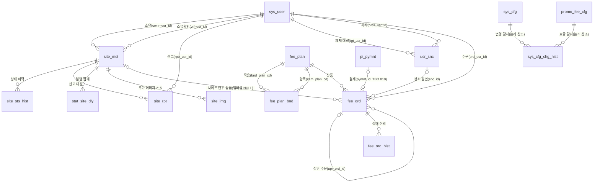

# 02_modeler_model — sitemap.pi 1차 데이터 모델 (개념·논리·물리)

- 잡 : `20261010_sitemap-data-model` / 단계 : 02 모델 / 작성 : modeler / 작성일 2026-10-10 / 승인 : leader (r1 요청)
- 입력 : `00_input.md`(§3 마스터 결정 8건, §3-1 마스터 확정 4건), `00_requirements.md`(REQ-01~92), `01_standards_dictionary.md` **r3**(leader r4 APPROVED — 마스터 약어 규칙 MV·ORD·`seq` 반영), As-Is `sitemap/sitemap.pi/sql/001_sitemap_phase1.sql`, 공용 `packages/pi-db/sql/000_baseline.sql`, `src/lib/site.ts`·`src/app/api/**`
- DDL 초안 : `02_modeler_ddl.sql` (Part A = Phase 1 델타, Part B = Phase 2) — ⛔ 운영 적용 금지, 마스터 승인 후 sql/ 확정
- **검증 실측** : PGlite(PostgreSQL 16 WASM, pg_trgm 포함)에 `000 → 001 → 02` 적용 + **02 재적용(멱등)** 통과. 동작 단언 29건 통과(r2 신규 6건 포함 — 중복 점유 거절 2·프로모 대상 거절·GRACE_DAY 누락 예외·501자 반려 거절·정지 사유 기록) — 기준선 이력 19건, 소유 확인 CHECK, 이동 URL CHECK, 신고 인용 RPC(정지·이력 사유 RPT_ACCEPT·재처리 NULL), 직권 정지 사유 NULL(설정값 누수 없음), 자사 구매 거절, 반짝임 NONE 거절·BSC1 허용, 카테고리 스냅샷, PREMIUM30 재고 소진 시 슬롯 거절, 멤버십 site_id 거절, 사이트 정지 → ACTIVE 회수·HELD 취소·재고 반환, 제재 → 멤버십 정지·판정 'N'·구매 거절, 오인 취소 → 복귀·0 Pi 보상 주문·주문 이력 3건. 운영 Supabase 미적용(범위 밖). da-ddl-guard 수동 실행 : `site_` 접두사 R2 2건 외 위반 없음(상단 DA-APPROVED 승계 주석으로 처리)
- 판 : **r3**(재점검 + 마스터 확정 반영 — sys_user 7컬럼 개명, 세션 필드 불변·매핑 원칙, 기존 함수 인자 grandfathered, 동반 변경표 §k. 변경 이력 참조)
- **r3 검증** : modeler 재현 스크립트 `02_modeler_pglite_check.mjs`(잡 디렉토리 보존) — **new 경로**(개명본 000 + 수정본 001 + 02 + 재적용) 단언 40건, **rename 경로**(구판 000·001 + 멱등 RENAME 델타 + 02 + 재적용) 단언 39건 모두 통과. 신규 단언 : 개명 7컬럼 존재·구 컬럼명 0, `sys_user_role_cd_check`·`ux_sys_user_pi_usr_nm_actv` 존재(구 인덱스명 0), 활성 `pi_usr_nm` 중복 INSERT 거절(REQ-11 불변 키), `role_cd` character varying(20), **단일 단어 컬럼 0**, grandfathered `fn_sel_stat_site_chg(p_days => 7)` 이름 호출 유지. 기존 단언 회귀 0. 컬럼 212(신규 152 / 승계 000 15 · 001 45). da-ddl-guard : 02는 R2 `site_` 2건 외 0, 개명본 000은 위반·경고 0, 구판 000은 R8 2건(`id`·`role`)
- 표기 : `[TBD]` 근거 없음 / `[확인중 : 마스터]` 마스터 결정 대기 / `M-n` 모델러 판정(leader 승인 대상)

---

## (a) 주제영역

| 주제영역 | 엔터티 | Phase | 비고 |
|---|---|---|---|
| 사용자 | `sys_user`(baseline 승계) · `usr_snc`(계정 제재) | 1 · 2 | sys_user 재정의·확장 금지(REQ-10, 마스터 확정 REQ-14) |
| 사이트 디렉터리 | `site_mst` · `site_sts_hist` · `site_rpt` · `site_img` | 1 · 1 · 1 · 2 | site_ 접두사 = 001 DA-APPROVED 승계 |
| 통계 | `stat_site_dly` | 1 | 001 그대로 |
| 요금·주문 | `fee_plan` · `fee_plan_bnd` · `fee_ord` · `fee_ord_hist` · `promo_fee_cfg` | 2 | 결제는 공용 `pi_pymnt`(010) 참조만 |
| 시스템 설정 | `sys_cfg` · `sys_cfg_chg_hist` | 2 | cafe sql/176 감사 구조 승계 |
| 결제(공용) | `pi_pymnt` | 2 | `@pi/db 010_pi_pymnt.sql` 대기 — **재정의 금지**, 참조만 |

DB 경계 : sitemap 전용 DB(운영 public / 개발·스테이징 `sitemap_dev`·`sitemap_stg`). cafe.pi DB 와 교차 FK 없음(REQ-02).

## (b) 개념 모델 (ERD)



- `sys_cfg_chg_hist` 는 cafe sql/176 과 같이 대상 테이블명+행 PK 문자열(`cfg_tbl_nm`·`cfg_tgt_id`)로 다형 참조 — FK 없음(대상 테이블이 여러 개).
- `pi_pymnt` FK 는 010 적용 후 추가(DDL 에 주석으로 위치 확보).

## (c) 논리 모델

### c-1. 엔터티·식별자

| 엔터티 | 논리명 | 주식별자 | 자연키·후보키 | 성격 |
|---|---|---|---|---|
| site_mst | 사이트 | site_id(UUID) | site_dom_nm — PENDING·APPROVED·SUSPENDED 활성 행 부분 UNIQUE(001) | 핵심 |
| site_sts_hist | 사이트상태이력 | hist_id | — | 이력(append-only) |
| site_rpt | 사이트신고 | rpt_id | (site_id, rptr_usr_id) RECEIVED 활성 UNIQUE(001) | 행위 |
| site_img | 사이트이미지 | img_id | (site_id, img_seq) 활성 UNIQUE | 종속 |
| stat_site_dly | 사이트일별통계 | (site_id, stat_dt) | — | 집계(001) |
| usr_snc | 사용자제재 | snc_id | tgt_usr_id ACTIVE 활성 UNIQUE(1인 1건) | 행위 |
| fee_plan | 요금상품 | fee_plan_id | fee_plan_cd 전체 UNIQUE(FK 대상) | 기준 |
| fee_plan_bnd | 요금상품묶음 | bnd_id | (bnd_plan_cd, item_plan_cd) 활성 UNIQUE | 교차(M:N 해소) |
| fee_ord | 요금주문 | ord_id | pymnt_id 활성 UNIQUE | 행위 |
| fee_ord_hist | 요금주문이력 | hist_id | — | 이력(append-only) |
| promo_fee_cfg | 프로모션요금설정 | promo_fee_id | 활성 1행(상수 식 부분 UNIQUE `((1))`) | 싱글톤 |
| sys_cfg | 운영설정 | cfg_id | cfg_key 활성 UNIQUE | 기준 |
| sys_cfg_chg_hist | 설정변경이력 | hist_id | — | 이력(append-only) |

### c-2. 관계·카디널리티

| 부모 | 자식 | 카디널리티 | 선택성 | FK(제약명) | 비고 |
|---|---|---|---|---|---|
| sys_user | site_mst(ownr_usr_id) | 1:N | 자식 선택(자사 시드 NULL) | site_mst_sys_user_id_fkey(001) | |
| sys_user | site_mst(vrf_usr_id) | 1:N | 선택 | site_mst_vrf_usr_id_fkey | 같은 부모 2번째 FK → 컬럼명으로 구분, 임베드 시 `!fkey` 힌트 |
| site_mst | site_sts_hist | 1:N | 필수 | site_sts_hist_site_mst_id_fkey | |
| site_mst | site_rpt | 1:N | 필수 | site_rpt_site_mst_id_fkey(001) | |
| sys_user | site_rpt | 1:N | 필수 | site_rpt_sys_user_id_fkey(001) | |
| site_mst | stat_site_dly | 1:N | 필수 | stat_site_dly_site_mst_id_fkey(001) | |
| site_mst | site_img | 1:0..4 | 필수 | site_img_site_mst_id_fkey | img_seq 2~5 |
| sys_user | usr_snc(tgt_usr_id) | 1:N(동시 ACTIVE ≤1) | 필수 | usr_snc_tgt_usr_id_fkey | |
| sys_user | usr_snc(prcs_usr_id) | 1:N | 필수 | usr_snc_prcs_usr_id_fkey | |
| fee_plan ↔ fee_plan | fee_plan_bnd | M:N → 교차 엔터티 | 필수 | fee_plan_bnd_bnd_plan_cd_fkey / _item_plan_cd_fkey | 묶음↔항목 |
| fee_plan | fee_ord | 1:N | 필수 | fee_ord_fee_plan_cd_fkey | 자연키(cd) 참조 — 임베드 `fee_plan(...)` |
| sys_user | fee_ord | 1:N | 필수 | fee_ord_sys_user_id_fkey | |
| site_mst | fee_ord | 1:N | 자식 선택(멤버십 NULL) | fee_ord_site_mst_id_fkey | |
| fee_ord | fee_ord(upr_ord_id) | 1:N(체인) | 선택(NEW 외 필수) | fee_ord_upr_ord_id_fkey | 갱신·연장·보상 체인 |
| usr_snc | fee_ord | 1:N | 선택(SUSPENDED 시 필수) | fee_ord_usr_snc_id_fkey | |
| fee_ord | fee_ord_hist | 1:N | 필수 | fee_ord_hist_fee_ord_id_fkey | |
| pi_pymnt | fee_ord | 1:0..1 | 선택(0 Pi NULL) | [TBD 010] | 키 타입·FK 는 010 확정 후 |

**FK 제약명 규칙(P-6, leader 확정)** : 기본 `<자식>_<부모>_id_fkey`. 같은 부모를 두 번째 이후로 참조하거나·자연키·자기참조 FK 는 `<자식>_<FK컬럼>_fkey` — 해당 7개 : `site_mst_vrf_usr_id_fkey` · `fee_plan_bnd_bnd_plan_cd_fkey` · `fee_plan_bnd_item_plan_cd_fkey` · `usr_snc_tgt_usr_id_fkey` · `usr_snc_prcs_usr_id_fkey` · `fee_ord_fee_plan_cd_fkey` · `fee_ord_upr_ord_id_fkey`. 같은 부모 복수 FK 는 PostgREST 임베드 시 `!<제약명>` 힌트 필수.

모든 FK 는 NO ACTION(ON DELETE 미지정) — 물리 DELETE 가 없으므로 동작 불필요. PostgREST 임베디드 조인 의존(루트 CLAUDE.md FK 정책) → 신규 관계도 FK 선언.

### c-3. 정규화·반정규화

기본 3NF. 반정규화는 아래만 두고 근거를 남긴다.

| # | 반정규화 | 위반 형태 | 근거 | 정합 수단 |
|---|---|---|---|---|
| N-1 | `site_mst.plan_cd`(001) | Phase 2 부터 fee_ord 파생값 | 버블 조회 경로 단순화(001 판정 12) | 동기화 규칙 [확인중 : 마스터](REQ-45) — §j |
| N-2 | `fee_ord.site_ctgr_cd` | site_id → site_ctgr_cd 이행 종속 | **주문 시점 스냅샷**(카테고리 변경 후에도 슬롯 재고 범위 유지) — 업무 요구 | INSERT 트리거가 강제로 채움(앱 입력 무시) |
| N-3 | `fee_ord.ord_pi_amt`·`nrm_pi_amt`·`promo_apl_yn` | fee_plan 값 복제 | **가격 변경 소급 금지**(REQ-62) — 스냅샷 | 주문 생성 시 확정, 이후 불변 |
| N-4 | `fee_plan.stk_cnt`·`stk_scp_cd` | 재고는 fee_tp_cd 종속인데 상품 행마다 보관 | 코드 테이블 없음(001 판정 3 CHECK 도메인) — 유형 마스터 신설보다 저렴 | 같은 유형 행은 같은 값 운영 규칙, 판정은 유형별 MIN(설계 한계 §j) |
| N-5 | `site_sts_hist.site_dom_nm`·`chg_rsn_cont` | site_mst 값 복제 | 이력 = 시점 스냅샷(덮어쓰기 대비 근거 보존) | 트리거 자동 복사 |
| N-6 | `site_mst.vrf_dom_nm` | 확인 시점 도메인 복제 | 확인 대상 도메인 증거 — 현재 도메인과 비교해 무효 판정 | CHECK `vrf_dom_nm = site_dom_nm` |

**채택하지 않은 반정규화(사전 조건부 단어 미사용)** : `fst_ord_id`(최초 주문 — 가격 잠금은 `upr_ord_id` 재귀 CTE, 월 구독 체인 연 12건 수준이라 충분), `dc_pi_amt`(= `nrm_pi_amt − ord_pi_amt` 파생), `fee_grp_cd`(fee_tp_cd 로 결정되는 파생 분류 — 화면 상수), `spk_yn`(반짝임 표시 = ACTIVE SPARKLE 주문 존재로 파생, M-17). 조건부 단어 ROOT/FST·DC·GRP·SPK 등재 불필요.

### c-4. 모델러 판정 (leader 승인 대상)

| # | 판정 | 사유 |
|---|---|---|
| M-1 | **`site_sts_hist` 신설 — 001 판정 11("hist 없음") 번복** | As-Is 는 현재값+modr_id/mod_dtm 만 남아 아래 4건에서 근거가 덮어써져 소실된다. ① 관리자 직권 정지 사유를 `rjct_rsn_cont` 에 쓰고 복구(restore)가 NULL 로 지움(`api/admin/sites/[id]/route.ts` suspend·restore 패치) ② 재제출·승인 시 `rjct_rsn_cd`·`rjct_rsn_cont` 초기화(`api/me/sites/[id]/route.ts` 패치, admin approve 패치) → OWNERSHIP 반려 근거(REQ-26) 소실 ③ 소유 확인(`ownershipVerified`)이 DB 에 전혀 남지 않음(REQ-28) ④ 신고 인용 실패 시 보상 처리가 신고를 RECEIVED·`prcs_cont` NULL 로 되돌려 처리 시도 흔적 소실(`api/admin/reports/[id]/route.ts`). ①②는 이력 스냅샷, ③은 M-3, ④는 M-5(RPC 원자화)로 해소 |
| M-2 | 상태 이력은 **site_mst AFTER 트리거로 자동 기록** — 앱 기록 아님 | 상태를 바꾸는 경로가 4개 API + RPC 로 흩어져 있어 앱 기록은 누락 위험. 행위자 = `NEW.modr_id`(앱이 이미 `modr_id: user.id` 를 쓰고 있음). 사유 코드는 REJECTED 면 `rjct_rsn_cd` 복사, 신고 인용 정지는 RPC 가 트랜잭션 로컬 설정 `sitemap.chg_rsn_cd='RPT_ACCEPT'` 로 전달(직권 정지는 NULL — old/new 쌍으로 판별). 기준선 이력 1건씩 백필 |
| M-3 | 소유 확인 결과 = **site_mst 현재값 4컬럼**(`vrf_yn`·`vrf_dtm`·`vrf_usr_id`·`vrf_dom_nm`) + CHECK `own_site_yn='Y' OR site_sts_cd NOT IN (APPROVED,SUSPENDED) OR (vrf_yn='Y' AND vrf_dom_nm=site_dom_nm)` | 승인 API 의 `ownershipVerified` 400 검사를 DB 가 재강제. 도메인 변경(DRAFT·REJECTED 에서만 허용)은 `vrf_dom_nm` 불일치로 자동 무효 → 초기화 로직 불필요. 승인 시점은 site_sts_hist 승인 행이 보존. 별도 확인 이력 테이블은 Phase 3 배지 요구 확정 시 |
| M-4 | 이동 URL = `site_mst.site_mv_url`(TEXT, https·≤1000 CHECK), **공개 응답 포함** | 마스터 확정 REQ-36(등록자 입력 + 관리자 심사). 심사 대상화는 기존 규칙 "APPROVED 내용 변경 → PENDING"(`api/me/sites/[id]` nextSts)을 그대로 적용 — 입력 스키마에 필드만 추가. 형식 CHECK 는 호스트 존재까지(`^https://[^\s/?#]+`) — 피싱·악성 URL 판정은 심사(사람) 책임. NULL = 도메인 사용 |
| M-5 | 신고 처리 = **RPC `fn_prcs_site_rpt`**(신고 상태 + 사이트 정지 단일 트랜잭션) | 현 앱은 PostgREST 다중 테이블 트랜잭션 불가로 보상 처리(실패 시 수동 확인 로그). RPC 로 원자화하면 보상 코드·④ 소실이 사라진다. 반환 NULL = 대상 없음·이미 처리(앱 409) |
| M-6 | `fee_tp_cd` = CTGR_SLOT·HOME_SLOT·STATS·PREMIUM30·MEMBERSHIP·SPARKLE — **REGISTER·EXTEND 제외** | REGISTER 는 무료라 주문·판매 행이 생기지 않음(등록은 site_mst). EXTEND 는 "같은 상품을 같은 단가로 이어 구매"라 상품 유형이 아니라 **주문 유형**(`ord_tp_cd='EXTEND'`, 같은 `fee_plan_cd`) — 유형으로 두면 단가 이중 관리. 표준사전 §5 코드값에서 두 값을 빼는 구조 판단(standards 검증 요청 시 명시) |
| M-7 | 재고 = `fee_plan.stk_cnt`·`stk_scp_cd`(유형 단위, N-4), PREMIUM30 은 NULL(구성 항목 재고로 판정) | 슬롯 재고는 기간(7일/30일) 무관 유형 공유. 묶음은 `fee_plan_bnd` 로 소비 유형 산출 |
| M-8 | 구매 자격·재고 = **fee_ord BEFORE INSERT 트리거 `fn_vrf_fee_ord_ins`**(DB 강제) | 자사 구매 금지(REQ-44)·반짝임 유료 요금제 한정(REQ-55)·APPROVED·멤버십 site_id NULL·제재 중 멤버십 구매 금지는 **다른 테이블(site_mst·usr_snc) 값에 의존**해 CHECK 불가. 앱 강제는 주문 생성 경로(신규·0 Pi 프로모·갱신·연장·보상)가 여럿이라 누락 위험 → 트리거가 모든 INSERT 의 단일 관문. 재고 확보도 같은 관문에서 유형·범위별 advisory lock 후 점유 수 계산 — PRD "approve 단계 원자 확보 = 그 시점 HELD 주문 INSERT" 와 정확히 일치. **같은 사이트·같은 소비 유형(자기 유형 + 묶음 구성 유형) 점유 주문이 있으면 신규·갱신 거절(ALREADY_OCCUPIED — 이어 구매는 EXTEND, 이중 결제·기간 중복 방지, 사이트별 advisory lock)**, 프로모 0 Pi 는 프로모 대상 상품만(PROMO_NOT_ELIGIBLE). 실패는 `P0001` + 메시지 코드(OWN_SITE_NOT_BUYABLE·SPARKLE_PLAN_REQUIRED·ALREADY_OCCUPIED·PROMO_NOT_ELIGIBLE·STOCK_EXHAUSTED 등) → 앱이 approve 거절(Pi 미차감) |
| M-9 | 다중 테이블 연쇄 = **트리거(불변식) / RPC(업무 행위)** 분리 — §h-4 | 경로와 무관하게 항상 성립해야 하는 불변식(정지·철회 사이트에 이용 중 주문 없음, 제재 중 멤버십 ACTIVE 없음)은 트리거, 사람이 판단하는 행위(신고 인용, 사이트 단위 오인 보상)는 RPC |
| M-10 | `usr_snc` 는 별도 이력 테이블 없음 | 전이가 ACTIVE→RELEASED/CANCELED **1회뿐**이고 행 자체가 이력(처리자 `prcs_usr_id`, 해제자 `modr_id`, 해제 시각 `rel_dtm`). 주문 쪽 영향은 `fee_ord_hist` 가 기록 |
| M-11 | `fee_ord.snc_id` 채택(표준사전 조건부) | 해제 시 "이 제재로 정지된 주문만" 정확히 복귀 — 다른 원인(향후) SUSPENDED 와 섞이지 않음. CHECK SUSPENDED ⇒ snc_id 필수 |
| M-12 | `site_img` = **추가 이미지 2~5번째만**, 대표(1번 = 로고)는 기존 `site_mst.site_img_url` | 표준사전 예시(img_seq 1=대표)와 달리 1번을 두지 않는다 — 대표 이미지의 이중 출처 방지, Phase 1 코드·버블 조회 무변경. 만료 시 비노출은 조회 시 `fn_sel_mbr_actv_yn` 계산(노출 컬럼 저장 안 함 — DSPL 단어 불필요) |
| M-13 | `sys_cfg` PK = `cfg_id` UUID + `cfg_key` 활성 UNIQUE | 정본 PK 규칙(`<엔터티약어>_id UUID`) 준수, 감사 이력 `cfg_tgt_id` 에 키 문자열 기록 가능 |
| M-14 | 요금제 화면 상수(면적 21.16·9.27·6.76·4.15·2.43·0.7, 색, 반짝임 보색, 배지) **DB 미저장**, 레벨 LV5~LV1 은 `PLAN_CD` 배열 순서에서 파생 | leader D-8 확정. plan_cd CHECK 6값(001) 유지, 코드 상수(`site.ts` PLAN_AREA·PLAN_COLOR·PLAN_SPARKLE·PLAN_BADGE)가 원천. 마스터 결정 #1·#2 반영(구 "면적 ×2 등비" 서술은 PRD 문서 갱신 대상) |
| M-15 | `pymnt_id TEXT` 가안 + FK 주석 | 키 타입 [TBD 010] — DDL 문법 유효성을 위해 TEXT 로 두되 010 확정 시 교체. `pi_pymnt` 재정의 없음 |
| M-16 | 함수 명명 동사 : `ins`·`upd`·`sel`·`inc`(001 선례), `prcs`·`rvk`·`chg`·`vrf`(등재·r3 단어) | MBR = 정본 §9 등재어 `member`·`mbr` 재사용(standards 검증 회신) — `fn_sel_mbr_actv_yn` 유지 |
| M-17 | 반짝임 표시 = 해당 사이트의 ACTIVE·미만료 SPARKLE 주문 존재 AND `plan_cd <> 'NONE'` AND `own_site_yn='N'` (파생) | site_mst 플래그 반정규화 안 함(동기화 대상 증가 방지, 버블 API 가 sitemap 규모 200 상한이라 조인 비용 무시 가능) |

## (d) 물리 테이블 정의서

공통 : 시스템 컬럼 4종 `regr_id TEXT NOT NULL DEFAULT 'ADMIN'` · `reg_dtm TIMESTAMPTZ NOT NULL DEFAULT CURRENT_TIMESTAMP` · `modr_id TEXT NOT NULL DEFAULT 'ADMIN'` · `mod_dtm TIMESTAMPTZ NOT NULL DEFAULT CURRENT_TIMESTAMP`(테이블 끝), 논리삭제 `del_yn CHAR(1) NOT NULL DEFAULT 'N' CHECK(Y,N)` + `del_dtm TIMESTAMPTZ`. 아래 표에서는 "시스템6" 으로 줄인다. mod_dtm 트리거 `fn_upd_<tbl>_mod_dtm`/`trg_<tbl>_mod_dtm` — append-only `_hist` 3종은 정본 §6 예외(트리거 없음, 논리삭제 시 modr_id·mod_dtm 수동). 전 테이블·RPC `fn_grant_svc_only`(RLS 비활성 + service_role 전용).

### d-1. site_mst (001 + Part A 델타) — 사이트

| 컬럼 | 타입 | NULL | 기본값 | 제약·설명 | 출처 |
|---|---|---|---|---|---|
| site_id | UUID | N | gen_random_uuid() | PK | 001 |
| site_dom_nm | VARCHAR(253) | N | | 정규식 `^[a-z0-9]([a-z0-9-]{0,61}[a-z0-9])?\.pi$`, 점유 상태 부분 UNIQUE | 001 |
| site_nm | VARCHAR(100) | N | | 사이트명 = **회사명**(마스터 확정 REQ-35, 별도 속성 없음) | 001 |
| site_ctgr_cd | VARCHAR(20) | N | | CHECK 9종 | 001 |
| site_desc | TEXT | Y | | ≤2000 | 001 |
| site_img_url | TEXT | Y | | 대표 이미지 = 버블 로고 | 001 |
| site_sts_cd | VARCHAR(20) | N | 'DRAFT' | CHECK 6종 | 001 |
| rjct_rsn_cd / rjct_rsn_cont | VARCHAR(20) / TEXT | Y | | CHECK 9종, REJECTED 시 필수 / **`site_mst_rjct_rsn_cont_check` ≤500(A 신규)** — 정지 시 처리 내용도 기록 | 001(+A) |
| apv_dtm | TIMESTAMPTZ | Y | | 최초 승인, APPROVED·SUSPENDED 필수 | 001 |
| ownr_usr_id | UUID | Y | | FK sys_user, 자사만 NULL | 001 |
| own_site_yn | CHAR(1) | N | 'N' | 자사(구매 금지) | 001 |
| plan_cd | VARCHAR(10) | N | 'NONE' | CHECK VIP·PRM2·PRM1·BSC2·BSC1·NONE | 001 |
| pvt_cntc_txt / pub_cntc_txt | TEXT | Y | | 비공개(공개 응답 제외)/공개 옵트인 | 001 |
| **site_mv_url** | TEXT | Y | | `site_mst_site_mv_url_check` : https·호스트·≤1000. 등록자 입력·심사 | **A 신규** |
| **vrf_yn** | CHAR(1) | N | 'N' | `site_mst_vrf_yn_check`·`site_mst_vrf_yn_apv_check` | **A 신규** |
| **vrf_dtm** | TIMESTAMPTZ | Y | | `site_mst_vrf_dtm_check`(Y 면 3컬럼 필수) | **A 신규** |
| **vrf_usr_id** | UUID | Y | | FK `site_mst_vrf_usr_id_fkey` → sys_user | **A 신규** |
| **vrf_dom_nm** | VARCHAR(253) | Y | | 확인 시점 도메인 | **A 신규** |
| 시스템6 | | | | | 001 |

인덱스 : 001 6종(ux_site_mst_site_dom_nm_actv · idx_site_mst_apv_dtm · idx_site_mst_site_ctgr_cd · idx_site_mst_site_sts_cd · idx_site_mst_ownr_usr_id · trgm 2종) + **idx_site_mst_vrf_usr_id**(활성·NOT NULL 부분). 트리거 : trg_site_mst_mod_dtm(001) · **trg_site_mst_sts_hist**(A) · **trg_site_mst_ord_rvk**(B).

### d-2. site_sts_hist (Part A 신규) — 사이트상태이력, append-only

| 컬럼 | 타입 | NULL | 기본값 | 제약·설명 |
|---|---|---|---|---|
| hist_id | UUID | N | gen_random_uuid() | PK |
| site_id | UUID | N | | FK site_sts_hist_site_mst_id_fkey |
| old_sts_cd | VARCHAR(20) | Y | | 최초 생성 NULL, CHECK 6종 |
| new_sts_cd | VARCHAR(20) | N | | CHECK 6종 |
| chg_rsn_cd | VARCHAR(20) | Y | | CHECK 반려사유 9종 + RPT_ACCEPT |
| chg_rsn_cont | TEXT | Y | | ≤500, REJECTED·SUSPENDED 시 rjct_rsn_cont 스냅샷 |
| site_dom_nm | VARCHAR(253) | N | | 전이 시점 도메인 |
| chgr_id | TEXT | N | | 수행자(NEW.modr_id) |
| chg_dtm | TIMESTAMPTZ | N | CURRENT_TIMESTAMP | |
| 시스템6 | | | | mod_dtm 트리거 없음(§6 예외) |

인덱스 : idx_site_sts_hist_site_id(site_id, chg_dtm DESC) · idx_site_sts_hist_site_dom_nm(site_dom_nm) WHERE chg_rsn_cd='OWNERSHIP'.

### d-3. site_rpt · stat_site_dly (001 그대로)

- site_rpt : rpt_id PK · site_id FK · rptr_usr_id FK · rpt_rsn_cd(10종) · rpt_cont(≤1000) · rpt_sts_cd(RECEIVED·ACCEPTED·DISMISSED) · prcs_dtm(처리 상태 필수) · prcs_cont · 시스템6. 인덱스 ux_site_rpt_site_id_rptr_actv · idx_site_rpt_rpt_sts_cd. **처리 경로만 RPC 로 변경(M-5)** — 구조 무변경.
- stat_site_dly : PK(site_id, stat_dt) · view_cnt·clck_cnt INT ≥0 · 시스템6. RPC fn_inc_stat_site_dly · fn_sel_stat_site_chg · idx_stat_site_dly_stat_dt. 무변경.

### d-4. site_img (Part B) — 사이트이미지

| 컬럼 | 타입 | NULL | 기본값 | 제약·설명 |
|---|---|---|---|---|
| img_id | UUID | N | gen_random_uuid() | PK |
| site_id | UUID | N | | FK site_img_site_mst_id_fkey |
| img_url | TEXT | N | | https·≤1000, Storage 본인 폴더(앱 isOwnImgUrl) |
| img_seq | INT | N | | 2~5 (1 = site_mst.site_img_url) |
| 시스템6 | | | | |

인덱스 : ux_site_img_site_id_img_seq_actv.

### d-5. usr_snc (Part B) — 사용자제재

| 컬럼 | 타입 | NULL | 기본값 | 제약·설명 |
|---|---|---|---|---|
| snc_id | UUID | N | gen_random_uuid() | PK |
| tgt_usr_id | UUID | N | | FK usr_snc_tgt_usr_id_fkey |
| snc_tp_cd | VARCHAR(20) | N | 'SUSPEND' | CHECK SUSPEND |
| snc_sts_cd | VARCHAR(20) | N | 'ACTIVE' | CHECK ACTIVE·RELEASED·CANCELED |
| snc_rsn_cd | VARCHAR(20) | N | | CHECK 제안값 11종 [TBD : legal-compliance-advisor] |
| snc_rsn_cont | TEXT | Y | | ≤500 |
| snc_bgn_dtm | TIMESTAMPTZ | N | CURRENT_TIMESTAMP | 등록 즉시 발효 |
| snc_end_dtm | TIMESTAMPTZ | Y | | 예정 종료(NULL 무기한), > bgn |
| rel_dtm | TIMESTAMPTZ | Y | | 실제 해제·취소, ACTIVE ⇔ NULL, ≥ bgn |
| prcs_usr_id | UUID | N | | FK usr_snc_prcs_usr_id_fkey(제재를 건 관리자) |
| 시스템6 | | | | modr_id = 해제·취소 처리자 |

인덱스 : ux_usr_snc_tgt_usr_id_actv(1인 진행 중 1건) · idx_usr_snc_snc_end_dtm(만료 배치) · idx_usr_snc_prcs_usr_id.

### d-6. fee_plan · fee_plan_bnd (Part B)

fee_plan — 요금상품

| 컬럼 | 타입 | NULL | 기본값 | 제약·설명 |
|---|---|---|---|---|
| fee_plan_id | UUID | N | gen_random_uuid() | PK |
| fee_plan_cd | VARCHAR(30) | N | | **전체 UNIQUE**(fee_plan_fee_plan_cd_key, FK 대상·재사용 금지), UPPER_SNAKE |
| fee_tp_cd | VARCHAR(20) | N | | CHECK 6종(M-6) |
| use_day_cnt | INT | Y | | lft_yn=Y ⇔ NULL, 아니면 >0 |
| lft_yn | CHAR(1) | N | 'N' | Y 는 MEMBERSHIP 만 |
| subscr_yn | CHAR(1) | N | 'N' | Y 는 MEMBERSHIP 만 |
| pi_amt | NUMERIC(18,7) | N | | ≥0 판매가 |
| nrm_pi_amt | NUMERIC(18,7) | N | | ≥ pi_amt 정가 |
| stk_cnt | INT | Y | | >0, stk_scp_cd 와 동시 NULL |
| stk_scp_cd | VARCHAR(20) | Y | | PER_CTGR·GLOBAL |
| promo_apl_yn | CHAR(1) | N | 'N' | 오픈 프로모 대상(7일 슬롯 행만 Y 운영) |
| apl_bgn_dtm / apl_end_dtm | TIMESTAMPTZ | Y | | 판매 기간, end > bgn |
| use_yn | CHAR(1) | N | **'N'** | 판매 on/off — 기본 중지(판매 개시 게이트 REQ-72) |
| sort_seq | INT | N | 0 | 정렬(`ord` 도메인 신규 금지 → seq) |
| fee_plan_desc | TEXT | Y | | ≤2000 관리 메모(표시명은 번역키) |
| 시스템6 | | | | |

인덱스 : idx_fee_plan_fee_tp_cd(fee_tp_cd, sort_seq). **행 시드 없음** — 단가 [확인중 : 마스터]. PRD 제안 행 예시 : CTGR_SLOT 7일 1 Pi·30일 3 Pi(stk 3 PER_CTGR) / HOME_SLOT 7일 2·30일 6(stk 6 GLOBAL) / STATS 30일 1 / PREMIUM30 9(정가 10) / MEMBERSHIP 30·180·365·730·1825·3650일·영구(3·15·27·48·108·180·270) + 구독 월 2.7·연 27 / SPARKLE [확인중].

fee_plan_bnd — 요금상품묶음 : bnd_id PK · bnd_plan_cd FK · item_plan_cd FK(≠ bnd) · 시스템6. 인덱스 ux_fee_plan_bnd_item_actv · idx_fee_plan_bnd_item_plan_cd.

### d-7. fee_ord · fee_ord_hist (Part B)

fee_ord — 요금주문

| 컬럼 | 타입 | NULL | 기본값 | 제약·설명 |
|---|---|---|---|---|
| ord_id | UUID | N | gen_random_uuid() | PK |
| ord_usr_id | UUID | N | | FK fee_ord_sys_user_id_fkey |
| site_id | UUID | Y | | FK fee_ord_site_mst_id_fkey, 멤버십 NULL(트리거) |
| fee_plan_cd | VARCHAR(30) | N | | FK fee_ord_fee_plan_cd_fkey |
| site_ctgr_cd | VARCHAR(20) | Y | | 스냅샷 — 트리거가 site_mst 값으로 강제 |
| ord_pi_amt | NUMERIC(18,7) | N | | 실결제 스냅샷 ≥0, ≤ nrm_pi_amt |
| nrm_pi_amt | NUMERIC(18,7) | N | | 정가 스냅샷 |
| promo_apl_yn | CHAR(1) | N | 'N' | Y 는 NEW·0 Pi 만(`fee_ord_promo_apl_yn_tp_check`) |
| pymnt_id | TEXT | Y | | [TBD 010] 가안, 활성 UNIQUE, 유료 이용 상태 필수 |
| ord_sts_cd | VARCHAR(20) | N | 'HELD' | CHECK 6종 |
| ord_tp_cd | VARCHAR(20) | N | 'NEW' | CHECK NEW·RENEW·EXTEND·CMPN, CMPN 은 0 Pi |
| use_bgn_dtm / use_end_dtm | TIMESTAMPTZ | Y | | 이용 상태면 bgn 필수, 영구 end NULL, end > bgn |
| hld_expr_dtm | TIMESTAMPTZ | Y | | HELD 필수 |
| upr_ord_id | UUID | Y | | FK 자기참조, NEW 외 필수 |
| subscr_cnl_yn | CHAR(1) | N | 'N' | "갱신 안 함" 표시만 |
| rvk_rsn_cd / rvk_dtm | VARCHAR(20) / TIMESTAMPTZ | Y | | REVOKED ⇔ 사유·일시 필수, CHECK 4종([TBD] 제안명) |
| snc_id | UUID | Y | | FK fee_ord_usr_snc_id_fkey, SUSPENDED 필수 |
| 시스템6 | | | | |

인덱스 : ux_fee_ord_pymnt_id_actv · ux_fee_ord_site_id_promo_actv(프로모 사이트당 1건) · idx_fee_ord_ord_usr_id · idx_fee_ord_site_id · idx_fee_ord_fee_plan_cd(재고, HELD·ACTIVE 부분) · idx_fee_ord_use_end_dtm(만료 배치) · idx_fee_ord_hld_expr_dtm · idx_fee_ord_upr_ord_id · idx_fee_ord_snc_id. 트리거 : mod_dtm · trg_fee_ord_ins_vrf(BEFORE INSERT) · trg_fee_ord_sts_hist(AFTER).

fee_ord_hist — 요금주문이력(append-only) : hist_id PK · ord_id FK · old_sts_cd(생성 NULL)·new_sts_cd CHECK 6종 · chg_rsn_cd(REVOKED 시 rvk_rsn_cd 복사, CHECK 4종) · chgr_id · chg_dtm · 시스템6. 인덱스 idx_fee_ord_hist_ord_id.

### d-8. promo_fee_cfg · sys_cfg · sys_cfg_chg_hist (Part B)

- promo_fee_cfg : promo_fee_id PK · promo_actv_yn('N') · promo_bgn_dtm·promo_end_dtm(end > bgn) · chg_rsn_cont(≤500) · 시스템6. **ux_promo_fee_cfg_sngl ON ((1)) WHERE del_yn='N'**(키 컬럼 없음). 비활성 1행 시드.
- sys_cfg : cfg_id PK · cfg_key VARCHAR(50)(UPPER_SNAKE CHECK, 활성 UNIQUE) · cfg_val JSONB · cfg_desc(≤2000) · use_yn('Y') · 시스템6. 시드 7키(EXTEND_BGN_DAY 7 · EXTEND_MAX_DAY 90 · EXTEND_COOL_DAY 7 · GRACE_DAY 7 · NTCE_DAY_LIST [7,3,1] · MBR_DC_PCT 10 · MBR_DC_MIN_PI 1) — PRD 제안값 [확인중 : 마스터].
- sys_cfg_chg_hist : cafe sql/176 구조(hist_id·cfg_tbl_nm VARCHAR(63)·cfg_tgt_id·chg_actn_cd·old_val·new_val·chg_rsn_cont·chgr_id·chg_dtm·시스템6), 차이 = `cfg_tbl_nm` CHECK(sys_cfg·promo_fee_cfg·fee_plan·fee_plan_bnd)·`chg_actn_cd` 에서 SWITCH 제외·스키마 접두 없음·`cfg_tbl_nm` TEXT→VARCHAR(63)(표준사전 §3 nm). 인덱스 idx_sys_cfg_chg_hist_cfg_tgt_id.

## (e) 요구 추적표 (REQ → 엔터티·속성·규칙)

| REQ | 반영 | 위치 |
|---|---|---|
| 01 시스템6·논리삭제 | 신규 10개 테이블 전부, _hist 3종 트리거 예외 | d 공통 |
| 02 전용 DB·스키마 비의존 | 접두 없음, 함수 SET search_path FROM CURRENT | DDL 전체 |
| 03 RLS 비활성·service_role | fn_grant_svc_only 테이블 10·RPC 2(Part A 2, B 10) | DDL 끝 |
| 04 FK 유지 | 신규 FK 13개(NO ACTION), 같은 부모 2개는 컬럼명 제약명 + 임베드 힌트 | c-2 |
| 05 TIMESTAMPTZ·UTC 일자 | 신규 일시 전부 TIMESTAMPTZ | d |
| 06 Pi 직접 표기·금지 어휘 | `*_pi_amt NUMERIC(18,7)`, BEAN/TOKEN/COIN 0건 | d-6·7 |
| 07 pg_trgm | 001 유지(신규 검색 대상 없음) | i |
| 08 페이지네이션 인덱스 | 001 유지, 신규 목록 인덱스(주문·제재·이력) | i |
| 10 sys_user 승계 | 재정의 없음, FK 참조만. 단 정본 v2.4·마스터 확정 개명 7건은 baseline 동반 변경 | g, k |
| 11 사람의 불변 키(pi_usr_nm, 구 pi_username) | 업무 키 복제 없음(UUID FK). 개명 영향 §k-3 | g, k |
| 12 관리자 = role_cd ADMIN | 처리자 = modr_id / prcs_usr_id / vrf_usr_id / chgr_id | d |
| 13 탈퇴·차단 | baseline 그대로. 탈퇴 시 멤버십 소멸 판정은 sys_user.del_yn(앱) | h-3 |
| 14 계정 제재(**마스터 확정**) | `usr_snc` + 트리거 연쇄(정지·복귀·보상), sys_user 미확장 | d-5, h-3·4 |
| 20 도메인·대리키 | 001 유지 | d-1 |
| 21 구분 9종 | 001 CHECK, fee_ord.site_ctgr_cd 동일 CHECK | d-1·7 |
| 22 사이트 상태 흐름 | 001 CHECK + 이력 | h-1 |
| 23 반려 사유 9종 | 001 + site_sts_hist.chg_rsn_cd | d-2 |
| 24 도메인 점유 | 001 부분 UNIQUE | i |
| 25 DRAFT+PENDING 5건 | 앱(현행) | h-1 |
| 26 OWNERSHIP 재제출 차단 | site_sts_hist(도메인 스냅샷) + idx_site_sts_hist_site_dom_nm | M-1, d-2 |
| 27 확인 키(HMAC) 미저장 | 컬럼 없음(유지) | — |
| 28 소유 확인 결과 저장 | site_mst.vrf_* 4컬럼 + CHECK | M-3 |
| 29 apv_dtm 최초 승인 | 001 유지(앱 덮어쓰기 금지) | d-1 |
| 30 연락처 | 001 유지(길이 앱 검증, 개인정보 등급 [TBD]) | j |
| 31 설명 500/2000 | 001 CHECK ≤2000 | d-1 |
| 32 자사 19개 시드 | 001 유지, 기준선 이력 19건 백필. 보류 사유 DB 보관 [확인중 : 마스터] | A2, j |
| 33 샘플 91개 미시드 | DB 객체·행 없음 | — |
| 35 회사명 = site_nm(**마스터 확정**) | 별도 속성 없음 | d-1 |
| 36 이동 URL(**마스터 확정**) | site_mv_url + CHECK, 변경 시 재심사 | M-4 |
| 37 외부 이동 A-6 | 앱, 클릭 = stat CLCK | — |
| 38 이미지 업로드 | site_img_url(001) | d-1 |
| 39 다건 이미지·만료 비노출 | site_img(2~5) + 조회 시 멤버십 판정 | M-12 |
| 40 요금제 6값 | 001 plan_cd CHECK | d-1 |
| 41 면적 가중치(마스터 #1) | DB 미저장 — 화면 상수 | M-14 |
| 42 레벨 LV(마스터 #2) | PLAN_CD 순서 파생, 저장 금지 | M-14 |
| 43 배지 | 화면 상수 | M-14 |
| 44 자사 요금제 관리자 배정·구매 금지 | plan_cd 수기 + fn_vrf_fee_ord_ins `OWN_SITE_NOT_BUYABLE` | M-8 |
| 45 plan_cd ← 멤버십 동기화 | 규칙 미정 [확인중 : 마스터] | j |
| 46 PRM1·BSC2 기간 동일 | 요금제-기간 매핑 DB 고정 안 함 [확인중 : 마스터] | j |
| 47 버블 API | 조회 컬럼 + site_mv_url + 반짝임 파생(Phase 2) | h-5 |
| 50 광고 판정 | 파생 : plan_cd≠NONE AND own=N → 광고 / own=Y → 자사 / 슬롯·반짝임 ACTIVE 주문 → 광고 | h-5 |
| 51 결제 ≠ 일반 순위 | 정렬 인덱스에 결제 속성 없음 | i |
| 52 추천 영역 | idx_fee_ord_site_id·fee_plan_cd 로 ACTIVE 슬롯 조회, 순서 저장 안 함 | i |
| 53 fee_plan 단일 출처 | fee_plan(fee_tp_cd 교정, use_day_cnt·stk_cnt·nrm_pi_amt·sort_seq) | d-6 |
| 54 재고·경합 | 트리거 advisory lock + 점유 수 판정, HELD 15분은 hld_expr_dtm 로 즉시 제외 | M-7·8 |
| 55 반짝임 실구매(**마스터 확정** : 유료 요금제만) | fee_tp_cd SPARKLE + fee_ord(사이트 단위) + 트리거 `SPARKLE_PLAN_REQUIRED`. 가격·기간·재고 [확인중 : 마스터] | M-8·17 |
| 56 PREMIUM30 묶음 | fee_plan_bnd + 구성 항목 재고 동시 확보 | d-6, M-8 |
| 57 EXTEND | ord_tp_cd EXTEND + upr_ord_id, 재고 미차감. 7·90·7 은 sys_cfg, 연속 일수 판정은 앱/RPC | M-6, h-3 |
| 58 기간제 7종 | fee_plan 행(use_day_cnt·lft_yn·use_yn) — 시드는 단가 확정 후 | d-6 |
| 59 운영 설정 | sys_cfg + sys_cfg_chg_hist | d-8 |
| 60 구독·가격 잠금 | subscr_yn·RENEW·upr_ord_id 재귀(최초 금액)·subscr_cnl_yn | h-3 |
| 61 오픈 프로모 | promo_fee_cfg 싱글톤 + promo_apl_yn 스냅샷 + 사이트당 1건 UNIQUE + NEW·0 Pi CHECK | d-7·8 |
| 62 금액 스냅샷 | ord_pi_amt·nrm_pi_amt NOT NULL | N-3 |
| 63 멤버십 할인 | MBR_DC_PCT·MBR_DC_MIN_PI(sys_cfg), 할인액 = nrm − ord 파생 | c-3 |
| 64 fee_ord | d-7 (`ord_sts_cd`·`ord_*` r3 명명) | d-7 |
| 65 주문 상태 흐름 | CHECK 6종 + 조건 CHECK 9종 + 이력 | h-2 |
| 66 멤버십 활성 함수 | fn_sel_mbr_actv_yn(plpgsql, GRACE_DAY 누락 시 CFG_MISSING 예외) | i |
| 67 수명주기(이어붙임·영구·단건/구독 배타) | RPC 계약(사용자별 advisory lock) — Phase 2 구현 | h-3 |
| 68 정지·철회 회수·보상 | 트리거(회수) + 사이트 오인 보상 RPC 계약 / 제재 오인 보상은 트리거 | h-4 |
| 69 pi_pymnt 승계·서버 정가 재계산 | pymnt_id [TBD 010], ord_pi_amt 대조 규칙 | g, h-3 |
| 70 metadata.type | SITE_MBR 확정, 나머지 [TBD](pi_pymnt 소관) | j |
| 71 환불 | 엔터티 없음 [확인중 : 마스터] | j |
| 72 판매 개시 게이트 | fee_plan.use_yn(기본 N)·apl_bgn_dtm | d-6 |
| 73 만료 알림 저장 | 엔터티 없음 [확인중 : 마스터] — NTCE_DAY_LIST 만 | j |
| 75~77 신고 | 001 + 처리 RPC | M-5 |
| 78·79·83 통계 | 001 유지 | i |
| 80 감사 이력 | site_sts_hist·fee_ord_hist·sys_cfg_chg_hist (제재는 행 자체, M-10) | M-1·2 |
| 81 STATS 유입 | 미모델 [TBD : 마스터 — 유입 정의] | j |
| 85 다국어 | 표시명 컬럼 없음(번역키) | — |
| 86 단일 언어 콘텐츠 | 001 유지 | — |
| 90·91 리뷰·배지(Phase 3) | 연결점 : site_mst.vrf_*(배지 근거) | M-3 |
| 92 허브 | 반영 금지 | — |

마스터 결정 8건(00_input §3) 반영 : #1 M-14 · #2 M-14 · #3 SPARKLE(M-6·8·17) · #4 site_mv_url(M-4) · #5 site_img_url·site_nm + 광고 파생(h-5) · #6 자사 구매 금지 트리거 · #7 샘플 미시드 · #8 search_path·fn_grant_svc_only.

## (f) As-Is(001) 대비 델타

| 구분 | 대상 | 사유 |
|---|---|---|
| 유지 | site_mst 기존 21컬럼·제약·인덱스·시드 19, site_rpt, stat_site_dly, fn_inc_stat_site_dly, fn_sel_stat_site_chg, plan_cd CHECK | 001 승인 범위, 재명명 금지 |
| 변경 | site_mst + 5컬럼(site_mv_url·vrf_*) + 제약 4 + FK 1 + 인덱스 1 + 트리거 2(A 이력, B 회수) | REQ-28·36·68·80 |
| 변경(판정) | 001 판정 11 "hist 없음" → site_sts_hist 신설 | M-1 ①~④ |
| 변경(경로) | 신고 처리 = fn_prcs_site_rpt RPC | M-5 |
| 신규 A | site_sts_hist, fn_ins_site_sts_hist, fn_prcs_site_rpt | Phase 1 |
| 신규 B | sys_cfg, sys_cfg_chg_hist, promo_fee_cfg, fee_plan, fee_plan_bnd, usr_snc, fee_ord, fee_ord_hist, site_img, 트리거 함수 4(fn_ins_fee_ord_hist·fn_vrf_fee_ord_ins·fn_rvk_site_fee_ord·fn_chg_usr_snc_fee_ord), fn_sel_mbr_actv_yn | Phase 2 |

**⚠ 동시 배포 조건(C-1)** : Part A 는 **앱 승인 API 변경(①, `vrf_*` 4컬럼 기록)과 동시 배포 필수** — A 만 적용하면 외부 사이트 승인이 `site_mst_vrf_yn_apv_check`(23514)로 전부 실패한다. 또한 사이트 상태 이력의 수행자는 `NEW.modr_id` 를 복사하므로 **사이트 생성 API 가 INSERT 때 `modr_id` 를 사용자 ID 로 넣는지 확인**(미설정 시 chgr_id 가 기본값 ADMIN 으로 오기록) — 현행 `src/app/api/me/sites/route.ts:74-75`(`regr_id`·`modr_id: user.id`) 충족.

**적용 순서** : 000_baseline → 001 → (A) `sql/002_sitemap_phase1_delta.sql` → [Phase 2 착수 + `@pi/db 010_pi_pymnt.sql`] → (B) `sql/003_sitemap_phase2.sql`(pymnt_id 타입 교체·FK 추가 포함). A 는 001 이 적용되지 않은 현 상태라 001 과 함께 적용 가능(데이터 이행 없음 — migration 미소집 근거 유지).

**앱 변경 동반(이 잡 범위 밖, 구현 턴 체크리스트)** : ① 승인 API 가 `ownershipVerified` 시 `vrf_yn='Y', vrf_dtm, vrf_usr_id=admin.id, vrf_dom_nm=site_dom_nm` 동시 기록(없으면 23514) ② 신고 처리 API → `rpc('fn_prcs_site_rpt')`(보상 코드 삭제) ③ `siteInputSchema`·패치·`PUBLIC_SITE_COLS` 에 `site_mv_url`(mvUrl) 추가 ④ `api/bubbles` 의 `sites.json url`·`REG_URL` 을 `site_mv_url` 로 대체(정적 폴백은 유지) ⑤ OWNERSHIP 재제출 판정을 site_sts_hist 조회로 확장.

## (g) baseline 승계 방식

- `sys_user` : 000_baseline 정의 그대로 사용 — 재정의·ALTER·컬럼 추가 없음. 참조는 `sys_user.usr_id`(UUID, r3 개명 — §k) FK 만 : ownr_usr_id·vrf_usr_id·rptr_usr_id·tgt_usr_id·prcs_usr_id·ord_usr_id. 계정 제재는 sys_user 가 아니라 `usr_snc`(마스터 확정 REQ-14). baseline `ADMIN_BLCK`(삭제·부활 불가)과 제재(혜택 정지·해제 가능)는 다른 개념으로 공존.
- `pi_pymnt` : baseline 에 **없음**(000 판정 5 의도적 제외 — 00_input §2 서술 정정 대상). `@pi/db 010_pi_pymnt.sql` 로 추가 예정이며 sitemap 은 `fee_ord.pymnt_id` 로 참조만. 키 타입 [TBD 010], FK 는 010 적용 후 `ALTER TABLE fee_ord ADD CONSTRAINT fee_ord_pi_pymnt_id_fkey ...`.
- `fn_grant_svc_only`·`pg_trgm` : baseline 함수·확장 재사용.

## (h) 업무 규칙·상태 전이

### h-1. 사이트 심사

| 전이 | 주체·경로 | DB 강제 | 이력 |
|---|---|---|---|
| (생성) → DRAFT/PENDING | 등록자 POST | 도메인 CHECK, 점유 UNIQUE(PENDING), 5건 상한은 앱 | old NULL |
| DRAFT → PENDING | 등록자 제출 | 점유 UNIQUE | 행 1 |
| APPROVED → PENDING | 등록자 내용 변경(이동 URL 포함) — **재심사** | — | 행 1 |
| PENDING → APPROVED | 관리자 승인 | `vrf_yn_apv_check`(외부 사이트 소유 확인 필수), apv_dtm 필수 | 행 1 |
| PENDING → REJECTED | 관리자 반려 | 사유 필수 | chg_rsn_cd = 반려사유, 도메인 스냅샷 |
| APPROVED → SUSPENDED | 관리자 직권 / 신고 인용(RPC) | — | 직권 NULL / RPT_ACCEPT |
| SUSPENDED → APPROVED | 관리자 복구 | vrf CHECK 재적용 | 행 1 |
| 임의(SUSPENDED·WITHDRAWN 제외) → WITHDRAWN | 등록자 | 앱 | 행 1 |
| 논리삭제 | del_yn='Y' | — | 상태 이력 없음(주문 회수 트리거만) |

### h-2. 주문 상태

| 전이 | 경로 | 강제 |
|---|---|---|
| (생성) HELD | approve 시 INSERT(재고 확보) | 트리거 자격·재고, hld_expr_dtm 필수 |
| (생성) ACTIVE | 0 Pi 프로모 · CMPN | 트리거 자격·재고(프로모), promo CHECK |
| HELD → ACTIVE | U2A complete — 서버가 fee_plan 정가(RENEW 는 체인 최초 ord_pi_amt) 재계산 대조 | pymnt_id 필수 CHECK |
| HELD → EXPIRED | 15분 배치(재고 판정은 배치 전에도 hld_expr_dtm 로 제외) | — |
| HELD → CANCELED | 사용자 취소 / 사이트 정지·철회·삭제(트리거) | — |
| ACTIVE → EXPIRED | use_end_dtm(멤버십 + GRACE_DAY) 경과 배치 | — |
| ACTIVE ↔ SUSPENDED | 제재 등록 / 해제·취소(트리거) | snc_id 필수 |
| SUSPENDED → EXPIRED | 해제 시점에 종료+유예 경과(트리거) | — |
| ACTIVE → REVOKED | 사이트 SUSPENDED·WITHDRAWN·삭제(트리거, SITE_*) / 영구 구매(LFTM_UPGRADE, RPC) | 사유·일시 필수 |
| 갱신·연장·보상 | 새 주문 RENEW·EXTEND·CMPN + upr_ord_id | upr 필수 CHECK |

### h-3. 요금제·부가서비스·멤버십 규칙과 강제 수단

| 규칙 | 강제 수단 | 이유 |
|---|---|---|
| 자사 사이트 구매 금지(REQ-44) | **DB 트리거** fn_vrf_fee_ord_ins | 교차 테이블 조건, 모든 주문 생성 경로의 단일 관문(M-8) |
| 반짝임 = plan_cd ≠ NONE 사이트만(REQ-55 마스터 확정) | **DB 트리거** 동일 | 동일. 구매 후 plan_cd 가 NONE 이 되면 표시는 파생 조건(M-17)에서 즉시 꺼짐, 잔여 주문 처리(회수·보상) [확인중 : 마스터] |
| APPROVED·활성 사이트만 구매 | DB 트리거 | 동일 |
| 멤버십 = 계정 단위(site_id NULL), 제재 중 구매 금지 | DB 트리거 | 동일 |
| 같은 사이트·같은 유형 중복 신규 구매 금지(이어 구매 = EXTEND) | DB 트리거 ALREADY_OCCUPIED + 사이트별 advisory lock | 이중 결제·기간 중복 방지(품질 게이트 Q-P2-3) |
| 재고(동시 노출 수) | DB 트리거 + advisory lock | 원자성(경합 시 초과 판매 방지) |
| 오픈 프로모 : 7일 슬롯만·사이트당 1건·NEW·0 Pi | fee_plan.promo_apl_yn(데이터) + **트리거 PROMO_NOT_ELIGIBLE** + UNIQUE 인덱스 + CHECK | 대상 판정(활성 토글 조회)은 주문 생성 RPC/앱 — 캐시 없이 promo_fee_cfg 직접 |
| 금액 스냅샷·서버 정가 재계산(REQ-62·69) | NOT NULL 스냅샷 + complete 시 서버 대조(앱) | 결제 흐름은 @pi/payments 코어 계약 |
| 구독 가격 잠금 | RENEW 금액 = upr_ord_id 재귀 최초 주문 ord_pi_amt(앱/RPC) | 반정규화(fst_ord_id) 불채택(c-3) |
| 연장 : 만료 7일 전부터·연속 90일·쿨다운 7일 | 앱/RPC + sys_cfg | 체인 일수 계산이라 업무 규칙 계층 |
| 멤버십 이어붙임·영구 전환 LFTM_UPGRADE·단건/구독 배타 | **Phase 2 RPC 계약**(사용자별 `pg_advisory_xact_lock`) | 기간 산정이 업무 판단 — 배제 제약(btree_gist)은 신규 확장 의존이라 보류 |
| 탈퇴 시 멤버십 소멸 | 앱(sys_user.del_yn 판정) [확인중 : 마스터 — 주문 상태 전이 여부] | baseline 무변경 |

### h-4. 다중 테이블 연쇄 — 원자성 판단

| 연쇄 | 방식 | 트랜잭션 | 판단 근거 |
|---|---|---|---|
| 신고 인용 → 사이트 정지 | **RPC** fn_prcs_site_rpt (Phase 1) | 단일 | 사람의 업무 행위 + 이력 사유(RPT_ACCEPT) 전달 필요. 정지 시 `rjct_rsn_cont := p_prcs_cont`(이전 반려 문구가 이력에 섞이지 않게). 현 앱 보상 처리 대체 |
| 사이트 정지·철회·삭제 → 슬롯·STATS·반짝임 REVOKED(HELD 는 CANCELED) | **트리거** trg_site_mst_ord_rvk (Phase 2) | 상위 문장과 동일 | 불변식 — 직권 정지·신고 인용 RPC·등록자 철회 어느 경로든 성립해야 함. RPC 안에서 발생해도 같은 트랜잭션으로 연쇄 |
| 제재 등록 → 멤버십 SUSPENDED | **트리거** trg_usr_snc_ord_chg | 동일 | 불변식(제재 중 ACTIVE 멤버십 없음) |
| 제재 해제·취소 → 복귀/EXPIRED, 취소 → 0 Pi 보상 | **트리거** 동일 | 동일 | CANCELED 자체가 "관리자 오인" 판정이라 보상은 결정적. 보상 일수 = rel_dtm − snc_bgn_dtm(일 올림), 사용자 최종 종료일 뒤에 이어붙임, 영구 보유 시 생략 |
| 사이트 복구 → 오인 보상 연장 | **RPC 계약**(Phase 2) | 단일 | 복구가 오인인지 정상 해제인지는 관리자 판단 → 자동화 금지 |
| 설정·단가 변경 → sys_cfg_chg_hist | 앱/RPC 같은 트랜잭션 | 단일 | cafe sql/176 관례 |

### h-5. 화면 파생 규칙 (DB 미저장)

- 버블 = `site_img_url`(로고) + `site_nm`(회사명). 광고·자사·등급 배지·증감률은 툴팁·aria-label(마스터 결정 #5) — 데이터는 판정 가능 : 광고 = (plan_cd≠NONE AND own=N) OR ACTIVE 슬롯·반짝임 주문 / 자사 = own=Y / 그 외 라벨 없음.
- 레벨 = PLAN_CD 배열 위치(VIP 5 … BSC1 1, NONE 없음). 크기·색·반짝임 색 = 코드 상수.
- 반짝임 표시 = M-17. 추천 영역 순서 = 요청마다 랜덤(저장 안 함).

## (i) 인덱스·검색·RPC

| 구분 | 객체 | 용도 |
|---|---|---|
| 검색 | idx_site_mst_site_nm_trgm · idx_site_mst_site_dom_nm_trgm(001, GIN gin_trgm_ops, 활성 부분) | `.ilike` 자동 가속, UI 최소 2글자. 신규 검색 대상 없음 |
| 목록 | 001 승인일·카테고리·심사 대기열 | 일반 순위(결제 비반영) |
| 이력 | idx_site_sts_hist_site_id · idx_site_sts_hist_site_dom_nm · idx_fee_ord_hist_ord_id · idx_sys_cfg_chg_hist_cfg_tgt_id | 감사 조회·OWNERSHIP 판정 |
| 주문 | ux_fee_ord_pymnt_id_actv · ux_fee_ord_site_id_promo_actv · idx_fee_ord_ord_usr_id · idx_fee_ord_site_id · idx_fee_ord_fee_plan_cd · idx_fee_ord_use_end_dtm · idx_fee_ord_hld_expr_dtm · idx_fee_ord_upr_ord_id · idx_fee_ord_snc_id | 멱등·프로모·멤버십·반짝임·재고·배치·체인 |
| 제재 | ux_usr_snc_tgt_usr_id_actv · idx_usr_snc_snc_end_dtm · idx_usr_snc_prcs_usr_id | 1인 1건·만료 배치 |
| RPC | fn_inc_stat_site_dly · fn_sel_stat_site_chg(001, 인자 `p_days` grandfathered — §k-4) · **fn_prcs_site_rpt**(A) · **fn_sel_mbr_actv_yn**(B, 'Y'/'N') | 집계·증감·신고 처리·멤버십 판정 |
| 트리거 함수 | fn_ins_site_sts_hist · fn_ins_fee_ord_hist · fn_vrf_fee_ord_ins · fn_rvk_site_fee_ord · fn_chg_usr_snc_fee_ord | 이력·자격·연쇄 |

통계 RPC 는 001 그대로(최근 N일 vs 직전 N일, DB 합산). 반짝임·추천 조회는 사이트 200 상한이라 별도 RPC 없이 `fee_ord` 조회(필요 시 Phase 2 에 `fn_sel_site_ord_actv` 검토 — 지금 만들지 않음).

## (j) 미결

| # | 항목 | 상태 | 모델 영향 |
|---|---|---|---|
| 1 | REQ-45 멤버십(계정) ↔ plan_cd(사이트) 대응, 요금제 5단계 기간 ↔ 멤버십 7기간 매핑 | [확인중 : 마스터] | plan_cd 동기화 규칙·함수 미작성 |
| 2 | REQ-46 PRM1(1년)·BSC2(12개월) 차이 | [확인중 : 마스터] | 요금제-기간 DB 고정 안 함 |
| 3 | REQ-55 반짝임 가격·기간·재고, plan_cd 가 NONE 이 된 뒤 잔여 반짝임 주문 처리 | [확인중 : 마스터] | fee_plan SPARKLE 행 미시드 |
| 4 | REQ-69 pi_pymnt 키 타입(010) | [TBD 010] | pymnt_id TEXT 가안, FK 주석 |
| 5 | REQ-70 슬롯·STATS·PREMIUM30·EXTEND·SPARKLE metadata.type | [TBD] | pi_pymnt 소관 |
| 6 | REQ-71 환불 기록, REQ-73 알림 저장, REQ-81 유입 정의 | [확인중 : 마스터] | 엔터티 미작성 |
| 7 | REQ-32 보류 4건 사유 DB 보관 | [확인중 : 마스터] | 컬럼 없음 |
| 8 | 기본 계정 등록 상한(PRD "1건" vs 코드 5건 vs 멤버십 5건) | [확인중 : 마스터] | 앱 상한, DB 무관 |
| 9 | 단가 전체(PRD §9 #3), sys_cfg 7키 값 | [확인중 : 마스터] | 시드는 제안값 |
| 10 | 유료 노출 중 사이트가 재심사(PENDING)로 바뀌면 이용 기간이 계속 차감되는지 | [확인중 : 마스터] | 현재 모델 = 차감(회수 안 함, 노출만 중단) |
| 11 | 탈퇴(sys_user.del_yn) 시 멤버십 주문 상태 전이 | [확인중 : 마스터] | 현재 = 앱 판정만 |
| 12 | snc_rsn_cd 코드값 | [TBD : legal-compliance-advisor] | 제안 11종 CHECK |
| 13 | rvk_rsn_cd SITE_SUSPENDED·SITE_WITHDRAWN·SITE_DELETED 명칭, ord_tp_cd CMPN 명칭 | [TBD] 제안명 | CHECK 반영 |
| 14 | 연락처 개인정보 등급 표기 | [TBD] | COMMENT 보강 대상 |
| 15 | MBR = 정본 §9 등재어(member) 재사용, 신규 등재 없음 | **판정 완료(leader)** | fn_sel_mbr_actv_yn 유지 |
| 16 | `role_cd` 타입 | **판정 완료(leader)** — `VARCHAR(20)`(`cd` 도메인) | §k-1·§k-2 |
| 18 | cafe.pi 가 공용 `@pi/db`·`@pi/auth` 로 옮겨 올 때 cafe DB 도 같은 개명 선행 | [확인중 : 마스터] | 정본 §10 잔여 위반 로드맵 |
| 19 | `sys_user` 7컬럼 개명 범위 | **판정 완료(마스터)** — 7건 모두 이번 개명, 기존 함수 인자 3(p_kind·p_obj·p_days) grandfathered | §k-1·§k-4 |

**설계 한계(ponytail 기록)** : ① 재고 판정은 유형별 `MIN(stk_cnt)` — 같은 유형 행 값이 어긋나면 작은 값 기준(유형 마스터를 두면 해소, 상품 종류가 크게 늘 때). ② 프로모 사이트당 1건 UNIQUE 는 프로모 행사 1회 전제 — 2회차부터 키에 promo_fee_id 추가. ③ 보상 일수는 일 단위 올림(3일 + 수 초 = 4일).

---

## (k) 재점검 반영 (r3)

### k-1. 재점검 반영 — 확정 개명 (마스터 확정 2026-10-10, leader #10 §7)

정본 v2.4 §1-3은 단일 표준단어로 된 표준용어를 금지한다. 도메인만 쓴 `id`, 도메인 없는 `role`이 여기에 해당한다(§10 #22). 1차 점검은 승계 객체(000 `sys_user`·001)를 점검 대상에서 빼서 이 컬럼들을 통과시켰다. 이번 재점검은 모델에 등장하는 **전 객체**를 점검했고, 마스터 확정에 따라 `sys_user` 위반 7건을 **이번에 모두 개명**한다(sitemap DB 대상, cafe.pi DB는 그대로).

| # | 현행 | 개명 | 위반 유형 | 동반 객체 |
|---|---|---|---|---|
| V1 | `id` | **`usr_id`** | 단일 단어(도메인 단독) | PK `sys_user_pkey (usr_id)`, 02 DDL `REFERENCES sys_user (usr_id)` 4곳·001 2곳 |
| V2 | `role` | **`role_cd`** | 단일 단어·도메인 미종결 | CHECK `sys_user_role_check` → **`sys_user_role_cd_check`**, 타입 `TEXT` → **`VARCHAR(20)`**(leader 확정 — `cd` 도메인) |
| V3 | `pi_username` | **`pi_usr_nm`** | 도메인 미종결 | 활성 UNIQUE `ux_sys_user_pi_username_actv` → **`ux_sys_user_pi_usr_nm_actv`** |
| V4 | `pi_wallet_address` | **`pi_wlt_adr_txt`** | 도메인 미종결 | PI(파이)·WLT(지갑)·ADR(주소) + `txt` 도메인. 주소는 표준 도메인이 아니어서 단어 ADR + 도메인 txt로 구성하고, `key` 도메인은 비밀키로 오인될 수 있어 배제 |
| V5 | `display_name` | **`dsp_nm`** | 도메인 미종결 | — |
| V6 | `last_login_dtm` | **`lst_lgn_dtm`** | 미등재 단어(LAST·LOGIN) | — |
| V7 | `rejoin_dtm` | **`rjn_dtm`** | 미등재 단어(REJOIN) | — |

- 표준단어 등재 확정 : ROLE(권한 — 마스터가 지정한 4자 이름이라 v2.3 "2~3자" 원칙의 예외) · WLT(지갑) · ADR(주소) · DSP(표시) · LST(최종) · LGN(로그인) · RJN(재가입). 등재 SQL은 standards 소관(01 §8 반영 대상)이다.
- FK 컬럼명 `*_usr_id`와 제약명 `<자식>_sys_user_id_fkey`는 표준형이라 그대로 둔다.
- 02 DDL이 받는 영향은 `REFERENCES sys_user (usr_id)` 4곳과 COMMENT·주석뿐이다. 02의 함수·트리거 본문은 `sys_user` 컬럼을 직접 읽지 않는다.
- `role_cd` 타입은 `VARCHAR(20)`으로 확정한다(leader 판정 — 표준사전 `cd` 도메인). 값은 ADMIN·USER 고정이라 길이 제약이 문제되지 않는다.

### k-2. baseline 개명 델타

**(1) 신규 DB(운영·개발·스테이징 모두 sitemap 스키마가 아직 없음)** — 구현 단계에서 `packages/pi-db/sql/000_baseline.sql` 본문을 고친다.

| 위치(000) | 현행 | 개명 후 |
|---|---|---|
| 컬럼 | `id` · `pi_username` · `pi_wallet_address` · `display_name` · `role` · `last_login_dtm` · `rejoin_dtm` | `usr_id` · `pi_usr_nm` · `pi_wlt_adr_txt` · `dsp_nm` · `role_cd` · `lst_lgn_dtm` · `rjn_dtm` |
| 타입 | `role TEXT NOT NULL DEFAULT 'USER'` | `role_cd VARCHAR(20) NOT NULL DEFAULT 'USER'` |
| PK | `PRIMARY KEY (id)` | `PRIMARY KEY (usr_id)` |
| CHECK | `sys_user_role_check CHECK (role IN ('ADMIN','USER'))` | `sys_user_role_cd_check CHECK (role_cd IN ('ADMIN','USER'))` |
| 활성 UNIQUE | `ux_sys_user_pi_username_actv ON sys_user (pi_username) WHERE del_yn='N' AND pi_username IS NOT NULL` | `ux_sys_user_pi_usr_nm_actv ON sys_user (pi_usr_nm) WHERE del_yn='N' AND pi_usr_nm IS NOT NULL` |
| COMMENT | `sys_user.pi_uid`·`pi_username`·`role`·`rejoin_dtm`·`del_rsn_cd` 설명 | 개명 컬럼명으로 갱신(설명 속 "pi_username" 언급 포함) |
| 판정 3·주석 | "id·role … cafe 원형 유지" / 검증 쿼리의 `pi_username` | 정본 v2.4·마스터 확정 개명으로 갱신 |

001의 `REFERENCES sys_user (id)` 2곳(86행 `site_mst_sys_user_id_fkey`, 202행 `site_rpt_sys_user_id_fkey`)도 같은 배포에서 `(usr_id)`로 고친다.

**(2) 구판 000이 이미 적용된 DB 전용(멱등)** — RENAME은 CHECK 식·FK 참조·인덱스 컬럼을 자동으로 따라가므로 001 FK는 별도 조치가 필요 없다. `role_cd` 타입 변경(TEXT → VARCHAR(20))도 같은 블록에서 처리한다.

```sql
DO $$
DECLARE
  r RECORD;
BEGIN
  FOR r IN SELECT * FROM (VALUES
      ('id', 'usr_id'), ('role', 'role_cd'), ('pi_username', 'pi_usr_nm'),
      ('pi_wallet_address', 'pi_wlt_adr_txt'), ('display_name', 'dsp_nm'),
      ('last_login_dtm', 'lst_lgn_dtm'), ('rejoin_dtm', 'rjn_dtm')) AS v (old_nm, new_nm)
  LOOP
    IF EXISTS (SELECT 1 FROM information_schema.columns
                WHERE table_schema = current_schema() AND table_name = 'sys_user' AND column_name = r.old_nm) THEN
      EXECUTE format('ALTER TABLE sys_user RENAME COLUMN %I TO %I', r.old_nm, r.new_nm);
    END IF;
  END LOOP;
  IF (SELECT data_type FROM information_schema.columns
       WHERE table_schema = current_schema() AND table_name = 'sys_user' AND column_name = 'role_cd') = 'text' THEN
    ALTER TABLE sys_user ALTER COLUMN role_cd TYPE VARCHAR(20);
  END IF;
  IF EXISTS (SELECT 1 FROM pg_constraint WHERE conname = 'sys_user_role_check' AND conrelid = 'sys_user'::regclass) THEN
    ALTER TABLE sys_user RENAME CONSTRAINT sys_user_role_check TO sys_user_role_cd_check;
  END IF;
  IF to_regclass('ux_sys_user_pi_username_actv') IS NOT NULL THEN
    ALTER INDEX ux_sys_user_pi_username_actv RENAME TO ux_sys_user_pi_usr_nm_actv;
  END IF;
END;
$$;
```

PGlite에서 두 경로를 모두 검증했다 — (1) 개명본 000 + 수정본 001 + 02, (2) 구판 000·001 + RENAME 델타 + 02.

### k-3. 구현 단계 동반 변경표 (같은 배포 필수 — 지금은 코드 수정 금지)

**매핑 원칙(마스터 확정)** : 세션·API 필드명은 그대로 두고 **DB 컬럼만 개명**한다. DB 컬럼명과 TypeScript 필드명의 대응은 **`@pi/db` 조회 계층(`users.ts`) 한 곳에서만** 처리한다. `PiSessionUser`의 `userId`·`role`·`username`·`displayName`과 `UserRow`·`PiAuthUserRecord`의 TS 필드명은 바꾸지 않는다. 따라서 `@pi/auth`와 sitemap의 `user.id`·`user.role` 사용 코드(20곳)·클라이언트(`site-header.tsx` 등)는 무변경이다. 이 표에 남은 것은 **DB 컬럼명을 문자열로 직접 쓰는 곳**뿐이다. `@pi/auth` 로그인(`/api/auth/pi` POST → `upsertUser`)의 username 매칭은 `@pi/db` `upsertPiUser`가 수행하므로, 매칭 키 문자열 변경도 R-3 한 곳에서 끝난다.

| 매핑(`users.ts`) | DB 컬럼 | TS 필드(불변) |
|---|---|---|
| 사용자 ID | `usr_id` | `UserRow.id` → 세션 `userId` |
| 권한 | `role_cd` | `UserRow.role` → 세션 `role` |
| Pi 사용자명 | `pi_usr_nm` | `UserRow.pi_username` → 세션 `username` |
| 지갑 주소 | `pi_wlt_adr_txt` | `UserRow.pi_wallet_address` |
| 표시명 | `dsp_nm` | `UserRow.display_name` → 세션 `displayName` |
| 최근 로그인 | `lst_lgn_dtm` | `UserRow.last_login_dtm` |
| 재가입 | `rjn_dtm` | `UserRow.rejoin_dtm` |

| # | 위치 | 변경 | 비고 | 상태 |
|---|---|---|---|---|
| R-1 | `packages/pi-db/sql/000_baseline.sql` | 위 (1) 표 | 신규 DB 경로 | **구현 대기** — 원본 000 미수정(이 잡은 임시 사본만 사용). 반영 확인 = 000에 `usr_id` 등장·`id UUID` 부재 |
| R-2 | `sitemap/sitemap.pi/sql/001_sitemap_phase1.sql` 86·202행 | `REFERENCES sys_user (id)` → `(usr_id)` | 기적용 DB는 (2) RENAME으로 자동 추종 | **구현 대기** — 원본 001 미수정. 반영 확인 = 001에 `REFERENCES sys_user (usr_id)` 2건 |
| R-3 | `packages/pi-db/src/users.ts` — **매핑 계층** | `sys_user` 조회 11곳(`.from('sys_user')`)의 컬럼 문자열을 개명한다 : `.eq('pi_username', …)`(72·98·136) → `pi_usr_nm`, `.select('id')`(91)·`.eq('id', …)`(119·164·219·254·290) → `usr_id`, 쓰기 페이로드 `pi_wallet_address`·`last_login_dtm`·`rejoin_dtm`·`pi_username`·`display_name`(114·115·157·159·160·190~193) → 새 이름, `.update({ last_login_dtm })`·`.or('last_login_dtm…')`(253·255) → `lst_lgn_dtm`, `.update({ role: 'ADMIN' })`(289) → `role_cd`. 전체 조회 `select()` 9곳은 DB 행을 `UserRow`(TS 필드 불변)로 변환하는 매핑 함수 하나를 거친다 | 매핑은 이 파일 밖으로 새지 않게 한다 | 구현 대기 |
| R-4 | `packages/pi-auth/src/types.ts` 3·13행 | 주석의 `sys_user.id`·`sys_user.role` → `usr_id`·`role_cd`(필드명은 불변) | 코드 무변경 | 구현 대기 |
| R-5 | 임베드 2곳 — `api/admin/sites/route.ts:29`, `api/admin/reports/route.ts:30` | **PostgREST 별칭으로 응답 키 `pi_username`을 유지한다(leader 확정 — 마스터 확정 "API 응답 필드 불변"과 같은 원칙)** : `api/admin/sites` → `sys_user!site_mst_sys_user_id_fkey(pi_username:pi_usr_nm)`(Part A의 `vrf_usr_id` FK로 `site_mst → sys_user` FK가 2개가 되어 힌트 없는 임베드는 PGRST201), `api/admin/reports` → `sys_user(pi_username:pi_usr_nm)`(`site_rpt → sys_user` FK 1개라 힌트 불필요). 화면 `components/admin-panel.tsx`는 무변경 | Part A·baseline 개명과 같은 배포 필수 | 구현 대기 |
| R-6 | `packages/pi-auth`·`sitemap/src` 그 밖의 코드 | 무변경 — TS 필드명 불변(매핑 원칙)·임베드 응답 키 불변(R-5 별칭). 화면 `components/admin-panel.tsx`(19·27·146·332행 `sys_user.pi_username` 사용)도 무변경 | `user.id`·`user.role` 20곳, `isAdmin`·`isMaster` 포함 | 해당 없음(무변경) |

**Pi 사용자 매칭 불변 키 영향(REQ-11, 루트 CLAUDE.md "사용자 매칭 철칙")** : 사람의 불변 키가 `pi_username` → **`pi_usr_nm`** 으로 바뀐다. 의미와 규칙은 그대로다 — 전역 유일·`/v2/me` 검증, `pi_uid`(앱×네트워크 scoped)는 영구 식별자가 아니며, `upsertPiUser`가 uid → username 재바인딩 폴백과 재가입 부활을 수행하고, 활성 유일성은 DB가 강제한다. 바뀌는 것은 강제 인덱스 이름(`ux_sys_user_pi_usr_nm_actv`)과 조회 계층의 컬럼 문자열(R-3의 72·98·136행)뿐이다. 장애 대응 문서·CLAUDE.md의 "`pi_username` 활성 UNIQUE(sql/162)" 서술은 cafe DB 기준이라 그대로 두고, sitemap(@pi/db) 기준 서술만 새 이름으로 바꾼다(구현 단계). 위반 에러가 나면 인덱스가 아니라 코드를 고친다는 원칙도 그대로다.

- cafe.pi 자체 DB(`id`·`role`·`pi_username` 등)는 이번 범위 밖이다(정본 §10 잔여 위반 로드맵). 현재 `@pi/db`·`@pi/auth`는 sitemap만 사용한다. cafe가 공용 패키지로 옮겨 오려면 cafe DB도 같은 개명을 먼저 거쳐야 한다 — 매핑 계층이 두 컬럼 체계를 동시에 지원하지 않도록 [확인중 : 마스터].

### k-4. grandfathered 위반 목록 (고치지 않는 객체도 점검 — 정본 v2.4 원칙)

| # | 객체 | 위반 | 사유 | 추적처 |
|---|---|---|---|---|
| F-1 | 기존 함수 인자 3건 — 000 `fn_grant_svc_only(p_kind, p_obj)`, 001 `fn_sel_stat_site_chg(p_days)` | 도메인 미종결 | 기존 함수 계약(마스터 확정 : 함수 인자 표준용어 규칙은 신규 함수만). `fn_grant_svc_only`는 위치 인자 호출, `fn_sel_stat_site_chg`는 앱이 이름으로 호출(`bubbles/route.ts` `{ p_days }`) — 무변경 | 정본 §10 잔여 위반 |

테이블 컬럼의 grandfathered는 0건이다(7건 모두 이번에 개명). 02 신규 함수 인자(`p_rpt_id`·`p_rpt_sts_cd`·`p_prcs_cont`·`p_prcs_usr_id`·`p_usr_id`)는 적합하다.

### k-5. 점검 범위 (전 객체)

| 구분 | 테이블 | 컬럼 수 | 위반 → 처리 |
|---|---|---|---|
| 신규(02) | 10 | 152 | 0 |
| 승계 000 | `sys_user` | 15 | 7 → **7 모두 개명** |
| 승계 001 | `site_mst`(001분 21)·`site_rpt` 14·`stat_site_dly` 10 | 45 | 0 |
| **합계** | **14** | **212** | 개명 후 **위반 0 · 단일 단어 컬럼 0** |
| 함수 인자 | 함수 5개 | 13(RETURNS TABLE 반환 컬럼 3 포함) | 3 → grandfathered 3(F-1 `p_kind`·`p_obj`·`p_days`) |

PGlite information_schema 실측도 같은 212개(14 테이블)였다.

---

## 변경 이력

| 판 | 날짜 | 내용 |
|---|---|---|
| r1 | 2026-10-10 | 초판 — 표준사전 r3(leader r4 승인, 마스터 약어 MV·ORD·seq) 기준. Part A(Phase 1 델타)·Part B(Phase 2) DDL + PGlite 실측 검증 |
| r1-a | 2026-10-10 | standards 명명 검증 반영(조건부 통과, 위반 1건) : `site_mst.vrf_dtm` COMMENT 의 통화 계열 금지 어휘 → "확인 키(HMAC 계산값)", 추적표 REQ-27 문구 동일 교정. 선택 개선 P3① 수용 — 트리거 `trg_usr_snc_ord` → `trg_usr_snc_ord_chg`. MBR 은 정본 §9 등재어(member)로 확인 → M-16·(j)#15 갱신. FK 제약명 예외는 standards 확장 규칙(같은 부모 2번째·자연키·자기참조 = `<자식>_<컬럼명>_fkey`, 01 §10 V-5·정본 개정 제안 P-6)으로 통과. PGlite 재검증 통과 |
| r2 | 2026-10-10 | 품질 게이트 r1(PASS·P2 조건부) leader 처리 지시 반영 : **Q-P2-3** fn_vrf_fee_ord_ins 에 같은 사이트·같은 소비 유형 점유 시 ALREADY_OCCUPIED(사이트별 advisory lock) / **Q-P3-8** PROMO_NOT_ELIGIBLE / **Q-P3-2** fn_sel_mbr_actv_yn plpgsql·CFG_MISSING 예외 / **Q-P3-3** Part A `site_mst_rjct_rsn_cont_check`(≤500) / **Q-P3-1** fn_prcs_site_rpt 정지 시 rjct_rsn_cont 기록 / **Q-P3-4** 코드값·신규 FK 컬럼 COMMENT 16건 / **Q-P3-5** DDL 1행 승인 주석 정정 / **Q-P3-7** sys_cfg_chg_hist 대상 4종 / **C-1** (f) 동시 배포 조건·modr_id 확인 / **C-2** c-2 P-6 규칙·FK 7개 / (j)#15 판정 완료. PGlite 재검증 29건 통과, Hook R2 2건 외 위반 없음 |
| r3 | 2026-10-10 | 재점검(정본 v2.4 §1-3) + 마스터 확정(leader #10 §7) + leader #11 판정(11_leader_reflect-review_r1) 반영 : `sys_user` 7컬럼 개명 — DDL `REFERENCES sys_user (usr_id)` 4곳·COMMENT·헤더 주석, `role_cd` VARCHAR(20). 기존 함수 인자 3(p_kind·p_obj·p_days) grandfathered. §k 신설 : 확정 개명 7·baseline 개명 델타(신규 DB 본문 수정 / 기적용 DB 멱등 RENAME — 컬럼 7·타입·CHECK·인덱스)·동반 변경표 R-1~R-6(세션·API 필드 불변 확정, `@pi/db` 매핑 계층, 임베드 선택 컬럼 3곳 + 관리자 목록 PGRST201 힌트)·REQ-11 불변 키 영향·grandfathered F-1·점검 범위 212컬럼. 재현 스크립트 `02_modeler_pglite_check.mjs` 보존. 후속(quality r3·leader 판정 정정) : 임베드 별칭 방식 확정(R-5, admin-panel 무변경)·동반 변경표 상태 열(R-1·R-2 구현 대기)·r3 검증 단언 수 40/39 정정·ERD 산출물 재생성 |
