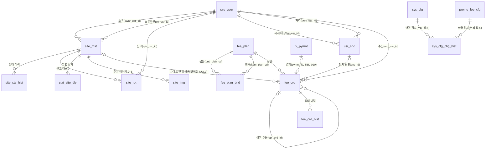

# sitemap.pi 1차 데이터 모델

> .pi 사이트 디렉터리(sitemap.pi)의 1차 데이터 모델 정본이다. 개념·논리·물리 모델, 코드, 업무 규칙, 요구 추적, 적용 순서, 미결 사항을 담는다.
> DDL 초안은 `docs/da/_workspace/20261010_sitemap-data-model/02_modeler_ddl.sql`에 있다(⛔ 초안이므로 운영 적용 금지 — 마스터 승인 후 `sql/`에 확정한다). 이 문서의 내용은 그 초안 r2와 일치한다.

---

## 0. 문서 정보

| 항목 | 내용 |
|---|---|
| 문서 | `sitemap/sitemap.pi/data-model/sitemaps-data-model.md` |
| 판 | 1.1 (2026-10-10 재점검 반영) |
| 작성 | DA팀 — leader(승인), standards(표준), modeler(모델·편집), quality(품질) |
| 요청 | 마스터 2026-10-10 "목업 완성 → 요구사항 기반 1차 데이터 모델 완성" |
| 범위 | 신규 설계(1차 모델). As-Is `sitemap/sitemap.pi/sql/001_sitemap_phase1.sql`은 수정하지 않고 델타로 제안한다. DB 적용과 `sql/` 확정은 마스터 승인 후 별도로 진행한다 |
| 정본 | 표준 `docs/da/데이터표준규칙.md` v2.3 · 품질 `docs/da/품질점검기준서.md` · 요구 `sitemap/sitemap.pi/docs/PRD.md` |
| 작업 기록 | `docs/da/_workspace/20261010_sitemap-data-model/`(00 요구 ~ 04 최종 승인) |

### 0-1. 단계별 승인 이력

| 단계 | 산출물 | 판정 | 라운드 |
|---|---|---|---|
| 00 요구 수집 | `00_requirements.md` (REQ-01~92) | — | — |
| 01 표준사전 | `01_standards_dictionary.md` | leader **APPROVED** | r1 반려(P1 4건) → r2 반려(P1 1건) → r3 승인 → 마스터 약어 규칙 개정(MV·ORD·seq) → r4 승인 |
| 02 모델·DDL | `02_modeler_model.md` · `02_modeler_ddl.sql` | leader **APPROVED**(조건 2건) | r1. standards 명명 검증 : 조건부 통과(금지 어휘 1건) → 재검증 위반 0 |
| 03 품질 게이트 | `03_quality_gate_r1.md` | **PASS(P2 조건부)** → leader **APPROVED** | P1 0 · P2 3 · P3 9. 처리 지시를 02 r2에 반영 |
| 04 최종 문서 | 이 문서 | leader **APPROVED** | r1 승인(quality 재확인 `03_quality_gate_r2.md` PASS 22/22). §8-3 잠금 순서 1줄은 리더 직접 추가(R2-1) |
| 09·10 재점검 | `09_standards_reinspection.md` · `10_leader_reinspection-decision.md`(§7 마스터 확정 반영) | leader 판정 | 정본 v2.4 §1-3(단일 단어 금지) 발견 — 승계 객체 포함 전 객체 212컬럼 점검, 위반 7(전부 000 `sys_user`) → **마스터 확정으로 7건 모두 개명**, 기존 함수 인자 3은 grandfathered |
| 11 재점검 반영 | 이 문서 1.1 · 02 r3 | leader 승인 요청 | §10-1~§10-5 |

---

## 1. 개요·설계 원칙

sitemap.pi는 .pi 도메인 사이트를 등록·심사해 노출하는 디렉터리다. Phase 1은 무료 MVP(등록·심사·신고·조회 집계·메인 버블)이고, Phase 2에서 유료 상품(추천 슬롯·STATS·PREMIUM30·멤버십·구독·부가서비스 반짝임)과 계정 제재를 추가한다. Phase 3은 리뷰와 "운영자 확인" 배지다.

| # | 원칙 | 적용 |
|---|---|---|
| 1 | **전용 DB·스키마 비의존** | 운영은 sitemap 전용 Supabase `public`, 개발·스테이징은 pi-nonprod의 `sitemap_dev`·`sitemap_stg`. DDL에 스키마 접두를 쓰지 않고(search_path 기준), 함수는 `SET search_path FROM CURRENT`로 둔다. cafe.pi DB와의 교차 FK는 없다 |
| 2 | **RLS 비활성 + 서버 전용** | 모든 테이블·RPC에 `fn_grant_svc_only`를 적용해 anon·authenticated 권한을 회수하고 service_role에만 허용한다 |
| 3 | **물리 DELETE 금지** | 전 테이블 `del_yn`·`del_dtm` 논리삭제. 시스템 컬럼 4종(`regr_id`·`reg_dtm`·`modr_id`·`mod_dtm`)은 테이블 끝에 둔다 |
| 4 | **FK 유지** | PostgREST 임베디드 조인이 FK에 의존하므로 신규 관계도 FK를 선언한다(NO ACTION) |
| 5 | **baseline 승계** | `sys_user`는 `@pi/db 000_baseline.sql` 정의를 그대로 쓴다(재정의·확장 금지). `pi_pymnt`는 공용 `010_pi_pymnt.sql` 대기 상태라 참조만 한다 |
| 6 | **코드는 CHECK, 표시명은 번역키** | 코드 테이블 없이 CHECK 도메인으로 두고, 표시명은 next-intl 번역키(`siteCtgr.<cd>`·`plan.<cd>`)에 둔다. DB에 이름을 중복 저장하지 않는다 |
| 7 | **Pi 직접 표기** | 금액은 `*_pi_amt NUMERIC(18,7)`(1 Pi = 10⁷ units). 통화 계열 금지 어휘는 이름·코드값·COMMENT에 쓰지 않는다 |
| 8 | **결제는 일반 순위와 무관** | 일반 목록 정렬 키에 결제·요금제 속성을 쓰지 않는다. 유료 노출은 항상 광고로 판정할 수 있어야 한다 |
| 9 | **다중 테이블 불변식은 DB가 지킨다** | 경로와 무관하게 성립해야 하는 규칙은 트리거로, 사람이 판단하는 업무 행위는 RPC로 처리한다(§8-4) |

---

## 2. 적용 표준 요약

정본 v2.3과 표준사전 `01_standards_dictionary.md`(r4 승인본) 기준이다.

| 구분 | 규칙 |
|---|---|
| 테이블명 | `<접두사>_<단어>` 소문자 snake·단수형·단어 3개 이하. 이번 잡의 신규 접두사는 0건이다 — `site_`(001 DA-APPROVED 승계)·`sys_`·`usr_`·`fee_`·`promo_`·`stat_`·`pi_` |
| 컬럼명 | `단어(_단어)_도메인`. 마지막 단어는 Hook `DOMAIN_SUFFIXES` 등재 도메인이어야 한다 |
| 신규 단어 | 자음 위주 2~3자, 현장 최빈형(마스터 지시 2026-10-10) — 이동 **MV**, 주문 **ORD** 등 |
| 순서 도메인 | `ord` 신규 사용 금지 → **`seq`**(`sort_seq`·`img_seq`). 기존 `sort_ord` 등은 grandfathered이며, 위치 규칙상 마지막이 아닌 자리의 `ord`는 "주문" 단어다 |
| PK·FK | PK `<엔터티약어>_id UUID DEFAULT gen_random_uuid()`. `sys_user.usr_id` 참조는 `<역할>_usr_id` |
| 최소 구성 | **단일 표준단어로 표준용어 금지**(정본 v2.4 §1-3) — 최소 `단어_도메인`. 도메인 단독(`id`)·도메인 없는 단어(`role`) 금지. 함수 인자는 신규 함수에만 적용(기존 함수 인자는 grandfathered — 마스터 확정) |
| 상태·유형 | `*_sts_cd`·`*_tp_cd`(`_st_cd` 금지) |
| 금액 | `*_pi_amt NUMERIC(18,7)`, `CHECK (≥ 0)` |
| 여부 | `CHAR(1) NOT NULL DEFAULT 'N' CHECK (IN ('Y','N'))`. CHAR(n)은 `_yn` 전용이다 |
| 일시 | `_dtm TIMESTAMPTZ`(UTC), `_dt DATE`. 영구·무기한은 NULL로 두고 `'infinity'`는 금지한다 |
| 감사 이력 | append-only `_hist`는 업무 감사 컬럼 `chgr_id`·`chg_dtm`을 둔다. mod_dtm 트리거는 예외로 생략한다(정본 §6) |
| 제약명 | `<tbl>_<col>_check`. FK는 `<자식>_<부모>_id_fkey`가 기본이고, **같은 부모 복수·자연키·자기참조는 `<자식>_<FK컬럼>_fkey`**(P-6) |
| 인덱스명 | `idx_<tbl>_<col>`, 활성 부분 UNIQUE는 `ux_<tbl>_<col>_actv`, 표현식 싱글톤은 의미 명칭(`ux_promo_fee_cfg_sngl`)(P-7) |
| 싱글톤 | 키 컬럼을 두지 않고 상수 식 부분 UNIQUE 인덱스 `((1)) WHERE del_yn='N'`으로 강제한다 |

**이번 모델이 쓰는 주요 신규·재사용 단어** : SITE·OWNR·OWN·RJCT·RPTR·PRCS·CLCK·CNTC·PVT·PUB·VIEW·DLY·MST·PLAN·CUR·PREV(001 등재 대기분) / MV(이동)·VRF(확인)·ORD(주문)·UPR(상위)·HLD(확보)·LFT(영구)·CNL(해지)·RVK(회수)·APL(적용)·BGN(시작)·DAY(일)·NRM(정가)·STK(재고)·SCP(범위)·BND(묶음)·PI(파이)·SNC(제재)·REL(해제)(신규) / MBR(멤버십 — 정본 §9 등재어 `member` 재사용, 신규 등재 없음).

---

## 3. 주제영역·ERD

| 주제영역 | 엔터티 | Phase |
|---|---|---|
| 사용자 | `sys_user`(baseline) · `usr_snc`(계정 제재) | 1 · 2 |
| 사이트 디렉터리 | `site_mst` · `site_sts_hist` · `site_rpt` · `site_img` | 1 · 1 · 1 · 2 |
| 통계 | `stat_site_dly` | 1 |
| 요금·주문 | `fee_plan` · `fee_plan_bnd` · `fee_ord` · `fee_ord_hist` · `promo_fee_cfg` | 2 |
| 시스템 설정 | `sys_cfg` · `sys_cfg_chg_hist` | 2 |
| 결제(공용) | `pi_pymnt`(`@pi/db 010` 대기 — 참조만) | 2 |



- `sys_cfg_chg_hist`는 대상 테이블명과 행 PK 문자열(`cfg_tbl_nm`·`cfg_tgt_id`)로 4개 테이블(sys_cfg·promo_fee_cfg·fee_plan·fee_plan_bnd)을 다형 참조하므로 FK가 없다(cafe sql/176 구조).
- `pi_pymnt` FK는 010 적용 후 추가한다.

---

## 4. 논리 모델

### 4-1. 엔터티·식별자

| 엔터티 | 논리명 | 주식별자 | 자연키·후보키 | 성격 |
|---|---|---|---|---|
| site_mst | 사이트 | site_id | site_dom_nm — PENDING·APPROVED·SUSPENDED 활성 행 부분 UNIQUE | 핵심 |
| site_sts_hist | 사이트상태이력 | hist_id | — | 이력(append-only) |
| site_rpt | 사이트신고 | rpt_id | (site_id, rptr_usr_id) RECEIVED 활성 UNIQUE | 행위 |
| site_img | 사이트이미지 | img_id | (site_id, img_seq) 활성 UNIQUE | 종속 |
| stat_site_dly | 사이트일별통계 | (site_id, stat_dt) | — | 집계 |
| usr_snc | 사용자제재 | snc_id | tgt_usr_id ACTIVE 활성 UNIQUE | 행위 |
| fee_plan | 요금상품 | fee_plan_id | fee_plan_cd 전체 UNIQUE(FK 대상, 재사용 금지) | 기준 |
| fee_plan_bnd | 요금상품묶음 | bnd_id | (bnd_plan_cd, item_plan_cd) 활성 UNIQUE | 교차(M:N 해소) |
| fee_ord | 요금주문 | ord_id | pymnt_id 활성 UNIQUE | 행위 |
| fee_ord_hist | 요금주문이력 | hist_id | — | 이력(append-only) |
| promo_fee_cfg | 프로모션요금설정 | promo_fee_id | 활성 1행 | 싱글톤 |
| sys_cfg | 운영설정 | cfg_id | cfg_key 활성 UNIQUE | 기준 |
| sys_cfg_chg_hist | 설정변경이력 | hist_id | — | 이력(append-only) |

### 4-2. 관계·카디널리티

| 부모 | 자식(FK 컬럼) | 카디널리티 | 선택성 | 제약명 |
|---|---|---|---|---|
| sys_user | site_mst(ownr_usr_id) | 1:N | 선택(자사 시드 NULL) | site_mst_sys_user_id_fkey |
| sys_user | site_mst(vrf_usr_id) | 1:N | 선택 | site_mst_vrf_usr_id_fkey ※P-6 |
| site_mst | site_sts_hist(site_id) | 1:N | 필수 | site_sts_hist_site_mst_id_fkey |
| site_mst | site_rpt(site_id) | 1:N | 필수 | site_rpt_site_mst_id_fkey |
| sys_user | site_rpt(rptr_usr_id) | 1:N | 필수 | site_rpt_sys_user_id_fkey |
| site_mst | stat_site_dly(site_id) | 1:N | 필수 | stat_site_dly_site_mst_id_fkey |
| site_mst | site_img(site_id) | 1:0..4 | 필수 | site_img_site_mst_id_fkey |
| sys_user | usr_snc(tgt_usr_id) | 1:N(동시 ACTIVE ≤ 1) | 필수 | usr_snc_tgt_usr_id_fkey ※P-6 |
| sys_user | usr_snc(prcs_usr_id) | 1:N | 필수 | usr_snc_prcs_usr_id_fkey ※P-6 |
| fee_plan ↔ fee_plan | fee_plan_bnd | M:N → 교차 | 필수 | fee_plan_bnd_bnd_plan_cd_fkey · fee_plan_bnd_item_plan_cd_fkey ※P-6 |
| fee_plan | fee_ord(fee_plan_cd) | 1:N | 필수 | fee_ord_fee_plan_cd_fkey ※P-6(자연키) |
| sys_user | fee_ord(ord_usr_id) | 1:N | 필수 | fee_ord_sys_user_id_fkey |
| site_mst | fee_ord(site_id) | 1:N | 선택(멤버십 NULL) | fee_ord_site_mst_id_fkey |
| fee_ord | fee_ord(upr_ord_id) | 1:N 체인 | 선택(NEW 외 필수) | fee_ord_upr_ord_id_fkey ※P-6(자기참조) |
| usr_snc | fee_ord(snc_id) | 1:N | 선택(SUSPENDED 필수) | fee_ord_usr_snc_id_fkey |
| fee_ord | fee_ord_hist(ord_id) | 1:N | 필수 | fee_ord_hist_fee_ord_id_fkey |
| pi_pymnt | fee_ord(pymnt_id) | 1:0..1 | 선택(0 Pi NULL) | [TBD 010] |

- **P-6 규칙** : 기본은 `<자식>_<부모>_id_fkey`다. 같은 부모를 두 번째 이후로 참조하는 FK, 자연키 참조 FK, 자기참조 FK는 `<자식>_<FK컬럼>_fkey`로 쓴다. 해당 FK는 7개다(※ 표시). 같은 부모를 여러 번 참조하는 FK를 PostgREST로 임베드할 때는 `sys_user!usr_snc_tgt_usr_id_fkey(...)`처럼 제약명 힌트가 필요하다.
- 모든 FK는 NO ACTION(ON DELETE 미지정)이다. 물리 DELETE가 없으므로 별도 동작이 필요 없다.

### 4-3. 정규화·반정규화

기본은 3NF이고, 반정규화는 아래 6건만 근거와 함께 둔다.

| # | 반정규화 | 근거 | 정합 수단 |
|---|---|---|---|
| N-1 | `site_mst.plan_cd` | 버블 조회 단순화. Phase 2부터 멤버십 주문의 파생값 | 동기화 규칙 [확인중 : 마스터](§12 #1) |
| N-2 | `fee_ord.site_ctgr_cd` | 주문 시점 카테고리 스냅샷(카테고리가 바뀌어도 슬롯 재고 범위 유지) | INSERT 트리거가 site_mst 값으로 강제 |
| N-3 | `fee_ord.ord_pi_amt`·`nrm_pi_amt`·`promo_apl_yn` | 가격 변경 소급 금지 — 금액 스냅샷 | 주문 생성 시 확정 |
| N-4 | `fee_plan.stk_cnt`·`stk_scp_cd` | 재고는 유형 단위인데 코드 테이블이 없어 상품 행마다 보관 | 같은 유형 행은 같은 값, 판정은 유형별 MIN |
| N-5 | `site_sts_hist.site_dom_nm`·`chg_rsn_cont` | 이력 = 시점 스냅샷 | 트리거 자동 복사 |
| N-6 | `site_mst.vrf_dom_nm` | 확인 대상 도메인 증거 | CHECK `vrf_dom_nm = site_dom_nm` |

**채택하지 않은 반정규화** : 최초 주문 ID(구독 가격 잠금은 `upr_ord_id` 재귀로 찾는다 — 월 구독 체인은 연 12건 수준), 할인액(= 정가 − 실결제 파생), 상품군 코드(fee_tp_cd로 정해지는 파생), 반짝임 플래그(ACTIVE 주문에서 파생, §8-5).

### 4-4. 주요 설계 판정

| # | 판정 | 사유 |
|---|---|---|
| M-1 | **사이트 상태 이력 `site_sts_hist` 신설** — 001 판정 11("이력 테이블 없음")을 번복 | As-Is는 현재값만 남아 근거가 덮어써지는 경로가 4개다. ① 직권 정지 사유를 `rjct_rsn_cont`에 쓰고 복구 때 NULL로 지운다 ② 재제출·승인 시 반려 사유가 초기화되어 OWNERSHIP 반려 근거가 사라진다 ③ 소유 확인 사실이 DB에 남지 않는다 ④ 신고 인용 실패 시 보상 처리가 처리 흔적을 지운다. ①②는 이력 스냅샷으로, ③은 M-3으로, ④는 M-5로 해소한다 |
| M-2 | 이력은 **site_mst AFTER 트리거가 자동 기록** | 상태 변경 경로(API 4개 + RPC)가 흩어져 있어 앱이 기록하면 누락 위험이 있다. 수행자는 `NEW.modr_id`다. 반려 사유는 `rjct_rsn_cd`를 복사하고, 신고 인용 정지 사유는 RPC가 트랜잭션 로컬 설정 `sitemap.chg_rsn_cd`로 넘긴다 |
| M-3 | 소유 확인 = `site_mst.vrf_*` 4컬럼 + CHECK | 외부 사이트는 현재 도메인의 소유 확인 없이 APPROVED·SUSPENDED가 될 수 없다. 도메인이 바뀌면 자동으로 무효가 된다 |
| M-4 | 이동 URL = `site_mst.site_mv_url` | 마스터 확정(등록자 입력 + 관리자 심사). APPROVED 상태에서 바꾸면 PENDING으로 재심사한다 |
| M-5 | 신고 처리 = RPC `fn_prcs_site_rpt` | 신고 상태 변경과 사이트 정지를 단일 트랜잭션으로 묶는다(현 앱의 보상 처리 대체) |
| M-6 | `fee_tp_cd`에서 REGISTER·EXTEND 제외 | REGISTER는 무료라 주문이 생기지 않는다. EXTEND는 주문 유형(`ord_tp_cd`)으로 표현해 단가를 이중 관리하지 않는다 |
| M-7 | 재고는 유형 단위(`stk_cnt`·`stk_scp_cd`), PREMIUM30은 구성 항목 재고로 판정 | 슬롯 재고는 7일·30일 기간과 무관하게 유형끼리 공유한다 |
| M-8 | 구매 자격·중복·재고는 **fee_ord INSERT 트리거 하나**에서 강제 | 조건이 교차 테이블에 걸쳐 CHECK로 표현할 수 없고, 주문 생성 경로(신규·0 Pi 프로모·갱신·연장·보상)가 여럿이라 앱에서 막으면 누락 위험이 있다 |
| M-9 | 연쇄 처리는 트리거(불변식)와 RPC(업무 행위)로 나눈다 | §8-4 |
| M-10 | `usr_snc`에는 별도 이력 테이블을 두지 않는다 | 전이가 ACTIVE → RELEASED/CANCELED 1회뿐이라 행 자체가 이력이다 |
| M-11 | `fee_ord.snc_id` 채택 | 해제할 때 "이 제재로 정지된 주문"만 정확히 복귀시키기 위해서다 |
| M-12 | `site_img`는 2~5번째 이미지만 담고, 대표는 `site_mst.site_img_url` | 대표 이미지의 출처를 하나로 유지하고 Phase 1 코드를 바꾸지 않기 위해서다. 만료 시 비노출 여부는 조회 시 계산한다 |
| M-13 | `sys_cfg` PK = `cfg_id` + `cfg_key` 활성 UNIQUE | 정본 PK 규칙을 준수한다 |
| M-14 | 요금제 화면 상수(면적·색·반짝임 색·배지)는 DB에 저장하지 않고, 레벨은 `PLAN_CD` 순서에서 파생 | leader 확정 D-8. 마스터 결정 #1·#2 |
| M-15 | `pymnt_id TEXT` 가안 | 키 타입은 [TBD 010]. `pi_pymnt`는 재정의하지 않는다 |
| M-16 | 함수 동사 `ins`·`upd`·`sel`·`inc`·`prcs`·`rvk`·`chg`·`vrf` | 모두 등재어 또는 001 선례다 |
| M-17 | 반짝임 표시는 파생 | §8-5 |

---

## 5. 물리 테이블 정의서

**공통 6컬럼**(아래 표에서는 "공통6"으로 줄인다) — 모든 테이블의 끝에 둔다.

| 컬럼 | 타입 | NULL | 기본값 | 제약 |
|---|---|---|---|---|
| del_yn | CHAR(1) | N | 'N' | `<tbl>_del_yn_check` IN ('Y','N') |
| del_dtm | TIMESTAMPTZ | Y | | 삭제일시 |
| regr_id | TEXT | N | 'ADMIN' | 등록자ID |
| reg_dtm | TIMESTAMPTZ | N | CURRENT_TIMESTAMP | 등록일시 |
| modr_id | TEXT | N | 'ADMIN' | 변경자ID |
| mod_dtm | TIMESTAMPTZ | N | CURRENT_TIMESTAMP | 변경일시 — `trg_<tbl>_mod_dtm` 자동 갱신(append-only `_hist` 3종은 예외, 논리삭제 시 수동 설정) |

- 각 표의 "제약·설명" 열에 적은 조건은 해당 컬럼의 CHECK다. 제약명은 `<테이블>_<컬럼>_check` 규칙을 따른다(예 : `fee_plan_stk_scp_cd_check`). 여러 컬럼에 걸친 조건 CHECK와 FK·인덱스 이름은 표 아래에 따로 적는다.
- 모든 테이블의 PK 제약명은 `<테이블>_pkey`다.

### 5-0. sys_user — Pi 사용자 (공용 baseline 승계, 재점검 개명 반영)

`@pi/db 000_baseline.sql` 정의다. sitemap은 재정의하지 않고, 정본 v2.4·마스터 확정 개명 7건을 baseline 동반 변경으로 반영한다(§10-1~§10-3). 세션·API 필드명은 그대로이고 `@pi/db` 조회 계층에서 매핑한다.

| 컬럼 | 타입 | NULL | 기본값 | 제약·설명 | 표준 판정 |
|---|---|---|---|---|---|
| **usr_id** | UUID | N | gen_random_uuid() | PK(`sys_user_pkey`). 구 `id` | 개명(V1) |
| pi_uid | TEXT | Y | | 전체 UNIQUE(`sys_user_pi_uid_key`). 앱×네트워크 scoped — 영구 식별자 아님 | 적합 |
| **pi_usr_nm** | TEXT | Y | | 사람의 불변 키(REQ-11). 활성 부분 UNIQUE(`ux_sys_user_pi_usr_nm_actv`). 구 `pi_username` | 개명(V3) |
| **pi_wlt_adr_txt** | TEXT | Y | | 지갑 주소(A2U 지급 대비). 구 `pi_wallet_address` | 개명(V4) |
| **dsp_nm** | TEXT | N | '' | 표시명. 구 `display_name` | 개명(V5) |
| **role_cd** | VARCHAR(20) | N | 'USER' | `sys_user_role_cd_check` IN ('ADMIN','USER'). ADMIN이 최상위(MASTER 행 없음). 구 `role` | 개명(V2) |
| **lst_lgn_dtm** | TIMESTAMPTZ | Y | | 최근 로그인. 구 `last_login_dtm` | 개명(V6) |
| **rjn_dtm** | TIMESTAMPTZ | Y | | 재가입(행 부활) 컷오프. 구 `rejoin_dtm` | 개명(V7) |
| del_rsn_cd | VARCHAR(20) | Y | | WDRW·SYS_DUP·ADMIN_BLCK | 적합 |
| 공통6 | | | | | 적합 |

트리거 `trg_sys_user_mod_dtm`. 계정 제재는 이 테이블을 확장하지 않고 `usr_snc`로 둔다(마스터 확정 REQ-14).

### 5-1. site_mst — 사이트 (001 + Phase 1 델타)

| 컬럼 | 타입 | NULL | 기본값 | 제약·설명 | 구분 |
|---|---|---|---|---|---|
| site_id | UUID | N | gen_random_uuid() | PK | 001 |
| site_dom_nm | VARCHAR(253) | N | | `^[a-z0-9]([a-z0-9-]{0,61}[a-z0-9])?\.pi$`, 점유 상태 부분 UNIQUE. 상세 URL 슬러그 | 001 |
| site_nm | VARCHAR(100) | N | | 사이트명 = 회사명(마스터 확정, 별도 속성 없음) | 001 |
| site_ctgr_cd | VARCHAR(20) | N | | 구분 9종(§6) | 001 |
| site_desc | TEXT | Y | | ≤ 2000(기본 500은 앱 검증) | 001 |
| site_img_url | TEXT | Y | | 대표 이미지 = 버블 로고. 등록자 업로드만 허용, 심사 대상 | 001 |
| site_sts_cd | VARCHAR(20) | N | 'DRAFT' | 상태 6종 | 001 |
| rjct_rsn_cd | VARCHAR(20) | Y | | 반려 사유 9종, REJECTED이면 필수 | 001 |
| rjct_rsn_cont | TEXT | Y | | 반려·정지 안내 문구. **`site_mst_rjct_rsn_cont_check` ≤ 500** | 001 + **A** |
| apv_dtm | TIMESTAMPTZ | Y | | 최초 승인일시(일반 순위 기준), APPROVED·SUSPENDED이면 필수 | 001 |
| ownr_usr_id | UUID | Y | | FK sys_user. 자사 사이트만 NULL 허용 | 001 |
| own_site_yn | CHAR(1) | N | 'N' | 자사 사이트 — 유료 구매 상시 금지 | 001 |
| plan_cd | VARCHAR(10) | N | 'NONE' | 요금제 6값(§6) | 001 |
| pvt_cntc_txt | TEXT | Y | | 심사용 비공개 연락처(공개 응답에서 제외 필수) | 001 |
| pub_cntc_txt | TEXT | Y | | 공개 연락처(옵트인) | 001 |
| **site_mv_url** | TEXT | Y | | `site_mst_site_mv_url_check` : `^https://[^\s/?#]+` + ≤ 1000. 등록자 입력·심사 대상, 공개 응답 포함. NULL이면 도메인으로 이동 | **A** |
| **vrf_yn** | CHAR(1) | N | 'N' | `site_mst_vrf_yn_check`. 도메인 소유 확인 여부 | **A** |
| **vrf_dtm** | TIMESTAMPTZ | Y | | 소유 확인 일시. 확인 키(HMAC 계산값)는 저장하지 않는다 | **A** |
| **vrf_usr_id** | UUID | Y | | FK `site_mst_vrf_usr_id_fkey` → sys_user(확인한 관리자) | **A** |
| **vrf_dom_nm** | VARCHAR(253) | Y | | 확인 시점 도메인 스냅샷 | **A** |
| 공통6 | | | | | |

추가 제약(Part A) : `site_mst_vrf_dtm_check` — vrf_yn = 'Y'이면 vrf_dtm·vrf_usr_id·vrf_dom_nm 필수 / `site_mst_vrf_yn_apv_check` — `own_site_yn = 'Y' OR site_sts_cd NOT IN ('APPROVED','SUSPENDED') OR (vrf_yn = 'Y' AND vrf_dom_nm = site_dom_nm)`.
001 제약 : 도메인 정규식, 구분·상태·반려 사유·요금제 CHECK, 반려 시 사유 필수, 승인 상태 시 apv_dtm 필수, 소유자 NULL은 자사만, site_desc ≤ 2000, own_site_yn·del_yn CHECK.
인덱스 : 001 — `ux_site_mst_site_dom_nm_actv`(PENDING·APPROVED·SUSPENDED 활성) · `idx_site_mst_apv_dtm` · `idx_site_mst_site_ctgr_cd` · `idx_site_mst_site_sts_cd` · `idx_site_mst_ownr_usr_id` · `idx_site_mst_site_nm_trgm` · `idx_site_mst_site_dom_nm_trgm` / A — `idx_site_mst_vrf_usr_id`(활성·NOT NULL 부분).
트리거 : `trg_site_mst_mod_dtm`(001) · `trg_site_mst_sts_hist`(A, 상태 이력) · `trg_site_mst_ord_rvk`(B, 주문 회수).

### 5-2. site_sts_hist — 사이트상태이력 (Phase 1 신규, append-only)

| 컬럼 | 타입 | NULL | 기본값 | 제약·설명 |
|---|---|---|---|---|
| hist_id | UUID | N | gen_random_uuid() | PK |
| site_id | UUID | N | | FK `site_sts_hist_site_mst_id_fkey` |
| old_sts_cd | VARCHAR(20) | Y | | 이전 상태(최초 생성 NULL), 상태 6종 CHECK |
| new_sts_cd | VARCHAR(20) | N | | 이후 상태, 상태 6종 CHECK |
| chg_rsn_cd | VARCHAR(20) | Y | | 반려 사유 9종 + RPT_ACCEPT. REJECTED이면 rjct_rsn_cd 복사, 신고 인용 정지는 RPT_ACCEPT, 그 외 NULL |
| chg_rsn_cont | TEXT | Y | | ≤ 500. REJECTED·SUSPENDED이면 rjct_rsn_cont 스냅샷 |
| site_dom_nm | VARCHAR(253) | N | | 전이 시점 도메인(OWNERSHIP 반려 근거) |
| chgr_id | TEXT | N | | 수행자 = site_mst.modr_id |
| chg_dtm | TIMESTAMPTZ | N | CURRENT_TIMESTAMP | 변경일시 |
| 공통6 | | | | mod_dtm 트리거 없음 |

인덱스 : `idx_site_sts_hist_site_id`(site_id, chg_dtm DESC) · `idx_site_sts_hist_site_dom_nm`(site_dom_nm) WHERE chg_rsn_cd = 'OWNERSHIP'. 001 시드 19건의 기준선 이력을 1건씩 백필한다.

### 5-3. site_rpt — 사이트신고 (001 그대로)

| 컬럼 | 타입 | NULL | 기본값 | 제약·설명 |
|---|---|---|---|---|
| rpt_id | UUID | N | gen_random_uuid() | PK |
| site_id | UUID | N | | FK site_mst |
| rptr_usr_id | UUID | N | | FK sys_user(로그인 필수) |
| rpt_rsn_cd | VARCHAR(20) | N | | 신고 사유 10종 |
| rpt_cont | TEXT | Y | | ≤ 1000 |
| rpt_sts_cd | VARCHAR(20) | N | 'RECEIVED' | RECEIVED·ACCEPTED·DISMISSED |
| prcs_dtm | TIMESTAMPTZ | Y | | RECEIVED가 아니면 필수 |
| prcs_cont | TEXT | Y | | 관리자 메모 |
| 공통6 | | | | |

인덱스 : `ux_site_rpt_site_id_rptr_actv`(같은 사용자의 미처리 신고 1건) · `idx_site_rpt_rpt_sts_cd`. 처리 경로만 RPC로 바꾸고 구조는 변경하지 않는다.

### 5-4. stat_site_dly — 사이트일별통계 (001 그대로)

| 컬럼 | 타입 | NULL | 기본값 | 제약·설명 |
|---|---|---|---|---|
| site_id | UUID | N | | PK·FK site_mst |
| stat_dt | DATE | N | | PK. UTC 일자 |
| view_cnt | INT | N | 0 | ≥ 0. 상세 조회 |
| clck_cnt | INT | N | 0 | ≥ 0. "사이트 방문" 이동 안내 확인 |
| 공통6 | | | | |

인덱스 : `idx_stat_site_dly_stat_dt`. 증가는 `fn_inc_stat_site_dly`로만 한다.

### 5-5. site_img — 사이트이미지 (Phase 2)

| 컬럼 | 타입 | NULL | 기본값 | 제약·설명 |
|---|---|---|---|---|
| img_id | UUID | N | gen_random_uuid() | PK |
| site_id | UUID | N | | FK `site_img_site_mst_id_fkey` |
| img_url | TEXT | N | | `^https://` + ≤ 1000. Storage 본인 폴더만 허용(앱 검증), 심사 대상 |
| img_seq | INT | N | | 2~5(1번 = site_mst.site_img_url) |
| 공통6 | | | | |

인덱스 : `ux_site_img_site_id_img_seq_actv`.

### 5-6. usr_snc — 사용자제재 (Phase 2)

| 컬럼 | 타입 | NULL | 기본값 | 제약·설명 |
|---|---|---|---|---|
| snc_id | UUID | N | gen_random_uuid() | PK |
| tgt_usr_id | UUID | N | | FK `usr_snc_tgt_usr_id_fkey` — 제재 대상 |
| snc_tp_cd | VARCHAR(20) | N | 'SUSPEND' | SUSPEND |
| snc_sts_cd | VARCHAR(20) | N | 'ACTIVE' | ACTIVE·RELEASED·CANCELED |
| snc_rsn_cd | VARCHAR(20) | N | | 제안 11종 [TBD : legal-compliance-advisor] |
| snc_rsn_cont | TEXT | Y | | ≤ 500 |
| snc_bgn_dtm | TIMESTAMPTZ | N | CURRENT_TIMESTAMP | 등록 즉시 발효(예약 제재 미지원) |
| snc_end_dtm | TIMESTAMPTZ | Y | | 예정 종료(NULL = 무기한), > snc_bgn_dtm |
| rel_dtm | TIMESTAMPTZ | Y | | 실제 해제·취소 시각. ACTIVE이면 NULL, 종료 상태이면 필수, ≥ snc_bgn_dtm |
| prcs_usr_id | UUID | N | | FK `usr_snc_prcs_usr_id_fkey` — 제재를 건 관리자 |
| 공통6 | | | | modr_id = 해제·취소 처리자 |

인덱스 : `ux_usr_snc_tgt_usr_id_actv`(1인 진행 중 1건) · `idx_usr_snc_snc_end_dtm`(만료 배치) · `idx_usr_snc_prcs_usr_id`. 트리거 : `trg_usr_snc_mod_dtm` · `trg_usr_snc_ord_chg`(§8-4).

### 5-7. fee_plan — 요금상품 (Phase 2)

| 컬럼 | 타입 | NULL | 기본값 | 제약·설명 |
|---|---|---|---|---|
| fee_plan_id | UUID | N | gen_random_uuid() | PK |
| fee_plan_cd | VARCHAR(30) | N | | `fee_plan_fee_plan_cd_key` 전체 UNIQUE(FK 대상), `^[A-Z][A-Z0-9_]{0,29}$`, 재사용 금지 |
| fee_tp_cd | VARCHAR(20) | N | | 요금 유형 6종(§6) |
| use_day_cnt | INT | Y | | 사용 일수. lft_yn = 'Y'이면 NULL, 아니면 > 0 |
| lft_yn | CHAR(1) | N | 'N' | 영구. Y는 MEMBERSHIP만 |
| subscr_yn | CHAR(1) | N | 'N' | 구독. Y는 MEMBERSHIP만 |
| pi_amt | NUMERIC(18,7) | N | | 판매가 ≥ 0 |
| nrm_pi_amt | NUMERIC(18,7) | N | | 정가 ≥ pi_amt |
| stk_cnt | INT | Y | | 동시 노출 수 > 0, stk_scp_cd와 동시에 NULL |
| stk_scp_cd | VARCHAR(20) | Y | | PER_CTGR·GLOBAL(NULL = 비배타) |
| promo_apl_yn | CHAR(1) | N | 'N' | 오픈 프로모 대상(7일 슬롯 행만 Y로 운영) |
| apl_bgn_dtm | TIMESTAMPTZ | Y | | 판매 시작 |
| apl_end_dtm | TIMESTAMPTZ | Y | | 판매 종료 > apl_bgn_dtm |
| use_yn | CHAR(1) | N | 'N' | 판매 on/off — 기본은 판매 중지(판매 개시 게이트) |
| sort_seq | INT | N | 0 | 정렬 |
| fee_plan_desc | TEXT | Y | | ≤ 2000. 관리 메모(표시명은 번역키) |
| 공통6 | | | | |

인덱스 : `idx_fee_plan_fee_tp_cd`(fee_tp_cd, sort_seq). **행 시드는 없다** — 단가가 [확인중 : 마스터]다. 가격을 바꾸면 행을 갱신하고 `sys_cfg_chg_hist`에 기록하며, 기존 주문은 금액 스냅샷으로 보호된다.

PRD 제안 단가(확정 전 참고) : CTGR_SLOT 7일 1 Pi·30일 3 Pi(재고 카테고리당 3) / HOME_SLOT 7일 2 Pi·30일 6 Pi(전체 6) / STATS 30일 1 Pi / PREMIUM30 9 Pi(정가 10) / MEMBERSHIP 30·180·365·730·1825·3650일·영구 = 3·15·27·48·108·180·270 Pi, 구독 월 2.7·연 27 Pi / SPARKLE [확인중 : 마스터].

### 5-8. fee_plan_bnd — 요금상품묶음 (Phase 2)

| 컬럼 | 타입 | NULL | 기본값 | 제약·설명 |
|---|---|---|---|---|
| bnd_id | UUID | N | gen_random_uuid() | PK |
| bnd_plan_cd | VARCHAR(30) | N | | FK `fee_plan_bnd_bnd_plan_cd_fkey` — 묶음 상품 |
| item_plan_cd | VARCHAR(30) | N | | FK `fee_plan_bnd_item_plan_cd_fkey` — 구성 항목, ≠ bnd_plan_cd |
| 공통6 | | | | |

인덱스 : `ux_fee_plan_bnd_item_actv`(bnd_plan_cd, item_plan_cd) · `idx_fee_plan_bnd_item_plan_cd`. 예 : PREMIUM30 = CTGR_SLOT + HOME_SLOT + STATS 30일.

### 5-9. fee_ord — 요금주문 (Phase 2)

| 컬럼 | 타입 | NULL | 기본값 | 제약·설명 |
|---|---|---|---|---|
| ord_id | UUID | N | gen_random_uuid() | PK |
| ord_usr_id | UUID | N | | FK `fee_ord_sys_user_id_fkey` |
| site_id | UUID | Y | | FK `fee_ord_site_mst_id_fkey`. 멤버십 NULL(트리거 강제) |
| fee_plan_cd | VARCHAR(30) | N | | FK `fee_ord_fee_plan_cd_fkey` |
| site_ctgr_cd | VARCHAR(20) | Y | | 구분 9종. 주문 시점 스냅샷(트리거가 채움) |
| ord_pi_amt | NUMERIC(18,7) | N | | 실결제 스냅샷 ≥ 0, ≤ nrm_pi_amt |
| nrm_pi_amt | NUMERIC(18,7) | N | | 정가 스냅샷 |
| promo_apl_yn | CHAR(1) | N | 'N' | Y는 NEW·0 Pi만(`fee_ord_promo_apl_yn_tp_check`) |
| pymnt_id | TEXT | Y | | → pi_pymnt [TBD 010 : 타입·FK]. 활성 UNIQUE, 유료 이용 상태이면 필수 |
| ord_sts_cd | VARCHAR(20) | N | 'HELD' | 주문 상태 6종 |
| ord_tp_cd | VARCHAR(20) | N | 'NEW' | 주문 유형 4종. CMPN은 0 Pi |
| use_bgn_dtm | TIMESTAMPTZ | Y | | ACTIVE·SUSPENDED·REVOKED이면 필수 |
| use_end_dtm | TIMESTAMPTZ | Y | | 영구 NULL, > use_bgn_dtm |
| hld_expr_dtm | TIMESTAMPTZ | Y | | HELD 만료(15분). HELD이면 필수 |
| upr_ord_id | UUID | Y | | FK `fee_ord_upr_ord_id_fkey`(자기참조). NEW가 아니면 필수 |
| subscr_cnl_yn | CHAR(1) | N | 'N' | 구독 "갱신 안 함" 표시만 |
| rvk_rsn_cd | VARCHAR(20) | Y | | 회수 사유 4종. REVOKED이면 필수 |
| rvk_dtm | TIMESTAMPTZ | Y | | REVOKED이면 필수 |
| snc_id | UUID | Y | | FK `fee_ord_usr_snc_id_fkey`. SUSPENDED이면 필수 |
| 공통6 | | | | |

조건 CHECK : `fee_ord_ord_pi_amt_check` · `fee_ord_promo_apl_yn_check` · `fee_ord_promo_apl_yn_tp_check` · `fee_ord_upr_ord_id_check` · `fee_ord_ord_tp_cd_amt_check` · `fee_ord_pymnt_id_check` · `fee_ord_hld_expr_dtm_check` · `fee_ord_use_bgn_dtm_check` · `fee_ord_use_end_dtm_check` · `fee_ord_rvk_dtm_check` · `fee_ord_snc_id_check` 외 코드 CHECK.
인덱스 : `ux_fee_ord_pymnt_id_actv` · `ux_fee_ord_site_id_promo_actv`(프로모 사이트당 1건, 취소 제외) · `idx_fee_ord_ord_usr_id` · `idx_fee_ord_site_id` · `idx_fee_ord_fee_plan_cd`(재고, HELD·ACTIVE 부분) · `idx_fee_ord_use_end_dtm` · `idx_fee_ord_hld_expr_dtm` · `idx_fee_ord_upr_ord_id` · `idx_fee_ord_snc_id`.
트리거 : `trg_fee_ord_mod_dtm` · `trg_fee_ord_ins_vrf`(BEFORE INSERT, §8-3) · `trg_fee_ord_sts_hist`(AFTER).

### 5-10. fee_ord_hist — 요금주문이력 (Phase 2, append-only)

| 컬럼 | 타입 | NULL | 기본값 | 제약·설명 |
|---|---|---|---|---|
| hist_id | UUID | N | gen_random_uuid() | PK |
| ord_id | UUID | N | | FK `fee_ord_hist_fee_ord_id_fkey` |
| old_sts_cd | VARCHAR(20) | Y | | 생성 시 NULL, 주문 상태 6종 |
| new_sts_cd | VARCHAR(20) | N | | 주문 상태 6종 |
| chg_rsn_cd | VARCHAR(20) | Y | | REVOKED이면 rvk_rsn_cd 복사, 회수 사유 4종 |
| chgr_id | TEXT | N | | fee_ord.modr_id |
| chg_dtm | TIMESTAMPTZ | N | CURRENT_TIMESTAMP | |
| 공통6 | | | | mod_dtm 트리거 없음 |

인덱스 : `idx_fee_ord_hist_ord_id`.

### 5-11. promo_fee_cfg — 프로모션요금설정 (Phase 2, 싱글톤)

| 컬럼 | 타입 | NULL | 기본값 | 제약·설명 |
|---|---|---|---|---|
| promo_fee_id | UUID | N | gen_random_uuid() | PK |
| promo_actv_yn | CHAR(1) | N | 'N' | 프로모션 활성 |
| promo_bgn_dtm | TIMESTAMPTZ | Y | | |
| promo_end_dtm | TIMESTAMPTZ | Y | | > promo_bgn_dtm |
| chg_rsn_cont | TEXT | Y | | ≤ 500. 최근 토글 사유 |
| 공통6 | | | | |

인덱스 : `ux_promo_fee_cfg_sngl` ON ((1)) WHERE del_yn = 'N'(활성 1행 강제). 비활성 1행을 시드한다. 청구 판정은 캐시 없이 이 행을 직접 조회한다.

### 5-12. sys_cfg — 운영설정 (Phase 2)

| 컬럼 | 타입 | NULL | 기본값 | 제약·설명 |
|---|---|---|---|---|
| cfg_id | UUID | N | gen_random_uuid() | PK |
| cfg_key | VARCHAR(50) | N | | `^[A-Z][A-Z0-9_]{0,49}$`, 활성 UNIQUE(`ux_sys_cfg_cfg_key_actv`) |
| cfg_val | JSONB | N | | 숫자는 JSON 숫자, 목록은 배열 |
| cfg_desc | TEXT | Y | | ≤ 2000 |
| use_yn | CHAR(1) | N | 'Y' | |
| 공통6 | | | | |

시드 7키(PRD 제안값 [확인중 : 마스터]) : `EXTEND_BGN_DAY` 7 · `EXTEND_MAX_DAY` 90 · `EXTEND_COOL_DAY` 7 · `GRACE_DAY` 7 · `NTCE_DAY_LIST` [7,3,1] · `MBR_DC_PCT` 10 · `MBR_DC_MIN_PI` 1. **GRACE_DAY가 없으면 멤버십 판정 함수와 제재 트리거가 `CFG_MISSING` 예외를 낸다**(기본값으로 숨기지 않는다).

### 5-13. sys_cfg_chg_hist — 설정변경이력 (Phase 2, append-only)

| 컬럼 | 타입 | NULL | 기본값 | 제약·설명 |
|---|---|---|---|---|
| hist_id | UUID | N | gen_random_uuid() | PK |
| cfg_tbl_nm | VARCHAR(63) | N | | sys_cfg·promo_fee_cfg·fee_plan·fee_plan_bnd |
| cfg_tgt_id | TEXT | N | | 대상 행 PK 문자열 |
| chg_actn_cd | VARCHAR(20) | N | | INSERT·UPDATE·TOGGLE·ROLLBACK·DELETE |
| old_val | JSONB | Y | | 변경 전 업무 컬럼 스냅샷(INSERT이면 NULL) |
| new_val | JSONB | Y | | 변경 후(DELETE이면 NULL) |
| chg_rsn_cont | TEXT | Y | | ≤ 500 |
| chgr_id | TEXT | N | | 수행 관리자 |
| chg_dtm | TIMESTAMPTZ | N | CURRENT_TIMESTAMP | |
| 공통6 | | | | mod_dtm 트리거 없음 |

인덱스 : `idx_sys_cfg_chg_hist_cfg_tgt_id`(cfg_tbl_nm, cfg_tgt_id, chg_dtm DESC). cafe sql/176 구조를 승계했다. 차이는 SWITCH 제외, cfg_tbl_nm CHECK 4종·VARCHAR(63), 스키마 접두 없음이다. 기록 주체는 변경과 같은 트랜잭션에서 실행되는 앱/RPC다.

---

## 6. 코드

모두 CHECK 도메인이며 표시명은 번역키다. 코드 테이블 전환 기준은 하위 계층이 생기거나, 운영 중에 데이터만으로 코드를 추가해야 할 때다.

| 코드(컬럼) | 값 | 상태 |
|---|---|---|
| site_ctgr_cd | COMMUNITY·EDU·SHOP·CONTENT·PERSONAL·EVENT·GAME·TOOL·ETC | 001 |
| site_sts_cd (site_sts_hist old/new 동일) | DRAFT 작성중 · PENDING 심사대기 · APPROVED 노출 · REJECTED 반려 · SUSPENDED 정지 · WITHDRAWN 철회 | 001 |
| rjct_rsn_cd | GAMBLING · NON_PI_PYMNT · GIFT_CARD · INVEST · ADULT · PII_COLLECT · PI_BRAND · OWNERSHIP(소유 확인 불가) · ETC | 001 |
| chg_rsn_cd (site_sts_hist) | rjct_rsn_cd 9종 + RPT_ACCEPT(신고 인용 정지). 관리자 직권 정지는 NULL | 신규 |
| rpt_rsn_cd | 금지 7종 + FRAUD·BROKEN·ETC | 001 [확인중 : legal-compliance-advisor] |
| rpt_sts_cd | RECEIVED · ACCEPTED(사이트 정지 동반) · DISMISSED | 001 |
| plan_cd | VIP · PRM2 · PRM1 · BSC2 · BSC1 · NONE — 나열 순서가 크기 순서다. 레벨 VIP LV5 … BSC1 LV1, NONE 없음(파생). 배지 VIP·P2·P1·B2·B1. 면적·색은 화면 상수 | 001 |
| p_cnt_tp_cd (RPC 인자) | VIEW · CLCK | 001 |
| fee_tp_cd | CTGR_SLOT · HOME_SLOT · STATS · PREMIUM30 · MEMBERSHIP · SPARKLE(부가서비스 반짝임) | 신규 |
| stk_scp_cd | PER_CTGR · GLOBAL (NULL = 비배타) | 신규 |
| ord_sts_cd (fee_ord_hist old/new 동일) | HELD 결제 대기 · ACTIVE 이용 · EXPIRED 만료 · CANCELED 취소 · SUSPENDED 제재 정지 · REVOKED 회수 | 신규 |
| ord_tp_cd | NEW 신규 · RENEW 구독 갱신 · EXTEND 슬롯 연장 · CMPN 0 Pi 보상 | 신규(CMPN 명칭 [TBD]) |
| rvk_rsn_cd (fee_ord_hist.chg_rsn_cd 동일) | SITE_SUSPENDED · SITE_WITHDRAWN · SITE_DELETED · LFTM_UPGRADE | 신규(LFTM_UPGRADE만 PRD 확정, 나머지 [TBD] 제안명) |
| snc_tp_cd | SUSPEND | 신규(추가 유형 [TBD]) |
| snc_sts_cd | ACTIVE · RELEASED(정상 해제·만료) · CANCELED(관리자 오인 → 0 Pi 보상) | 신규 |
| snc_rsn_cd | rpt_rsn_cd 10종 + ADMIN_ETC | 제안값 [TBD : legal-compliance-advisor] |
| chg_actn_cd (sys_cfg_chg_hist) | INSERT · UPDATE · TOGGLE · ROLLBACK · DELETE | sql/176 승계 |
| cfg_key (sys_cfg) | EXTEND_BGN_DAY · EXTEND_MAX_DAY · EXTEND_COOL_DAY · GRACE_DAY · NTCE_DAY_LIST · MBR_DC_PCT · MBR_DC_MIN_PI | 신규(값 [확인중]) |
| Pi 결제 metadata.type | SITE_MBR(확정) / 슬롯·STATS·PREMIUM30·EXTEND·SPARKLE [TBD] | pi_pymnt 소관 |

코드값은 ASCII 대문자·숫자·`_`만 쓴다(™·é 금지).

**트리거·RPC 예외 메시지 코드**(`P0001`, 앱이 응답으로 변환) : PLAN_NOT_FOUND · PROMO_NOT_ELIGIBLE · MBR_SITE_NOT_ALLOWED · USR_SANCTIONED · SITE_REQUIRED · SITE_NOT_APPROVED · OWN_SITE_NOT_BUYABLE · SPARKLE_PLAN_REQUIRED · ALREADY_OCCUPIED · STOCK_EXHAUSTED · CFG_MISSING.

---

## 7. 인덱스·검색·RPC

| 구분 | 객체 | 용도 |
|---|---|---|
| 검색 | `idx_site_mst_site_nm_trgm` · `idx_site_mst_site_dom_nm_trgm`(GIN `gin_trgm_ops`, 활성 부분) | `.ilike` 부분일치 자동 가속. UI 최소 2글자. 신규 검색 대상은 없다 |
| 공개 목록 | `idx_site_mst_apv_dtm` · `idx_site_mst_site_ctgr_cd` | 일반 순위(승인일 역순, 결제 비반영) — 쿼리가 `del_yn='N' AND site_sts_cd='APPROVED'`를 그대로 걸어야 사용된다 |
| 심사 | `idx_site_mst_site_sts_cd` · `idx_site_rpt_rpt_sts_cd` | 관리자 대기열 |
| 이력 | `idx_site_sts_hist_site_id` · `idx_site_sts_hist_site_dom_nm` · `idx_fee_ord_hist_ord_id` · `idx_sys_cfg_chg_hist_cfg_tgt_id` | 감사 조회·OWNERSHIP 재제출 판정 |
| 주문 | `ux_fee_ord_pymnt_id_actv` · `ux_fee_ord_site_id_promo_actv` · `idx_fee_ord_ord_usr_id` · `idx_fee_ord_site_id` · `idx_fee_ord_fee_plan_cd` · `idx_fee_ord_use_end_dtm` · `idx_fee_ord_hld_expr_dtm` · `idx_fee_ord_upr_ord_id` · `idx_fee_ord_snc_id` | 결제 멱등·프로모·멤버십·반짝임·재고·만료 배치·체인 |
| 제재 | `ux_usr_snc_tgt_usr_id_actv` · `idx_usr_snc_snc_end_dtm` · `idx_usr_snc_prcs_usr_id` | 1인 1건·만료 배치 |

| RPC | 호출 | 반환 | Phase |
|---|---|---|---|
| `fn_inc_stat_site_dly(p_site_id, p_cnt_tp_cd)` | 상세 조회·방문 클릭 | 없음(원자적 +1, UTC 일자) | 1(001) |
| `fn_sel_stat_site_chg(p_days)` — 인자명은 grandfathered(F-2, 기존 함수 계약) | 메인 버블 증감(1·7·30일) | site_id, cur_view_cnt, prev_view_cnt — DB에서 합산 | 1(001) |
| `fn_prcs_site_rpt(p_rpt_id, p_rpt_sts_cd, p_prcs_cont, p_prcs_usr_id)` | 신고 처리 | 처리된 site_rpt 행 / NULL = 대상 없음·이미 처리(앱 409) | 1(A) |
| `fn_sel_mbr_actv_yn(p_usr_id)` | 멤버십 활성 판정(단일 함수) | 'Y' / 'N'. GRACE_DAY가 없으면 CFG_MISSING | 2(B) |

트리거 함수 : `fn_ins_site_sts_hist`(A) · `fn_ins_fee_ord_hist` · `fn_vrf_fee_ord_ins` · `fn_rvk_site_fee_ord` · `fn_chg_usr_snc_fee_ord`(B). 업무 함수 7개는 모두 `SET search_path FROM CURRENT`로 둔다.
RPC 호출 형식 주의 : 상태를 바꾸는 RPC를 `SELECT (fn(...)).*`로 부르면 PostgreSQL이 컬럼 수만큼 함수를 반복 실행한다. 검증 SQL은 `SELECT * FROM fn(...)` 형식을 쓴다(PostgREST는 원래 이 형식이다).

---

## 8. 업무 규칙

### 8-1. 사이트 심사·상태 전이

| 전이 | 주체·경로 | DB 강제 | 이력 |
|---|---|---|---|
| (생성) → DRAFT / PENDING | 등록자 | 도메인 형식 CHECK, 점유 UNIQUE. 계정당 DRAFT+PENDING 5건 상한은 앱 | old NULL |
| DRAFT → PENDING | 등록자 제출(비공개 연락처 필수 — 앱) | 점유 UNIQUE(DRAFT는 도메인을 점유하지 않는다) | 1행 |
| APPROVED → PENDING | 등록자 내용 변경(이동 URL 포함) = **재심사** | — | 1행 |
| PENDING → APPROVED | 관리자 승인 | **외부 사이트는 소유 확인 필수**(`site_mst_vrf_yn_apv_check`), apv_dtm 필수(최초 값 유지 — 앱) | 1행 |
| PENDING → REJECTED | 관리자 반려 | 사유 필수, 안내 문구 ≤ 500 | chg_rsn_cd = 반려 사유, 도메인 스냅샷 |
| APPROVED → SUSPENDED | 관리자 직권 / 신고 인용(RPC) | — | 직권 NULL / RPT_ACCEPT(+처리 내용) |
| SUSPENDED → APPROVED | 관리자 복구 | 소유 확인 CHECK 재적용 | 1행 |
| 임의 → WITHDRAWN | 등록자 철회(SUSPENDED·WITHDRAWN에서는 불가 — 앱) | — | 1행 |
| 논리삭제 | del_yn = 'Y' | — | 상태 이력 없음(주문 회수만) |

- 도메인 소유 확인 : 등록자가 내 사이트 화면의 확인 키를 `https://<도메인>/sitemap-verify.txt`에 게시하면, 관리자가 심사 때 일치 여부를 확인한다. 확인 키는 HMAC으로 매번 계산하므로 저장하지 않는다.
- OWNERSHIP으로 반려된 (등록자, 도메인)은 재제출을 차단한다 — `site_sts_hist`(chg_rsn_cd = 'OWNERSHIP', 도메인 스냅샷)와 site_mst.ownr_usr_id를 조인해 판정한다.

### 8-2. 주문 상태 전이

| 전이 | 경로 | 강제 |
|---|---|---|
| (생성) HELD | Pi approve 시 INSERT = 재고 확보 | 트리거(자격·중복·재고), hld_expr_dtm 필수 |
| (생성) ACTIVE | 0 Pi 프로모 · CMPN 보상 | 트리거, 프로모 CHECK |
| HELD → ACTIVE | U2A complete. 서버가 정가(구독 갱신은 체인 최초 주문 금액)를 재계산해 대조하고, 클라이언트 금액은 신뢰하지 않는다 | pymnt_id 필수 CHECK |
| HELD → EXPIRED | 15분 경과 배치(재고 판정은 배치 전에도 hld_expr_dtm로 제외) | — |
| HELD → CANCELED | 사용자 취소 / 사이트 정지·철회·삭제(트리거) | — |
| ACTIVE → EXPIRED | use_end_dtm(멤버십은 + GRACE_DAY) 경과 배치 | — |
| ACTIVE ↔ SUSPENDED | 제재 등록 / 해제·취소(트리거) | snc_id 필수 |
| SUSPENDED → EXPIRED | 해제 시점에 종료+유예가 이미 지났으면(트리거) | — |
| ACTIVE → REVOKED | 사이트 정지·철회·삭제(트리거, SITE_*) / 영구 구매 전환(LFTM_UPGRADE, Phase 2 RPC) | 사유·일시 필수 |
| 갱신·연장·보상 | 새 주문 RENEW·EXTEND·CMPN + upr_ord_id | upr_ord_id 필수 CHECK |

### 8-3. 요금·부가서비스·멤버십 규칙과 강제 수단

| 규칙 | 강제 수단 | 이유 |
|---|---|---|
| 자사 사이트 구매 금지 — 자사 요금제는 관리자가 배정 | **DB 트리거** `fn_vrf_fee_ord_ins`(OWN_SITE_NOT_BUYABLE) | 교차 테이블 조건이고, 모든 주문 생성 경로가 거치는 단일 관문이다 |
| 반짝임은 유료 요금제(VIP~BSC1) 사이트만 — NONE 불가(마스터 확정) | **DB 트리거**(SPARKLE_PLAN_REQUIRED) | 위와 같다 |
| 구매 대상은 APPROVED·활성 사이트 | DB 트리거(SITE_NOT_APPROVED) | 위와 같다 |
| 멤버십은 계정 단위(site_id NULL), 제재 중에는 구매 불가 | DB 트리거(MBR_SITE_NOT_ALLOWED·USR_SANCTIONED) | 위와 같다 |
| **같은 사이트·같은 소비 유형(자기 유형 + 묶음 구성 유형) 중복 신규 금지 — 이어 구매는 EXTEND** | DB 트리거(ALREADY_OCCUPIED) + 사이트별 advisory lock | 이중 결제·기간 중복 방지 |
| 오픈 프로모 0 Pi는 프로모 대상 상품만 / 신규·0 Pi만 / 사이트당 누적 1건 | DB 트리거(PROMO_NOT_ELIGIBLE) + CHECK + 부분 UNIQUE | 프로모 활성 판정(토글 조회)은 주문 생성 RPC/앱이 캐시 없이 수행한다 |
| 재고 = 동시 노출 수(CTGR_SLOT 카테고리당·HOME_SLOT 전체) | DB 트리거 + 유형·범위별 advisory lock, 점유 = HELD 미만료 또는 ACTIVE 미만료, 사이트 수로 계산 | 경합 시 초과 판매를 막는다. 재고가 0이면 approve를 거절해 Pi가 차감되지 않는다. **잠금 순서 = 사이트 lock → 재고 lock(유형순), 전제 = 트랜잭션당 주문 1건**(여러 사이트 주문을 한 트랜잭션에 넣으면 순서가 교차해 40P01 교착 중단이 날 수 있음). 운영 적용 전 2세션 동시 approve 테스트 필요(PGlite는 단일 연결이라 미검증) |
| 금액 스냅샷·소급 금지 | NOT NULL 스냅샷 + complete 시 서버 대조(앱) | 결제 흐름은 `@pi/payments` 코어 계약을 따른다 |
| 구독 가격 잠금 | RENEW 금액 = upr_ord_id 체인의 최초 주문 금액(앱/RPC) | 최초 주문 ID 반정규화는 채택하지 않았다 |
| 연장 : 만료 7일 전부터·연속 90일 상한·쿨다운 7일 | 앱/RPC + sys_cfg | 체인 일수 계산이라 업무 규칙 계층에 둔다 |
| 멤버십 이어붙임·영구 전환(LFTM_UPGRADE)·단건/구독 동시 활성 금지 | Phase 2 RPC 계약(사용자별 advisory lock) | 기간 산정이 업무 판단이다. 배제 제약은 신규 확장(btree_gist)에 의존해 보류한다 |
| 멤버십 할인 10%(하한 1 Pi) | sys_cfg `MBR_DC_PCT`·`MBR_DC_MIN_PI` | 할인액 = 정가 − 실결제(파생) |
| 판매 개시 게이트 | fee_plan.use_yn(기본 N)·apl_bgn_dtm | 데이터로만 제어한다 |
| 멤버십 활성 판정 | `fn_sel_mbr_actv_yn` : ACTIVE AND 시작 ≤ now AND (영구 OR 종료 + GRACE_DAY > now) | 계정 제재는 주문이 SUSPENDED라 자동으로 제외된다 |
| 추가 이미지 비노출 | 조회 시 멤버십 판정(저장 안 함) | 만료돼도 삭제하지 않고, 재가입하면 복원된다 |

### 8-4. 다중 테이블 연쇄 — 원자성

| 연쇄 | 방식 | 트랜잭션 | 판단 근거 |
|---|---|---|---|
| 신고 인용 → 사이트 정지(+ 정지 안내 문구 = 처리 내용) | **RPC** `fn_prcs_site_rpt`(Phase 1) | 단일 | 사람이 판단하는 업무 행위이고, 이력 사유(RPT_ACCEPT)를 넘겨야 한다. 현 앱의 보상 처리를 대체한다 |
| 사이트 정지·철회·논리삭제 → 사이트 단위 주문 ACTIVE→REVOKED, HELD→CANCELED | **트리거** `trg_site_mst_ord_rvk` | 상위 문장과 동일 | 불변식이다. 직권 정지·신고 인용 RPC·등록자 철회 중 어느 경로든 성립해야 한다. 멤버십(site_id NULL)은 영향받지 않는다 |
| 제재 등록 → 해당 사용자의 ACTIVE 멤버십 SUSPENDED(snc_id 기록) | **트리거** `trg_usr_snc_ord_chg` | 동일 | 불변식(제재 중에는 ACTIVE 멤버십이 없다) |
| 제재 해제(RELEASED)·취소(CANCELED) → SUSPENDED 주문 복귀(종료+유예가 지났으면 EXPIRED) | 트리거 동일 | 동일 | 정지 기간에도 기간은 계속 차감된다 |
| 제재 취소(관리자 오인) → 0 Pi 보상 주문(CMPN) | 트리거 동일 | 동일 | CANCELED 자체가 오인 판정이라 보상이 결정적이다. 일수 = rel_dtm − snc_bgn_dtm(일 단위 올림), 사용자의 마지막 멤버십 종료일 뒤에 이어붙인다. 영구 보유자는 생략한다 |
| 사이트 복구 → 오인 보상 연장 | **RPC 계약**(Phase 2) | 단일 | 복구가 오인 때문인지 정상 해제인지는 관리자가 판단한다 — 자동화하지 않는다 |
| 설정·단가 변경 → sys_cfg_chg_hist | 앱/RPC 같은 트랜잭션 | 단일 | cafe sql/176 관례 |

### 8-5. 화면 파생 규칙 (DB에 저장하지 않음)

- **버블** = 로고(`site_img_url`) + 회사명(`site_nm`). 광고·자사·등급 배지와 증감률은 툴팁·aria-label로만 보여 준다(마스터 결정 #5). 다만 데이터로는 언제든 판정할 수 있어야 한다.
- **광고 판정** = (plan_cd ≠ NONE AND own_site_yn = 'N') OR (ACTIVE 슬롯·반짝임 주문 존재) / **자사** = own_site_yn = 'Y' / 그 외는 라벨이 없다. 일반 순위에는 반영하지 않는다.
- **레벨** = PLAN_CD 배열 위치. **크기·색·반짝임 색·배지** = 코드 상수(`src/lib/site.ts`). 면적 가중치는 VIP 21.16 · PRM2 9.27 · PRM1 6.76 · BSC2 4.15 · BSC1 2.43 · NONE 0.7이다(마스터 결정 2026-10-10. 구 "면적 ×2 등비" 서술은 PRD 갱신 대상).
- **반짝임 표시** = 해당 사이트에 ACTIVE·미만료 SPARKLE 주문이 있고 AND plan_cd ≠ NONE AND own_site_yn = 'N'.
- **추천 영역 순서** = 요청마다 랜덤(저장하지 않음). **가상 샘플 91개**는 DB에 넣지 않는다(데모 전용, env `SITEMAP_SHOW_SAMPLES`).

---

## 9. 요구 추적 (REQ → 엔터티·속성·규칙)

| REQ | 요구 | 반영 |
|---|---|---|
| 01 | 시스템 컬럼·논리삭제 | 전 테이블 공통6, `_hist` 3종은 트리거 예외 |
| 02 | 전용 DB·스키마 비의존 | 스키마 접두 없음, `SET search_path FROM CURRENT` |
| 03 | RLS 비활성·service_role | `fn_grant_svc_only` 테이블 10·RPC 2(신규) |
| 04 | FK 유지 | 신규 FK 13개, P-6 제약명 |
| 05 | TIMESTAMPTZ·UTC | 신규 일시 전부 |
| 06 | Pi 직접 표기 | `*_pi_amt NUMERIC(18,7)` |
| 07 | pg_trgm 검색 | 001 GIN 2종 |
| 08 | 페이지네이션 인덱스 | 001 목록 인덱스 + 신규 조회 인덱스 |
| 10 | sys_user 승계 | 재정의 없음, UUID FK만. 정본 v2.4·마스터 확정 개명 7건만 baseline 동반 변경(§10-1~§10-3) |
| 11 | 사람의 불변 키(pi_usr_nm, 구 pi_username) | 업무 키 복제 없음. 개명 영향은 §10-3 |
| 12 | 관리자 = ADMIN | 처리자 modr_id·prcs_usr_id·vrf_usr_id·chgr_id |
| 13 | 탈퇴·차단 | baseline 그대로(멤버십 소멸 판정은 §12 #11) |
| 14 | 계정 제재(마스터 확정) | `usr_snc` + 연쇄 트리거, sys_user 미확장 |
| 20~24 | 도메인·구분·상태·반려 사유·점유 | 001 + site_sts_hist |
| 25 | DRAFT+PENDING 5건 | 앱 |
| 26 | OWNERSHIP 재제출 차단 | site_sts_hist 도메인 스냅샷 + 인덱스 |
| 27 | 확인 키 미저장 | 컬럼 없음 |
| 28 | 소유 확인 결과 저장 | site_mst.vrf_* + CHECK |
| 29 | apv_dtm 최초 승인 | 001(앱 덮어쓰기 금지) |
| 30 | 연락처 | 001(개인정보 등급 [TBD]) |
| 31 | 설명 500/2000 | 001 CHECK ≤ 2000 |
| 32 | 자사 19개 시드 | 001 + 기준선 이력 백필 |
| 33 | 샘플 미시드 | 객체·행 없음 |
| 35 | 회사명(마스터 확정) | site_nm |
| 36 | 이동 URL(마스터 확정) | site_mv_url + CHECK + 재심사 |
| 37 | 외부 이동 A-6 | 앱, 클릭 집계 CLCK |
| 38 | 이미지 업로드 | site_img_url |
| 39 | 다건 이미지·만료 비노출 | site_img(2~5) + 조회 시 판정 |
| 40~43 | 요금제·면적·레벨·배지 | plan_cd CHECK + 화면 상수·파생 |
| 44 | 자사 관리자 배정·구매 금지 | 트리거 OWN_SITE_NOT_BUYABLE |
| 45·46 | plan_cd 동기화·기간 매핑 | [확인중 : 마스터] |
| 47 | 버블 API | 조회 컬럼 + site_mv_url + 반짝임 파생 |
| 50 | 광고 판정 | §8-5 파생 |
| 51 | 결제 ≠ 일반 순위 | 정렬 인덱스에 결제 속성 없음 |
| 52 | 추천 영역 | ACTIVE 슬롯 조회 인덱스 |
| 53 | fee_plan 단일 출처 | fee_plan |
| 54 | 재고·경합 | 트리거 advisory lock |
| 55 | 반짝임 실구매(마스터 확정) | SPARKLE + fee_ord + 트리거. 가격·기간·재고 [확인중] |
| 56 | PREMIUM30 묶음 | fee_plan_bnd |
| 57 | EXTEND | ord_tp_cd EXTEND + upr_ord_id + sys_cfg |
| 58 | 기간제 7종 | fee_plan 행(단가 확정 후) |
| 59 | 운영 설정 | sys_cfg + sys_cfg_chg_hist |
| 60 | 구독·가격 잠금 | subscr_yn·RENEW·upr_ord_id·subscr_cnl_yn |
| 61 | 오픈 프로모 | promo_fee_cfg + 트리거 + CHECK + UNIQUE |
| 62·63 | 금액 스냅샷·멤버십 할인 | ord_pi_amt·nrm_pi_amt, sys_cfg |
| 64·65 | 주문·상태 흐름 | fee_ord + CHECK + fee_ord_hist |
| 66 | 멤버십 활성 함수 | fn_sel_mbr_actv_yn |
| 67 | 멤버십 수명주기 | Phase 2 RPC 계약 |
| 68 | 정지·철회 회수·보상 | 트리거 + RPC 계약 |
| 69 | pi_pymnt 승계·서버 재계산 | pymnt_id [TBD 010] |
| 70 | metadata.type | [TBD] |
| 71·73 | 환불·알림 저장 | [확인중 : 마스터] |
| 72 | 판매 개시 게이트 | fee_plan.use_yn |
| 75~77 | 신고 | 001 + fn_prcs_site_rpt |
| 78·79·83 | 통계·증감·조회 합계 | 001 |
| 80 | 감사 이력 | site_sts_hist·fee_ord_hist·sys_cfg_chg_hist |
| 81 | STATS 유입 | [TBD : 유입 정의] |
| 85·86 | 다국어·단일 언어 콘텐츠 | 번역키, 표시명 컬럼 없음 |
| 90·91 | 리뷰·배지(Phase 3) | 연결점 site_mst.vrf_* |
| 92 | 허브 | 반영 금지 |

**마스터 결정 8건** : #1 면적 가중치(화면 상수) · #2 LV 레벨(파생) · #3 반짝임 실구매(SPARKLE) · #4 이동 URL(site_mv_url) · #5 로고·회사명 + 광고 판정 가능 · #6 자사 구매 금지(트리거) · #7 샘플 미시드 · #8 전용 DB·RLS 비활성. **마스터 확정 4건** : REQ-14 · 35 · 36 · 55 — 모두 반영했다.

---

## 10. 001 대비 델타·적용 순서

| 구분 | 대상 |
|---|---|
| 유지 | site_mst 기존 컬럼·제약·인덱스·시드 19, site_rpt, stat_site_dly, fn_inc_stat_site_dly, fn_sel_stat_site_chg |
| 변경(Part A) | site_mst + 5컬럼(site_mv_url·vrf_yn·vrf_dtm·vrf_usr_id·vrf_dom_nm) + 제약 5(site_mv_url·vrf_yn·vrf_dtm·vrf_yn_apv·**rjct_rsn_cont ≤ 500**) + FK 1 + 인덱스 1 + 상태 이력 트리거 |
| 변경(판정) | 001 판정 11 "이력 없음" → site_sts_hist(M-1) / 신고 처리 경로 → RPC(M-5) |
| 신규(Part A) | site_sts_hist · fn_ins_site_sts_hist · fn_prcs_site_rpt |
| 신규(Part B) | sys_cfg · sys_cfg_chg_hist · promo_fee_cfg · fee_plan · fee_plan_bnd · usr_snc · fee_ord · fee_ord_hist · site_img · 트리거 함수 4 · fn_sel_mbr_actv_yn · site_mst 회수 트리거 |

**적용 순서** (r3 : 1의 000은 sys_user 7컬럼 개명본, 2의 001은 REFERENCES `(usr_id)` 수정본 — 구판이 이미 적용된 DB는 §10-2의 RENAME 델타를 3 앞에 실행)

1. `packages/pi-db/sql/000_baseline.sql`
2. `sitemap/sitemap.pi/sql/001_sitemap_phase1.sql`
3. Part A → `sitemap/sitemap.pi/sql/002_sitemap_phase1_delta.sql`(확정 시)
4. [Phase 2 착수 + `packages/pi-db/sql/010_pi_pymnt.sql`]
5. Part B → `sitemap/sitemap.pi/sql/003_sitemap_phase2.sql`(pymnt_id 타입 교체·pi_pymnt FK 추가 포함)

운영 DB에는 sitemap 스키마가 아직 없으므로 데이터 이행은 없다. Part A는 001과 함께 적용할 수 있다. 적용 도구는 `scripts/db-migrate.mjs --app sitemap.pi --tier <dev|stg|prod>`다.

**⚠ 동시 배포 조건** : Part A는 **앱 승인 API 변경(아래 ①)과 반드시 동시에 배포해야 한다**. Part A만 적용하면 외부 사이트 승인이 `site_mst_vrf_yn_apv_check`(23514)에 걸려 전부 실패한다.

**앱 동반 변경 체크리스트**

| # | 변경 | 위치 | 비고 |
|---|---|---|---|
| ① | 승인 시 `ownershipVerified`이면 `vrf_yn='Y'`·`vrf_dtm`·`vrf_usr_id=admin.id`·`vrf_dom_nm=site_dom_nm`을 함께 기록 | `src/app/api/admin/sites/[id]/route.ts` | **Part A와 동시 배포 필수** |
| ② | 신고 처리 → `rpc('fn_prcs_site_rpt')`(보상 처리 코드 삭제) | `src/app/api/admin/reports/[id]/route.ts` | |
| ③ | 입력 스키마·패치·공개 컬럼에 `site_mv_url` 추가 | `src/lib/site.ts`(siteInputSchema·PUBLIC_SITE_COLS)·`src/app/api/me/sites/**` | 형식은 DB CHECK와 같게 |
| ④ | 버블의 `sites.json url`·`REG_URL`을 `site_mv_url`로 대체(정적 폴백은 유지) | `src/app/api/bubbles/route.ts` | |
| ⑤ | OWNERSHIP 재제출 판정을 site_sts_hist 조회로 확장 | `src/lib/api.ts` checkSiteWrite 등 | |
| ⑥ | 사이트 생성 API가 INSERT 때 `modr_id`를 사용자 ID로 넣는지 확인 — 상태 이력 수행자가 `NEW.modr_id`라, 넣지 않으면 기본값 ADMIN으로 잘못 기록된다 | `src/app/api/me/sites/route.ts` | **현행 74~75행 `regr_id`·`modr_id: user.id`로 충족** |
| ⑦ | 관리자 사이트 목록 임베드 `sys_user(pi_username)` → `sys_user!site_mst_sys_user_id_fkey(pi_username:pi_usr_nm)` — Part A의 `vrf_usr_id` FK로 `site_mst → sys_user` FK가 2개가 되어 힌트 없는 임베드는 PGRST201. 별칭으로 응답 키 `pi_username` 유지(leader 확정) → 화면 무변경 | `src/app/api/admin/sites/route.ts:29` | **Part A·baseline 개명과 동시 배포 필수** |
| ⑧ | `sys_user` 7컬럼 개명 동반 — 000·001 본문, `@pi/db` 매핑 계층, 임베드 별칭 | §10-3 R-1~R-6 | baseline 개명과 같은 배포. 세션·API 필드명 불변(마스터 확정 — `@pi/db` 매핑) |

### 10-1. 재점검 반영 — 확정 개명 (마스터 확정 2026-10-10, leader #10 §7)

정본 v2.4 §1-3은 단일 표준단어로 된 표준용어를 금지한다. 도메인만 쓴 `id`, 도메인 없는 `role`이 여기에 해당한다(§10 #22). 1차 점검은 승계 객체(000 `sys_user`·001)를 점검 대상에서 빼서 이 컬럼들을 통과시켰다. 이번 재점검은 모델에 등장하는 **전 객체**를 점검했고, 마스터 확정에 따라 `sys_user` 위반 7건을 **이번에 모두 개명**한다(sitemap DB 대상, cafe.pi DB는 그대로).

| # | 현행 | 개명 | 위반 유형 | 동반 객체 |
|---|---|---|---|---|
| V1 | `id` | **`usr_id`** | 단일 단어(도메인 단독) | PK `sys_user_pkey (usr_id)`, 02 DDL `REFERENCES sys_user (usr_id)` 4곳·001 2곳 |
| V2 | `role` | **`role_cd`** | 단일 단어·도메인 미종결 | CHECK `sys_user_role_check` → **`sys_user_role_cd_check`**, 타입 `TEXT` → **`VARCHAR(20)`**(leader 확정 — `cd` 도메인) |
| V3 | `pi_username` | **`pi_usr_nm`** | 도메인 미종결 | 활성 UNIQUE `ux_sys_user_pi_username_actv` → **`ux_sys_user_pi_usr_nm_actv`** |
| V4 | `pi_wallet_address` | **`pi_wlt_adr_txt`** | 도메인 미종결 | PI(파이)·WLT(지갑)·ADR(주소) + `txt` 도메인. 주소는 표준 도메인이 아니어서 단어 ADR + 도메인 txt로 구성하고, `key` 도메인은 비밀키로 오인될 수 있어 배제 |
| V5 | `display_name` | **`dsp_nm`** | 도메인 미종결 | — |
| V6 | `last_login_dtm` | **`lst_lgn_dtm`** | 미등재 단어(LAST·LOGIN) | — |
| V7 | `rejoin_dtm` | **`rjn_dtm`** | 미등재 단어(REJOIN) | — |

- 표준단어 등재 확정 : ROLE(권한 — 마스터가 지정한 4자 이름이라 v2.3 "2~3자" 원칙의 예외) · WLT(지갑) · ADR(주소) · DSP(표시) · LST(최종) · LGN(로그인) · RJN(재가입). 등재 SQL은 standards 소관(01 §8 반영 대상)이다.
- FK 컬럼명 `*_usr_id`와 제약명 `<자식>_sys_user_id_fkey`는 표준형이라 그대로 둔다.
- 02 DDL이 받는 영향은 `REFERENCES sys_user (usr_id)` 4곳과 COMMENT·주석뿐이다. 02의 함수·트리거 본문은 `sys_user` 컬럼을 직접 읽지 않는다.
- `role_cd` 타입은 `VARCHAR(20)`으로 확정한다(leader 판정 — 표준사전 `cd` 도메인). 값은 ADMIN·USER 고정이라 길이 제약이 문제되지 않는다.

### 10-2. baseline 개명 델타

**(1) 신규 DB(운영·개발·스테이징 모두 sitemap 스키마가 아직 없음)** — 구현 단계에서 `packages/pi-db/sql/000_baseline.sql` 본문을 고친다.

| 위치(000) | 현행 | 개명 후 |
|---|---|---|
| 컬럼 | `id` · `pi_username` · `pi_wallet_address` · `display_name` · `role` · `last_login_dtm` · `rejoin_dtm` | `usr_id` · `pi_usr_nm` · `pi_wlt_adr_txt` · `dsp_nm` · `role_cd` · `lst_lgn_dtm` · `rjn_dtm` |
| 타입 | `role TEXT NOT NULL DEFAULT 'USER'` | `role_cd VARCHAR(20) NOT NULL DEFAULT 'USER'` |
| PK | `PRIMARY KEY (id)` | `PRIMARY KEY (usr_id)` |
| CHECK | `sys_user_role_check CHECK (role IN ('ADMIN','USER'))` | `sys_user_role_cd_check CHECK (role_cd IN ('ADMIN','USER'))` |
| 활성 UNIQUE | `ux_sys_user_pi_username_actv ON sys_user (pi_username) WHERE del_yn='N' AND pi_username IS NOT NULL` | `ux_sys_user_pi_usr_nm_actv ON sys_user (pi_usr_nm) WHERE del_yn='N' AND pi_usr_nm IS NOT NULL` |
| COMMENT | `sys_user.pi_uid`·`pi_username`·`role`·`rejoin_dtm`·`del_rsn_cd` 설명 | 개명 컬럼명으로 갱신(설명 속 "pi_username" 언급 포함) |
| 판정 3·주석 | "id·role … cafe 원형 유지" / 검증 쿼리의 `pi_username` | 정본 v2.4·마스터 확정 개명으로 갱신 |

001의 `REFERENCES sys_user (id)` 2곳(86행 `site_mst_sys_user_id_fkey`, 202행 `site_rpt_sys_user_id_fkey`)도 같은 배포에서 `(usr_id)`로 고친다.

**(2) 구판 000이 이미 적용된 DB 전용(멱등)** — RENAME은 CHECK 식·FK 참조·인덱스 컬럼을 자동으로 따라가므로 001 FK는 별도 조치가 필요 없다. `role_cd` 타입 변경(TEXT → VARCHAR(20))도 같은 블록에서 처리한다.

```sql
DO $$
DECLARE
  r RECORD;
BEGIN
  FOR r IN SELECT * FROM (VALUES
      ('id', 'usr_id'), ('role', 'role_cd'), ('pi_username', 'pi_usr_nm'),
      ('pi_wallet_address', 'pi_wlt_adr_txt'), ('display_name', 'dsp_nm'),
      ('last_login_dtm', 'lst_lgn_dtm'), ('rejoin_dtm', 'rjn_dtm')) AS v (old_nm, new_nm)
  LOOP
    IF EXISTS (SELECT 1 FROM information_schema.columns
                WHERE table_schema = current_schema() AND table_name = 'sys_user' AND column_name = r.old_nm) THEN
      EXECUTE format('ALTER TABLE sys_user RENAME COLUMN %I TO %I', r.old_nm, r.new_nm);
    END IF;
  END LOOP;
  IF (SELECT data_type FROM information_schema.columns
       WHERE table_schema = current_schema() AND table_name = 'sys_user' AND column_name = 'role_cd') = 'text' THEN
    ALTER TABLE sys_user ALTER COLUMN role_cd TYPE VARCHAR(20);
  END IF;
  IF EXISTS (SELECT 1 FROM pg_constraint WHERE conname = 'sys_user_role_check' AND conrelid = 'sys_user'::regclass) THEN
    ALTER TABLE sys_user RENAME CONSTRAINT sys_user_role_check TO sys_user_role_cd_check;
  END IF;
  IF to_regclass('ux_sys_user_pi_username_actv') IS NOT NULL THEN
    ALTER INDEX ux_sys_user_pi_username_actv RENAME TO ux_sys_user_pi_usr_nm_actv;
  END IF;
END;
$$;
```

PGlite에서 두 경로를 모두 검증했다 — (1) 개명본 000 + 수정본 001 + 02, (2) 구판 000·001 + RENAME 델타 + 02.

### 10-3. 구현 단계 동반 변경표 (같은 배포 필수 — 지금은 코드 수정 금지)

**매핑 원칙(마스터 확정)** : 세션·API 필드명은 그대로 두고 **DB 컬럼만 개명**한다. DB 컬럼명과 TypeScript 필드명의 대응은 **`@pi/db` 조회 계층(`users.ts`) 한 곳에서만** 처리한다. `PiSessionUser`의 `userId`·`role`·`username`·`displayName`과 `UserRow`·`PiAuthUserRecord`의 TS 필드명은 바꾸지 않는다. 따라서 `@pi/auth`와 sitemap의 `user.id`·`user.role` 사용 코드(20곳)·클라이언트(`site-header.tsx` 등)는 무변경이다. 이 표에 남은 것은 **DB 컬럼명을 문자열로 직접 쓰는 곳**뿐이다. `@pi/auth` 로그인(`/api/auth/pi` POST → `upsertUser`)의 username 매칭은 `@pi/db` `upsertPiUser`가 수행하므로, 매칭 키 문자열 변경도 R-3 한 곳에서 끝난다.

| 매핑(`users.ts`) | DB 컬럼 | TS 필드(불변) |
|---|---|---|
| 사용자 ID | `usr_id` | `UserRow.id` → 세션 `userId` |
| 권한 | `role_cd` | `UserRow.role` → 세션 `role` |
| Pi 사용자명 | `pi_usr_nm` | `UserRow.pi_username` → 세션 `username` |
| 지갑 주소 | `pi_wlt_adr_txt` | `UserRow.pi_wallet_address` |
| 표시명 | `dsp_nm` | `UserRow.display_name` → 세션 `displayName` |
| 최근 로그인 | `lst_lgn_dtm` | `UserRow.last_login_dtm` |
| 재가입 | `rjn_dtm` | `UserRow.rejoin_dtm` |

| # | 위치 | 변경 | 비고 | 상태 |
|---|---|---|---|---|
| R-1 | `packages/pi-db/sql/000_baseline.sql` | 위 (1) 표 | 신규 DB 경로 | **구현 대기** — 원본 000 미수정(이 잡은 임시 사본만 사용). 반영 확인 = 000에 `usr_id` 등장·`id UUID` 부재 |
| R-2 | `sitemap/sitemap.pi/sql/001_sitemap_phase1.sql` 86·202행 | `REFERENCES sys_user (id)` → `(usr_id)` | 기적용 DB는 (2) RENAME으로 자동 추종 | **구현 대기** — 원본 001 미수정. 반영 확인 = 001에 `REFERENCES sys_user (usr_id)` 2건 |
| R-3 | `packages/pi-db/src/users.ts` — **매핑 계층** | `sys_user` 조회 11곳(`.from('sys_user')`)의 컬럼 문자열을 개명한다 : `.eq('pi_username', …)`(72·98·136) → `pi_usr_nm`, `.select('id')`(91)·`.eq('id', …)`(119·164·219·254·290) → `usr_id`, 쓰기 페이로드 `pi_wallet_address`·`last_login_dtm`·`rejoin_dtm`·`pi_username`·`display_name`(114·115·157·159·160·190~193) → 새 이름, `.update({ last_login_dtm })`·`.or('last_login_dtm…')`(253·255) → `lst_lgn_dtm`, `.update({ role: 'ADMIN' })`(289) → `role_cd`. 전체 조회 `select()` 9곳은 DB 행을 `UserRow`(TS 필드 불변)로 변환하는 매핑 함수 하나를 거친다 | 매핑은 이 파일 밖으로 새지 않게 한다 | 구현 대기 |
| R-4 | `packages/pi-auth/src/types.ts` 3·13행 | 주석의 `sys_user.id`·`sys_user.role` → `usr_id`·`role_cd`(필드명은 불변) | 코드 무변경 | 구현 대기 |
| R-5 | 임베드 2곳 — `api/admin/sites/route.ts:29`, `api/admin/reports/route.ts:30` | **PostgREST 별칭으로 응답 키 `pi_username`을 유지한다(leader 확정 — 마스터 확정 "API 응답 필드 불변"과 같은 원칙)** : `api/admin/sites` → `sys_user!site_mst_sys_user_id_fkey(pi_username:pi_usr_nm)`(Part A의 `vrf_usr_id` FK로 `site_mst → sys_user` FK가 2개가 되어 힌트 없는 임베드는 PGRST201), `api/admin/reports` → `sys_user(pi_username:pi_usr_nm)`(`site_rpt → sys_user` FK 1개라 힌트 불필요). 화면 `components/admin-panel.tsx`는 무변경 | Part A·baseline 개명과 같은 배포 필수 | 구현 대기 |
| R-6 | `packages/pi-auth`·`sitemap/src` 그 밖의 코드 | 무변경 — TS 필드명 불변(매핑 원칙)·임베드 응답 키 불변(R-5 별칭). 화면 `components/admin-panel.tsx`(19·27·146·332행 `sys_user.pi_username` 사용)도 무변경 | `user.id`·`user.role` 20곳, `isAdmin`·`isMaster` 포함 | 해당 없음(무변경) |

**Pi 사용자 매칭 불변 키 영향(REQ-11, 루트 CLAUDE.md "사용자 매칭 철칙")** : 사람의 불변 키가 `pi_username` → **`pi_usr_nm`** 으로 바뀐다. 의미와 규칙은 그대로다 — 전역 유일·`/v2/me` 검증, `pi_uid`(앱×네트워크 scoped)는 영구 식별자가 아니며, `upsertPiUser`가 uid → username 재바인딩 폴백과 재가입 부활을 수행하고, 활성 유일성은 DB가 강제한다. 바뀌는 것은 강제 인덱스 이름(`ux_sys_user_pi_usr_nm_actv`)과 조회 계층의 컬럼 문자열(R-3의 72·98·136행)뿐이다. 장애 대응 문서·CLAUDE.md의 "`pi_username` 활성 UNIQUE(sql/162)" 서술은 cafe DB 기준이라 그대로 두고, sitemap(@pi/db) 기준 서술만 새 이름으로 바꾼다(구현 단계). 위반 에러가 나면 인덱스가 아니라 코드를 고친다는 원칙도 그대로다.

- cafe.pi 자체 DB(`id`·`role`·`pi_username` 등)는 이번 범위 밖이다(정본 §10 잔여 위반 로드맵). 현재 `@pi/db`·`@pi/auth`는 sitemap만 사용한다. cafe가 공용 패키지로 옮겨 오려면 cafe DB도 같은 개명을 먼저 거쳐야 한다 — 매핑 계층이 두 컬럼 체계를 동시에 지원하지 않도록 [확인중 : 마스터].

### 10-4. grandfathered 위반 목록 (고치지 않는 객체도 점검 — 정본 v2.4 원칙)

| # | 객체 | 위반 | 사유 | 추적처 |
|---|---|---|---|---|
| F-1 | 기존 함수 인자 3건 — 000 `fn_grant_svc_only(p_kind, p_obj)`, 001 `fn_sel_stat_site_chg(p_days)` | 도메인 미종결 | 기존 함수 계약(마스터 확정 : 함수 인자 표준용어 규칙은 신규 함수만). `fn_grant_svc_only`는 위치 인자 호출, `fn_sel_stat_site_chg`는 앱이 이름으로 호출(`bubbles/route.ts` `{ p_days }`) — 무변경 | 정본 §10 잔여 위반 |

테이블 컬럼의 grandfathered는 0건이다(7건 모두 이번에 개명). 02 신규 함수 인자(`p_rpt_id`·`p_rpt_sts_cd`·`p_prcs_cont`·`p_prcs_usr_id`·`p_usr_id`)는 적합하다.

### 10-5. 점검 범위 (전 객체)

| 구분 | 테이블 | 컬럼 수 | 위반 → 처리 |
|---|---|---|---|
| 신규(02) | 10 | 152 | 0 |
| 승계 000 | `sys_user` | 15 | 7 → **7 모두 개명** |
| 승계 001 | `site_mst`(001분 21)·`site_rpt` 14·`stat_site_dly` 10 | 45 | 0 |
| **합계** | **14** | **212** | 개명 후 **위반 0 · 단일 단어 컬럼 0** |
| 함수 인자 | 함수 5개 | 13(RETURNS TABLE 반환 컬럼 3 포함) | 3 → grandfathered 3(F-1 `p_kind`·`p_obj`·`p_days`) |

PGlite information_schema 실측도 같은 212개(14 테이블)였다.

---

## 11. 품질 결과 요약

| 항목 | 결과 |
|---|---|
| 품질 게이트 r1(quality) | **PASS(P2 조건부)** — P1 0 · P2 3 · P3 9. leader APPROVED |
| 독립 점검 | da-ddl-guard Hook 실제 실행(R2 `site_` 2건 외 0 — 승계 주석으로 처리), PGlite 독립 재실행·멱등, 금지 어휘 전수 스캔 0, 컬럼명 단어 분해 역대조 미등재 0, DDL↔문서↔앱 경계면 대조 |
| standards 명명 검증 | 컬럼 152개 lint 위반 0(1차 지적 1건 해소) |
| P2 처리 | Q-P2-1 동시 배포 조건 → §10 / Q-P2-2 P-6 규칙·FK 7개 → §4-2 / Q-P2-3 같은 사이트 중복 점유 → 트리거 ALREADY_OCCUPIED(§8-3) |
| P3 처리 | 필수 반영 : Q-P3-1 정지 시 처리 내용 기록 · Q-P3-2 멤버십 판정 CFG_MISSING · Q-P3-3 rjct_rsn_cont ≤ 500 · Q-P3-4 코드값·FK 컬럼 COMMENT 16건 · Q-P3-5 승인 주석 서식 · Q-P3-7 설정 이력 대상 4종 · Q-P3-8 프로모 대상 거절 / Q-P3-6 인덱스 명명 → P-7 상신 / Q-P3-9 컬럼 정렬 → 003 확정 시 |
| 재점검 반영 검증(r3) | modeler 재현 스크립트 `02_modeler_pglite_check.mjs`(잡 디렉토리 보존) — **new 경로**(개명본 000 + 수정본 001 + 02 + 재적용) 단언 40건, **rename 경로**(구판 000·001 + 멱등 RENAME 델타 + 02 + 재적용) 단언 39건 모두 통과. 신규 단언 : 개명 7컬럼 존재·구 컬럼명 0, `sys_user_role_cd_check`·`ux_sys_user_pi_usr_nm_actv` 존재(구 인덱스명 0), 활성 `pi_usr_nm` 중복 INSERT 거절(REQ-11 불변 키), `role_cd` character varying(20), **단일 단어 컬럼 0**, grandfathered `fn_sel_stat_site_chg(p_days => 7)` 이름 호출 유지. 기존 단언 회귀 0. 컬럼 212(신규 152 / 승계 000 15 · 001 45). da-ddl-guard : 02는 R2 `site_` 2건 외 0, 개명본 000은 위반·경고 0, 구판 000은 R8 2건(`id`·`role`) |
| 최종 재검증(r2) | **quality 독립 재확인 PGlite(PostgreSQL 16) 22/22 PASS — 재현 가능**(`tools/gate.mjs`, `03_quality_gate_r2.md`): 000 → 001 → 02 적용 + 재적용 멱등, 중복 점유 거절·프로모 대상 거절·GRACE_DAY 누락 예외·501자 반려 거절·정지 사유 기록 포함. 참고: modeler 자체 실행 단언 29건 통과 보고는 스크립트 미보존이라 재현 불가. 운영 Supabase는 미적용, 동시성(2세션 동시 approve)은 미검증 |

---

## 12. 미결

| # | 항목 | 상태 | 현재 모델 |
|---|---|---|---|
| 1 | 멤버십(계정 단위) ↔ plan_cd(사이트 단위) 대응, 요금제 5단계 기간 ↔ 멤버십 7기간 매핑 | [확인중 : 마스터] | plan_cd 동기화 규칙 미작성 |
| 2 | PRM1(1년)과 BSC2(12개월)의 차이 | [확인중 : 마스터] | 요금제-기간을 DB에 고정하지 않음 |
| 3 | 반짝임 가격·기간·재고, plan_cd가 NONE이 된 뒤 남은 반짝임 주문 처리 | [확인중 : 마스터] | SPARKLE 행 미시드, 표시는 파생 조건에서 즉시 꺼짐 |
| 4 | pi_pymnt 키 타입 | [TBD 010] | pymnt_id TEXT 가안, FK 주석 |
| 5 | 슬롯·STATS·PREMIUM30·EXTEND·SPARKLE metadata.type | [TBD] | pi_pymnt 소관 |
| 6 | 환불 기록·만료 알림 저장·STATS 유입 정의 | [확인중 : 마스터] | 엔터티 미작성(알림 일수만 sys_cfg) |
| 7 | 보류 4건(gifticon·omok·yoda·fondation) 사유의 DB 보관 | [확인중 : 마스터] | 컬럼 없음(sites.json·시드 주석) |
| 8 | 기본 계정 등록 상한(PRD "1건" vs 코드 5건 vs 멤버십 5건) | [확인중 : 마스터] | 앱 상한 |
| 9 | 단가 전체, sys_cfg 7키 값 | [확인중 : 마스터] | 시드는 제안값 |
| 10 | 유료 노출 중인 사이트가 재심사(PENDING)로 바뀔 때 이용 기간 차감 여부 | [확인중 : 마스터] | 차감(회수하지 않고 노출만 중단) |
| 11 | 탈퇴(sys_user.del_yn) 시 멤버십 주문 상태 전이 | [확인중 : 마스터] | 앱 판정만 |
| 12 | snc_rsn_cd 코드값 | [TBD : legal-compliance-advisor] | 제안 11종 CHECK |
| 13 | rvk_rsn_cd SITE_* 3종·ord_tp_cd CMPN 명칭 | [TBD] 제안명 | CHECK 반영 |
| 14 | 연락처 개인정보 등급 표기 | [TBD] | COMMENT 보강 대상 |
| 15 | MBR 단어 | **판정 완료(leader)** — 정본 §9 등재어(member) 재사용, 신규 등재 없음 | fn_sel_mbr_actv_yn 유지 |
| 16 | `role_cd` 타입 | **판정 완료(leader)** — `VARCHAR(20)`(`cd` 도메인) | §10-1·§10-2 |
| 18 | cafe.pi 가 공용 `@pi/db`·`@pi/auth` 로 옮겨 올 때 cafe DB 도 같은 개명 선행 | [확인중 : 마스터] | 정본 §10 잔여 위반 로드맵 |
| 19 | `sys_user` 7컬럼 개명 범위 | **판정 완료(마스터)** — 7건 모두 이번 개명(sitemap DB 대상). 기존 함수 인자 3은 grandfathered | §10-1·§10-4 |

**설계 한계** : ① 재고는 유형별 `MIN(stk_cnt)`로 판정하므로 같은 유형 행의 값이 어긋나면 작은 값이 기준이 된다 — 상품 종류가 크게 늘면 유형 마스터를 둔다. ② 프로모 사이트당 1건 UNIQUE는 프로모 행사가 1회라는 전제다 — 2회차부터는 키에 promo_fee_id를 추가한다. ③ 보상 일수는 일 단위 올림이다(3일 + 수 초 = 4일).

### 12-1. 정본 개정 제안 (마스터 상신 — 이 잡의 쓰기 범위 밖)

| # | 대상 | 제안 |
|---|---|---|
| P-1 | 정본 §2-1 + Hook `PREFIX_RE` | `site_`·`rpt_`를 양쪽에 추가하고, Hook에만 있는 `approval_`을 정본에 소급 등재한다(반영 전에는 site_* DDL마다 승인 주석이 필요하다) |
| P-2 | 정본 §1-2 도메인 `pi` | "레거시 전용(신규 금지)"으로 명확히 하거나 폐지한다(`*_pi_amt`와 이중 표현되는 모순) |
| P-3 | 정본 §2-1 `fee_` 설명 | "요금 모드 설정" → "요금 설정·요금 상품·구매 주문" |
| P-4 | 정본 §9 약어 목록 | 이번 잡 등재 단어 44개(SITE·OWNR·ORD·SNC 등)를 추가한다 |
| P-5 | Hook | 신규 `_ord` 종결 컬럼 경고 기능을 추가한다(기존 grandfathered 파일 호환을 위해 DOMAIN_SUFFIXES의 `ord`는 유지) |
| P-6 | 정본 §5 FK 제약명 | 같은 부모 복수·자연키·자기참조 FK는 `<자식>_<FK컬럼>_fkey`로 쓴다 |
| P-7 | 정본 §5 인덱스명 | 부분 UNIQUE `ux_<테이블>_<컬럼>_actv`(001 선례 소급)와 표현식 인덱스 의미 명칭(`ux_promo_fee_cfg_sngl`)을 명문화한다 |
| D-2 | 표준사전 원장 위치 | cafe DB의 `std_dic`·`std_dom`을 멀티사이트 단일 사전으로 쓰고 sitemap 단어도 같은 곳에 등재한다(타 시스템 DB 쓰기이므로 마스터 결정 사항). 등재 SQL 초안은 `01_standards_dictionary.md` §8 |

---

## 13. DDL 초안 위치

| 파일 | 내용 | 상태 |
|---|---|---|
| `docs/da/_workspace/20261010_sitemap-data-model/02_modeler_ddl.sql` | Part A(Phase 1 델타) · Part B(Phase 2) | ⛔ 초안 r3 — 운영 적용 금지, 마스터 승인 후 `sql/002`·`sql/003`으로 분리 확정 |
| `docs/da/_workspace/20261010_sitemap-data-model/02_modeler_model.md` | 모델 설계서(판정 M-1~M-17 근거·§k 재점검·변경 이력) | r3 |
| `docs/da/_workspace/20261010_sitemap-data-model/02_modeler_pglite_check.mjs` | modeler 재현 스크립트(new·rename 두 경로) | 보존 |
| `docs/da/_workspace/20261010_sitemap-data-model/09_standards_reinspection.md` · `10_leader_reinspection-decision.md` | 전 객체 재점검·위반 처리 판정 | 판정 완료 |
| `docs/da/_workspace/20261010_sitemap-data-model/01_standards_dictionary.md` | 표준사전·등재 SQL 초안(cafe DB 대상) | r3(leader r4 승인) |
| `docs/da/_workspace/20261010_sitemap-data-model/03_quality_gate_r1.md` | 품질 게이트 보고서 | PASS(P2 조건부) |
| `docs/da/_workspace/20261010_sitemap-data-model/03_quality_gate_r2.md` | 수정 후 PGlite 재확인 보고서 | PASS 22/22 |
| `docs/da/_workspace/20261010_sitemap-data-model/04_leader_final-approval_r1.md` | 최종 승인 기록 | APPROVED |
| `docs/da/_workspace/20261010_sitemap-data-model/tools/` | 품질 게이트 재현 스크립트(`gate.mjs` r2 기대값·`gate_r1.mjs` r1 결함 재현) + 실행법 README | 보존 |
| `sitemap/sitemap.pi/data-model/erd/` | ERD(ERD Editor `.erd`)·PNG(3760×3420, 100%)·생성기·README — `sys_user` 7컬럼 개명 반영(000·001은 생성기가 메모리 개명 사본으로 읽음, 인벤토리 `05_erd_inventory.json` 동기화) | 재생성 2026-10-10(r3) — 테이블 14·컬럼 212·FK 17 |
| `sitemap/sitemap.pi/sql/001_sitemap_phase1.sql` | As-Is(수정하지 않음) | 기존 |

---

## 14. 변경 이력

| 판 | 날짜 | 내용 |
|---|---|---|
| 1.0 | 2026-10-10 | 초판 — DA팀 1차 모델(표준사전 r4 승인 · 모델 r1 승인 · 품질 게이트 PASS 반영, DDL 초안 r2 기준). 표준사전 1차 검증에서 지적된 금지 어휘(통화 계열) COMMENT 문구 교정분 포함 |
| 1.0.1 | 2026-10-10 | 품질 게이트 r2 재확인(PASS 22/22)·최종 승인(04 r1) 반영. §11 재검증 근거를 재현 가능한 quality 22/22 로 정정(modeler 29건은 스크립트 미보존 표기), §13 위치 표에 03 r2·04·tools/·erd/ 추가 — teamanakin-admin 지적 반영 |
| 1.1 | 2026-10-10 | 재점검(정본 v2.4 §1-3 단일 단어 금지) + 마스터 확정(leader #10 §7) + leader #11 판정 반영 — `sys_user` 7컬럼 개명(`usr_id`·`role_cd`·`pi_usr_nm`·`pi_wlt_adr_txt`·`dsp_nm`·`lst_lgn_dtm`·`rjn_dtm`, 활성 UNIQUE `ux_sys_user_pi_usr_nm_actv`, `role_cd` VARCHAR(20)), 세션·API 필드명 불변·`@pi/db` 매핑(확정), 기존 함수 인자 3 grandfathered. §5-0 sys_user 정의서, §10-1~§10-5(확정 개명·baseline 개명 델타·동반 변경표 R-1~R-6·grandfathered F-1·점검 범위 212컬럼), 앱 동반 ⑦(관리자 목록 임베드 PGRST201 힌트)·⑧, 미결 #16 판정 완료·#17 삭제·#18·#19, §11 r3 검증, §13 ERD 재생성 반영(quality r3 Q3-P1-1)·§11 단언 수 40/39 정정, 임베드 별칭 방식 확정(leader — R-5·⑦, admin-panel 무변경)·동반 변경표 상태 열(R-1·R-2 구현 대기 추적) |
